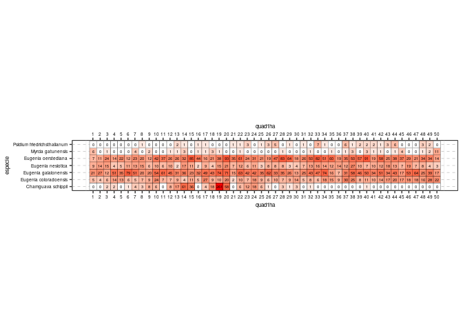

Análisis exploratorio de datos. Riqueza y abundancia
================
JR
13 de octubre, 2020

### Área de cargar paquetes

``` r
library(vegan)
```

    ## Loading required package: permute

    ## Loading required package: lattice

    ## This is vegan 2.5-6

``` r
library(tidyverse)
```

    ## ── Attaching packages ─────────────────────────────────────────────────────────────────── tidyverse 1.2.1 ──

    ## ✔ ggplot2 3.2.1     ✔ purrr   0.3.3
    ## ✔ tibble  2.1.3     ✔ dplyr   0.8.3
    ## ✔ tidyr   1.0.0     ✔ stringr 1.4.0
    ## ✔ readr   1.3.1     ✔ forcats 0.4.0

    ## ── Conflicts ────────────────────────────────────────────────────────────────────── tidyverse_conflicts() ──
    ## ✖ dplyr::filter() masks stats::filter()
    ## ✖ dplyr::lag()    masks stats::lag()

``` r
library(sf)
```

    ## Linking to GEOS 3.8.0, GDAL 3.0.4, PROJ 7.0.0

``` r
source('biodata/funciones.R')
```

### Área de cargar datos

Censo (el objeto se carga con prefijo "censo") y matriz de comunidad (prefijo "mc")

``` r
load('biodata/Myrtaceae.Rdata')
load('biodata/matriz_ambiental.Rdata') #Matriz ambiental, se carga como "bci_env_grid"
```

### Imprimir datos en pantalla (impresiones parciales con head)

``` r
head(censo_myrtc)
```

    ##   treeID stemID    tag StemTag     sp quadrat    gx    gy MeasureID
    ## 1     77      1 000062         eugene    4914 997.0 291.0        48
    ## 2    905      1 000898         eugeco    4409 886.3 190.8       801
    ## 3   1253      5 001251       1 eugene    4210 855.2 203.3      1092
    ## 4   1446      1 001444         psidfr    4114 821.0 293.6      1273
    ## 5   1618      1 001617         eugeco    4007 806.1 145.3      1400
    ## 6   2113      1 002117         eugene    3719 744.8 393.9      1802
    ##   CensusID dbh pom hom  ExactDate DFstatus    codes nostems  date status
    ## 1      171 302 1.3 1.3 2010-09-14    alive     <NA>       1 18519      A
    ## 2      171 227 1.3 1.3 2010-08-06    alive     <NA>       1 18480      A
    ## 3      171 357   3 3.1 2010-09-14    alive Q,B,cylY       2 18519      A
    ## 4      171 245 1.3 1.3 2010-08-03    alive     <NA>       1 18477      A
    ## 5      171 299 1.3 1.3 2010-07-21    alive     <NA>       1 18464      A
    ## 6      171 292 1.3 1.3 2010-07-23    alive     <NA>       1 18466      A
    ##         agb                       Latin   Genus             Species
    ## 1 0.8890848           Eugenia nesiotica Eugenia           nesiotica
    ## 2 0.4231892       Eugenia coloradoensis Eugenia       coloradoensis
    ## 3 1.3659274           Eugenia nesiotica Eugenia           nesiotica
    ## 4 0.5779156 Psidium friedrichsthalianum Psidium friedrichsthalianum
    ## 5 0.8664713       Eugenia coloradoensis Eugenia       coloradoensis
    ## 6 0.8150351           Eugenia nesiotica Eugenia           nesiotica
    ##      Family speciesID       authority IDlevel syn subsp quad1ha
    ## 1 Myrtaceae       361         Standl. species      <NA>      48
    ## 2 Myrtaceae       358         Standl. species      <NA>      42
    ## 3 Myrtaceae       361         Standl. species      <NA>      43
    ## 4 Myrtaceae       834 (O. Berg) Nied. species      <NA>      43
    ## 5 Myrtaceae       358         Standl. species      <NA>      42
    ## 6 Myrtaceae       361         Standl. species      <NA>      39

``` r
head(mc_myrtc)
```

    ##   Chamguava schippii Eugenia coloradoensis Eugenia galalonensis
    ## 1                  0                     5                   21
    ## 2                  0                     4                   27
    ## 3                  2                     6                   12
    ## 4                  2                    14                   51
    ## 5                  0                    13                   35
    ## 6                  1                     6                   79
    ##   Eugenia nesiotica Eugenia oerstediana Myrcia gatunensis
    ## 1                 9                   7                 6
    ## 2                14                  11                 0
    ## 3                15                  24                 1
    ## 4                 4                  14                 0
    ## 5                 5                  22                 0
    ## 6                11                  12                 0
    ##   Psidium friedrichsthalianum
    ## 1                           0
    ## 2                           0
    ## 3                           0
    ## 4                           0
    ## 5                           0
    ## 6                           0

``` r
bci_env_grid # No necesita imprimirse parcialmente
```

    ## Simple feature collection with 50 features and 38 fields
    ## geometry type:  POLYGON
    ## dimension:      XY
    ## bbox:           xmin: 625704 ymin: 1011519 xmax: 626704 ymax: 1012019
    ## projected CRS:  WGS 84 / UTM zone 17N
    ## First 10 features:
    ##    id categoria_de_edad geologia  habitat quebrada
    ## 1   1                c3       Tb OldSlope      Yes
    ## 2   2                c3       Tb   OldLow      Yes
    ## 3   3                c3       Tb   OldLow       No
    ## 4   4                c3       Tb   OldLow       No
    ## 5   5                c3       Tb OldSlope       No
    ## 6   6                c3       Tb   OldLow       No
    ## 7   7                c3       Tb   OldLow      Yes
    ## 8   8                c3       Tb   OldLow      Yes
    ## 9   9                c3       Tb   OldLow       No
    ## 10 10                c3       Tb   OldLow       No
    ##    heterogeneidad_ambiental UTM.EW  UTM.NS geomorf_llanura_pct
    ## 1                    0.6272 625754 1011569               10.02
    ## 2                    0.3936 625754 1011669               34.77
    ## 3                    0.0000 625754 1011769                0.00
    ## 4                    0.0000 625754 1011869                0.00
    ## 5                    0.4608 625754 1011969                2.58
    ## 6                    0.0768 625854 1011569                0.00
    ## 7                    0.3808 625854 1011669                0.00
    ## 8                    0.2112 625854 1011769                0.00
    ## 9                    0.0000 625854 1011869                0.00
    ## 10                   0.0000 625854 1011969                1.03
    ##    geomorf_pico_pct geomorf_interfluvio_pct geomorf_hombrera_pct
    ## 1              0.00                    0.83                10.76
    ## 2              0.00                    0.36                10.65
    ## 3              0.00                    0.00                 1.36
    ## 4              0.00                    0.16                 0.00
    ## 5              0.00                    0.00                 1.74
    ## 6              0.17                    3.01                 0.86
    ## 7              0.53                    2.87                 2.99
    ## 8              0.00                    0.00                 0.26
    ## 9              0.00                    0.00                 2.24
    ## 10             0.00                    0.00                 5.83
    ##    geomorf_espolón/gajo_pct geomorf_vertiente_pct geomorf_vaguada_pct
    ## 1                      7.26                 67.07                3.28
    ## 2                      0.64                 47.97                0.57
    ## 3                      5.21                 77.04               12.62
    ## 4                     10.99                 84.18                4.53
    ## 5                      0.00                 93.86                0.17
    ## 6                      5.57                 72.04                8.85
    ## 7                     16.15                 63.48                9.34
    ## 8                      9.53                 88.20                0.35
    ## 9                      6.45                 84.34                3.75
    ## 10                     0.03                 86.46                1.54
    ##    geomorf_piedemonte_pct geomorf_valle_pct geomorf_sima_pct        Al
    ## 1                    0.78              0.00             0.00  901.0908
    ## 2                    4.88              0.16             0.00  954.2488
    ## 3                    0.00              3.77             0.00 1114.1122
    ## 4                    0.00              0.14             0.00 1023.5793
    ## 5                    1.65              0.00             0.00 1001.8848
    ## 6                    1.90              7.60             0.00 1091.4672
    ## 7                    0.19              4.45             0.00 1183.8837
    ## 8                    0.00              1.66             0.00 1256.1447
    ## 9                    0.00              3.11             0.11 1122.3259
    ## 10                   4.82              0.29             0.00 1171.6015
    ##          B       Ca      Cu       Fe         K       Mg       Mn       P
    ## 1  0.79448 1680.021 6.20312 135.2870 141.88128 279.1291 266.9997 1.95248
    ## 2  0.66968 1503.365 6.03148 141.8080 137.23932 280.4524 320.4786 2.24740
    ## 3  0.59516 1182.311 6.79768 157.0878  98.69056 230.3973 445.0708 1.95484
    ## 4  0.56780 1558.020 6.63400 153.1746  98.36412 228.9468 407.7580 2.63444
    ## 5  0.39876 1242.251 6.44428 149.2509  94.07208 202.6820 250.5403 1.86356
    ## 6  0.73120 1441.977 6.49552 173.8682 131.89280 276.5010 477.3249 1.61612
    ## 7  0.34012 1111.443 5.55292 138.2678 117.12156 242.1834 300.6756 2.12696
    ## 8  0.32224 1029.210 6.28208 147.1563 104.30808 184.5147 204.2532 3.10668
    ## 9  0.46360 1230.271 7.17968 153.0034 110.24420 206.6087 414.7284 1.99128
    ## 10 0.31404 1126.864 6.88668 132.5661 104.81508 172.3453 329.6930 1.68548
    ##         Zn        N   N.min.      pH elevacion_media pendiente_media
    ## 1  2.96948 18.46500 -3.88544 4.32432        136.5520       10.226696
    ## 2  2.53208 21.59896  5.64388 4.37548        142.0903        3.047809
    ## 3  2.24672 20.24516 -4.06408 4.34700        137.2355       10.523937
    ## 4  2.44284 20.84232  7.89012 4.46112        143.0398        9.790396
    ## 5  2.13748 16.94500  8.53716 4.40128        154.1270        5.368328
    ## 6  2.63148 20.29812  4.38948 4.57252        123.8959       10.795729
    ## 7  2.15556 20.09600  8.33632 4.55972        138.6581       12.870604
    ## 8  2.07284 21.50216 -0.03472 4.41168        146.2986        7.778736
    ## 9  2.33068 21.43224  0.05456 4.53336        149.0022        7.079292
    ## 10 2.05104 18.28212  7.69104 4.55500        154.7737        4.158707
    ##    orientacion_media curvatura_perfil_media curvatura_tangencial_media
    ## 1           288.3795           0.0028371971               0.0005204064
    ## 2           181.3852           0.0013339481               0.0007514740
    ## 3           164.9017          -0.0008496227              -0.0009649617
    ## 4           221.3076           0.0001992615              -0.0001589584
    ## 5           248.0873           0.0017627041               0.0003943572
    ## 6           244.4480          -0.0031542362              -0.0003680417
    ## 7           218.3005           0.0018408727               0.0003022548
    ## 8           205.6930           0.0011782487               0.0001404646
    ## 9           239.3841           0.0010674261              -0.0011360541
    ## 10          274.6112           0.0003328637              -0.0001897943
    ##                          geometry abundancia_global riqueza_global
    ## 1  POLYGON ((625704 1011519, 6...              4079            181
    ## 2  POLYGON ((625704 1011619, 6...              3800            163
    ## 3  POLYGON ((625704 1011719, 6...              4611            171
    ## 4  POLYGON ((625704 1011819, 6...              3906            163
    ## 5  POLYGON ((625704 1011919, 6...              4549            174
    ## 6  POLYGON ((625804 1011519, 6...              3685            165
    ## 7  POLYGON ((625804 1011619, 6...              4527            173
    ## 8  POLYGON ((625804 1011719, 6...              4376            176
    ## 9  POLYGON ((625804 1011819, 6...              4381            162
    ## 10 POLYGON ((625804 1011919, 6...              4057            163

### También podemos usar

Requiere que se haya cargado ya la colección tidyverse

``` r
censo_myrtc %>% tibble
```

    ## # A tibble: 5,579 x 1
    ##    .$treeID $stemID $tag  $StemTag $sp   $quadrat   $gx   $gy $MeasureID
    ##       <int>   <int> <chr> <chr>    <chr> <chr>    <dbl> <dbl>      <int>
    ##  1       77       1 0000… ""       euge… 4914      997   291          48
    ##  2      905       1 0008… ""       euge… 4409      886.  191.        801
    ##  3     1253       5 0012… 1        euge… 4210      855.  203.       1092
    ##  4     1446       1 0014… ""       psid… 4114      821   294.       1273
    ##  5     1618       1 0016… ""       euge… 4007      806.  145.       1400
    ##  6     2113       1 0021… ""       euge… 3719      745.  394.       1802
    ##  7     2331       2 0023… 1        euge… 3613      720.  280.       1966
    ##  8     2456       1 0024… ""       euge… 3517      703.  354.       2073
    ##  9     2827       1 0028… ""       psid… 3314      664.  281.       2402
    ## 10     3993       1 0040… ""       euge… 2609      525   199.       3387
    ## # … with 5,569 more rows, and 21 more variables: $CensusID <int>,
    ## #   $dbh <dbl>, $pom <chr>, $hom <dbl>, $ExactDate <chr>, $DFstatus <chr>,
    ## #   $codes <chr>, $nostems <dbl>, $date <dbl>, $status <chr>, $agb <dbl>,
    ## #   $Latin <chr>, $Genus <chr>, $Species <chr>, $Family <chr>,
    ## #   $speciesID <int>, $authority <chr>, $IDlevel <chr>, $syn <chr>,
    ## #   $subsp <chr>, $quad1ha <dbl>

``` r
mc_myrtc %>% tibble
```

    ## # A tibble: 50 x 1
    ##    .$`Chamguava sc… $`Eugenia color… $`Eugenia galal… $`Eugenia nesio…
    ##               <dbl>            <dbl>            <dbl>            <dbl>
    ##  1                0                5               21                9
    ##  2                0                4               27               14
    ##  3                2                6               12               15
    ##  4                2               14               51                4
    ##  5                0               13               35                5
    ##  6                1                6               79               11
    ##  7                4                5               51               13
    ##  8                3                7               20               15
    ##  9                8                9               20                6
    ## 10                6               24               54               10
    ## # … with 40 more rows, and 3 more variables: $`Eugenia oerstediana` <dbl>,
    ## #   $`Myrcia gatunensis` <dbl>, $`Psidium friedrichsthalianum` <dbl>

### Lista de especies

``` r
sort(colnames(mc_myrtc))
```

    ## [1] "Chamguava schippii"          "Eugenia coloradoensis"      
    ## [3] "Eugenia galalonensis"        "Eugenia nesiotica"          
    ## [5] "Eugenia oerstediana"         "Myrcia gatunensis"          
    ## [7] "Psidium friedrichsthalianum"

### Número de sitios, tanto en matriz de comunidad como en ambiental

Verifica que coinciden

``` r
nrow(mc_myrtc) #En la matriz de comunidad
```

    ## [1] 50

``` r
nrow(bci_env_grid) #En la matriz ambiental
```

    ## [1] 50

### Riqueza numérica de especies (usando matriz de comunidad) por quadrat

Nota: cargar paquete vegan arriba, en el área de paquetes

``` r
specnumber(mc_myrtc)
```

    ##  1  2  3  4  5  6  7  8  9 10 11 12 13 14 15 16 17 18 19 20 21 22 23 24 25 
    ##  5  4  6  5  4  5  6  6  6  5  4  6  7  7  5  6  7  6  6  5  5  7  6  5  6 
    ## 26 27 28 29 30 31 32 33 34 35 36 37 38 39 40 41 42 43 44 45 46 47 48 49 50 
    ##  6  5  6  6  5  5  6  5  5  5  4  6  6  5  7  6  6  5  6  5  4  4  6  6  5

``` r
sort(specnumber(mc_myrtc)) # Ordenados ascendentemente
```

    ##  2  5 11 36 46 47  1  4  6 10 15 20 21 24 27 30 31 33 34 35 39 43 45 50  3 
    ##  4  4  4  4  4  4  5  5  5  5  5  5  5  5  5  5  5  5  5  5  5  5  5  5  6 
    ##  7  8  9 12 16 18 19 23 25 26 28 29 32 37 38 41 42 44 48 49 13 14 17 22 40 
    ##  6  6  6  6  6  6  6  6  6  6  6  6  6  6  6  6  6  6  6  6  7  7  7  7  7

``` r
summary(specnumber(mc_myrtc)) # Resumen estadístico
```

    ##    Min. 1st Qu.  Median    Mean 3rd Qu.    Max. 
    ##     4.0     5.0     6.0     5.5     6.0     7.0

### Abundancia de especies por quadrat

``` r
sort(rowSums(mc_myrtc))
```

    ##   1  36  30   2   9   3  21  31   8  50   5  25  41  45   4  16  48  13 
    ##  48  49  52  56  57  60  60  64  66  67  75  75  76  82  85  85  87  88 
    ##  23  12  43  18  26   7  27  29  35  17   6  49  47  11  37  32  46  24 
    ##  94  97  97  98  99 100 103 104 104 107 109 109 110 111 115 116 119 120 
    ##  44  39  10  28  42  14  22  33  34  38  40  15  20  19 
    ## 121 123 136 137 137 154 154 158 158 164 165 166 263 399

``` r
summary(rowSums(mc_myrtc)) # Resumen estadístico
```

    ##    Min. 1st Qu.  Median    Mean 3rd Qu.    Max. 
    ##    48.0    77.5   103.5   111.6   122.5   399.0

### Abundancia por especie

``` r
sort(colSums(mc_myrtc))
```

    ##           Myrcia gatunensis Psidium friedrichsthalianum 
    ##                          56                          58 
    ##           Eugenia nesiotica          Chamguava schippii 
    ##                         502                         541 
    ##       Eugenia coloradoensis         Eugenia oerstediana 
    ##                         609                        1838 
    ##        Eugenia galalonensis 
    ##                        1975

``` r
summary(colSums(mc_myrtc)) # Resumen estadístico
```

    ##    Min. 1st Qu.  Median    Mean 3rd Qu.    Max. 
    ##      56     280     541     797    1224    1975

### Riqueza numérica de toda la "comunidad"

``` r
specnumber(colSums(mc_myrtc))
```

    ## [1] 7

### Abundancia de toda la comunidad

``` r
sum(colSums(mc_myrtc))
```

    ## [1] 5579

### Una tabla para el manuscrito, es necesario asignarle nombre

Para esto, usaré la colección "tidyverse"

``` r
abun_sp <- censo_myrtc %>%
  group_by(Latin) %>% 
  count() %>% 
  arrange(desc(n))
abun_sp
```

    ## # A tibble: 7 x 2
    ## # Groups:   Latin [7]
    ##   Latin                           n
    ##   <chr>                       <int>
    ## 1 Eugenia galalonensis         1975
    ## 2 Eugenia oerstediana          1838
    ## 3 Eugenia coloradoensis         609
    ## 4 Chamguava schippii            541
    ## 5 Eugenia nesiotica             502
    ## 6 Psidium friedrichsthalianum    58
    ## 7 Myrcia gatunensis              56

### Un gráfico para el manuscrito

Gráfico de mosaicos de la abundancia por especie por cuadros

``` r
abun_sp_q <- crear_grafico_mosaico_de_mc(mc_myrtc, tam_rotulo = 6)
abun_sp_q
```


