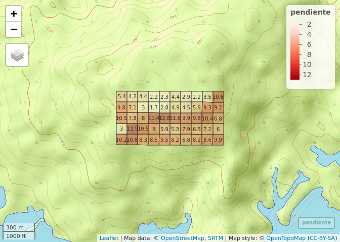
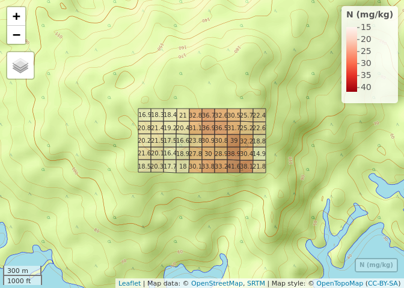
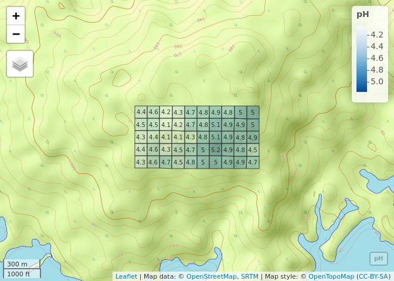

Análisis exploratorio de datos. Mapas de variables ambientales
================
JR
25 de octubre, 2020

### Cargar paquetes

``` r
library(mapview)
library(tidyverse)
```

    ## ── Attaching packages ─────────────────────────────────────────────────────────────────── tidyverse 1.2.1 ──

    ## ✔ ggplot2 3.2.1     ✔ purrr   0.3.3
    ## ✔ tibble  2.1.3     ✔ dplyr   0.8.3
    ## ✔ tidyr   1.0.0     ✔ stringr 1.4.0
    ## ✔ readr   1.3.1     ✔ forcats 0.4.0

    ## ── Conflicts ────────────────────────────────────────────────────────────────────── tidyverse_conflicts() ──
    ## ✖ dplyr::filter() masks stats::filter()
    ## ✖ dplyr::lag()    masks stats::lag()

``` r
library(sf)
```

    ## Linking to GEOS 3.8.0, GDAL 3.0.4, PROJ 7.0.0

``` r
library(RColorBrewer)
```

### Cargar datos

``` r
load('biodata/matriz_ambiental.Rdata')
```

### Paletas

``` r
azul <- colorRampPalette(brewer.pal(8, "Blues"))
rojo <- colorRampPalette(brewer.pal(8, "Reds"))
rojo_inv <- colorRampPalette(rev(brewer.pal(8, "Reds")))
```

### Mapa de cuadros, simbología por pendiente

``` r
mapa_cuadros_pendiente <- mapView(
  bci_env_grid,
  layer.name = 'pendiente',
  alpha.regions = 0.4,
  map.types = 'OpenTopoMap',
  legend = T, zoom = 14,
  col.regions = rojo,
  zcol = 'pendiente_media') %>%
  addStaticLabels(label = round(bci_env_grid$pendiente_media, 1)) %>%
  leaflet::setView(
    lng = -79.85136,
    lat = 9.15097,
    zoom = 15)
mapa_cuadros_pendiente
```



``` r
mapa_cuadros_pendiente %>% mapshot(file = 'mapa_cuadros_pendiente.png') #Genera archivo
```

### Mapa de cuadros, simbología por Nitrógeno

``` r
mapa_cuadros_nit <- mapView(
  bci_env_grid,
  layer.name = 'N (mg/kg)',
  alpha.regions = 0.4,
  map.types = 'OpenTopoMap',
  legend = T, zoom = 14,
  col.regions = rojo,
  zcol = 'N') %>%
  addStaticLabels(label = round(bci_env_grid$N, 1)) %>%
  leaflet::setView(
    lng = -79.85136,
    lat = 9.15097,
    zoom = 15)
mapa_cuadros_nit
```



``` r
mapa_cuadros_nit %>% mapshot(file = 'mapa_cuadros_nit.png')
```

### Mapa de cuadros, simbología por pH

``` r
mapa_cuadros_ph <- mapView(
  bci_env_grid,
  layer.name = 'pH',
  alpha.regions = 0.4,
  map.types = 'OpenTopoMap',
  legend = T, zoom = 14,
  col.regions = azul,
  zcol = 'pH') %>%
  addStaticLabels(label = round(bci_env_grid$pH, 1)) %>%
  leaflet::setView(
    lng = -79.85136,
    lat = 9.15097,
    zoom = 15)
mapa_cuadros_ph
```



``` r
mapa_cuadros_ph %>% mapshot(file = 'mapa_cuadros_ph.png')
```
