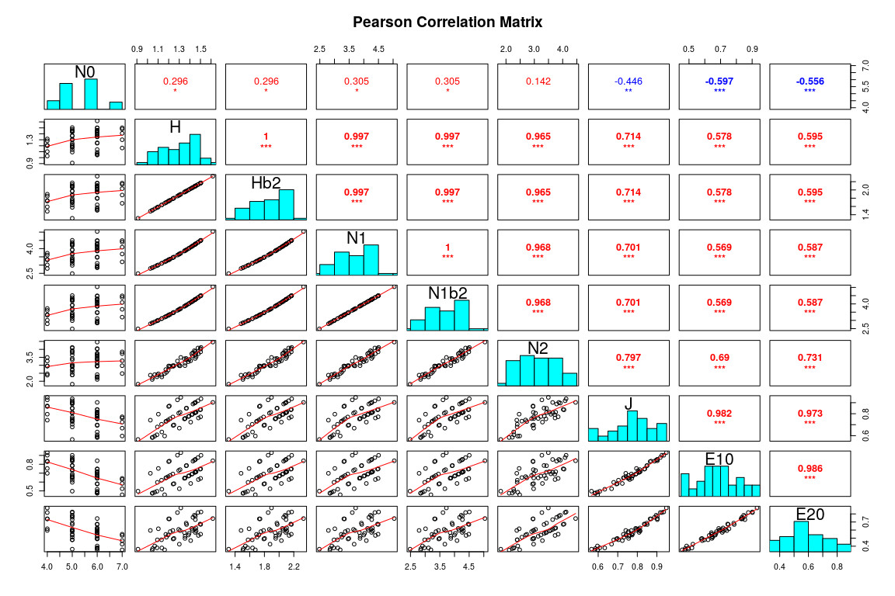
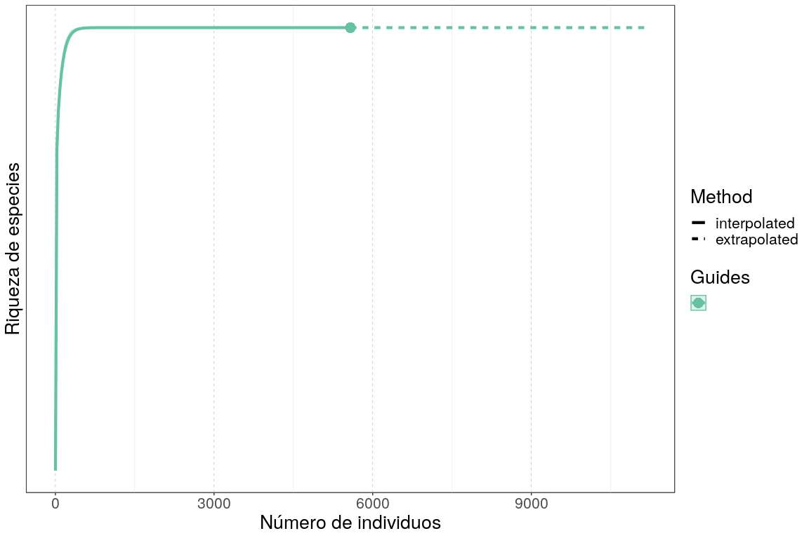

Análisis de diversidad. <br> Parte 1: Diversidad alpha
================
JR
29 de noviembre, 2020

``` r
knitr::opts_chunk$set(fig.width=12, fig.height=8)
```

Preámbulo
---------

### Cargar paquetes

``` r
library(vegan)
```

    ## Loading required package: permute

    ## Loading required package: lattice

    ## This is vegan 2.5-6

``` r
library(adespatial)
```

    ## Registered S3 methods overwritten by 'adegraphics':
    ##   method         from
    ##   biplot.dudi    ade4
    ##   kplot.foucart  ade4
    ##   kplot.mcoa     ade4
    ##   kplot.mfa      ade4
    ##   kplot.pta      ade4
    ##   kplot.sepan    ade4
    ##   kplot.statis   ade4
    ##   scatter.coa    ade4
    ##   scatter.dudi   ade4
    ##   scatter.nipals ade4
    ##   scatter.pco    ade4
    ##   score.acm      ade4
    ##   score.mix      ade4
    ##   score.pca      ade4
    ##   screeplot.dudi ade4

    ## Registered S3 method overwritten by 'spdep':
    ##   method   from
    ##   plot.mst ape

    ## Registered S3 methods overwritten by 'adespatial':
    ##   method             from       
    ##   plot.multispati    adegraphics
    ##   print.multispati   ade4       
    ##   summary.multispati ade4

``` r
library(plyr)
library(RColorBrewer)
library(tidyverse)
```

    ## ── Attaching packages ──────────────────────────────────────────────── tidyverse 1.2.1 ──

    ## ✔ ggplot2 3.2.1     ✔ purrr   0.3.3
    ## ✔ tibble  2.1.3     ✔ dplyr   0.8.3
    ## ✔ tidyr   1.0.0     ✔ stringr 1.4.0
    ## ✔ readr   1.3.1     ✔ forcats 0.4.0

    ## ── Conflicts ─────────────────────────────────────────────────── tidyverse_conflicts() ──
    ## ✖ dplyr::arrange()   masks plyr::arrange()
    ## ✖ purrr::compact()   masks plyr::compact()
    ## ✖ dplyr::count()     masks plyr::count()
    ## ✖ dplyr::failwith()  masks plyr::failwith()
    ## ✖ dplyr::filter()    masks stats::filter()
    ## ✖ dplyr::id()        masks plyr::id()
    ## ✖ dplyr::lag()       masks stats::lag()
    ## ✖ dplyr::mutate()    masks plyr::mutate()
    ## ✖ dplyr::rename()    masks plyr::rename()
    ## ✖ dplyr::summarise() masks plyr::summarise()
    ## ✖ dplyr::summarize() masks plyr::summarize()

``` r
library(sf)
```

    ## Linking to GEOS 3.8.0, GDAL 3.0.4, PROJ 7.0.0

``` r
library(SpadeR)
library(iNEXT)
```

    ## 
    ## Attaching package: 'iNEXT'

    ## The following object is masked from 'package:SpadeR':
    ## 
    ##     ChaoSpecies

``` r
source('biodata/funciones.R')
```

### Cargar datos

``` r
load('biodata/Myrtaceae.Rdata')
load('biodata/matriz_ambiental.Rdata')
mi_fam <- mc_myrtc
bci_env_grid %>% tibble
```

    ## # A tibble: 50 x 1
    ##     .$id $categoria_de_e… $geologia $habitat $quebrada $heterogeneidad…
    ##    <dbl> <fct>            <fct>     <fct>    <fct>                <dbl>
    ##  1     1 c3               Tb        OldSlope Yes                 0.627 
    ##  2     2 c3               Tb        OldLow   Yes                 0.394 
    ##  3     3 c3               Tb        OldLow   No                  0     
    ##  4     4 c3               Tb        OldLow   No                  0     
    ##  5     5 c3               Tb        OldSlope No                  0.461 
    ##  6     6 c3               Tb        OldLow   No                  0.0768
    ##  7     7 c3               Tb        OldLow   Yes                 0.381 
    ##  8     8 c3               Tb        OldLow   Yes                 0.211 
    ##  9     9 c3               Tb        OldLow   No                  0     
    ## 10    10 c3               Tb        OldLow   No                  0     
    ## # … with 40 more rows, and 33 more variables: $UTM.EW <dbl>,
    ## #   $UTM.NS <dbl>, $geomorf_llanura_pct <dbl>, $geomorf_pico_pct <dbl>,
    ## #   $geomorf_interfluvio_pct <dbl>, $geomorf_hombrera_pct <dbl>,
    ## #   $`geomorf_espolón/gajo_pct` <dbl>, $geomorf_vertiente_pct <dbl>,
    ## #   $geomorf_vaguada_pct <dbl>, $geomorf_piedemonte_pct <dbl>,
    ## #   $geomorf_valle_pct <dbl>, $geomorf_sima_pct <dbl>, $Al <dbl>,
    ## #   $B <dbl>, $Ca <dbl>, $Cu <dbl>, $Fe <dbl>, $K <dbl>, $Mg <dbl>,
    ## #   $Mn <dbl>, $P <dbl>, $Zn <dbl>, $N <dbl>, $N.min. <dbl>, $pH <dbl>,
    ## #   $elevacion_media <dbl>, $pendiente_media <dbl>,
    ## #   $orientacion_media <dbl>, $curvatura_perfil_media <dbl>,
    ## #   $curvatura_tangencial_media <dbl>, $geometry <POLYGON [m]>,
    ## #   $abundancia_global <dbl>, $riqueza_global <int>

``` r
grupos_upgma_k2 <- readRDS('grupos_upgma_k2.RDS')
table(grupos_upgma_k2)
```

    ## grupos_upgma_k2
    ##  1  2 
    ## 48  2

``` r
grupos_ward_k4 <- readRDS('grupos_ward_k4.RDS')
table(grupos_ward_k4)
```

    ## grupos_ward_k4
    ##  1  2  3  4 
    ## 20 13  2 15

Diversidad alpha
----------------

**La tentación de medir la diversidad mediante un único número, ha atrapado a muchos investigadores en el pasado**. En distintos momentos, sobre todo durante el siglo XX, se desarrollaron varios índices de diversidad, que hoy vemos en la bibliografía, a veces usados de manera indiscriminada o sin sentido ecológico.

**La riqueza de especies, una cifra de uso común en estudios ecológicos, es un elemento muy simple** de la medición biodiversidad. La diversidad va más allá de la riqueza de especies, puesto que tiene muchas dimensiones y puede medirse de múltiples maneras. Además, **hay otros tipos de diversidad, desde el genoma hasta el paisaje**, y en estudios de ecología de comunidades, está atrayendo cada vez más atención el análisis de la **diversidad funcional y la diversidad filogenética** (Borcard et al., 2018; Magurran, 2004).

El término **"diversidad biológica"** se asume que fue acuñado a principios de los 80, y **se atribuye a Lovejoy**. Magurran lo atribuye a Gerbilskii y Petrunkevitch (1955), pero con una acepción diferente a la actual. Whiteside y Harmsworth (1967) lo usan también tempranamente. Norse y otros (1986), la dividen por primera vez en genética, de especies y ecológica.

**Biodiversidad** es de factura más reciente, y es una contracción de "biológica-diversidad" (del inglés *biological diversity*). Se atribuye a **Walter G. Rosen** (1986), mientras planeaba un evento científico sobre el tema. Las actas del evento se publicaron como un **libro titulado "Biodiversidad", editado por Edward O. Wilson**.

La definición de biodiversidad del PNUMA es: "**variabilidad entre organismos vivos** de todos los medios, incluyendo terrestres, marinos y otros sistemas acuáticos, y los complejos ecológicos de los cuales forman parte. Esto incluye la diversidad intraespecífica, interespecífica y de ecosistemas". Se trata de una definición de sentido amplio. Harper y Hawsworth sugieren esos mismos tres niveles, con los adjetivos **"genética", "de organismos" y "ecológica"**.

**Hubbell** (2001) ofrece una definición más adaptada a la práctica actual y mucho más restringida: "biodiversidad es sinónimo de **riqueza de especies y de abundancia relativa de especies** en el espacio y en el tiempo". Magurran utiliza **"diversidad biológica" y "biodiversidad" como sinónimos**, y la define como "la **variedad y la abundancia** de especies en una unidad de estudio", siguiendo lo planteado por Hubbel.

En estas dos últimas acepciones (Hubbell y Magurran), la diversidad biológica puede dividirse en dos componentes: **riqueza de especies y equidad**. Las mediciones de la biodiversidad, de las cuales hay un gran número, dan un peso relativo diferenciado a dichos componentes.

### La diversidad de especies como un único número

Usaré la notación *q* para designar el número de especies o riqueza de especies, y *n* para número de individuos, abundancia. Cualquier unidad de muestreo contiene un número determinado de individuos que pertenece a un cierto número de especies y, dado el hecho de que algunas especies son más raras que otras, es decir, son menos detectables, **el número total de especies de una unidad de muestreo o de un conjunto de unidades de muestreo, se incrementa al aumentar el área/volumen o el número de individuos muestreados**. Por lo tanto, comparar *q* entre dos unidades de muestreo, la cual es un estimado del número de especies real, estará sesgada (Borcard et al., 2018).

#### Riqueza de especies y rarefacción

Magurran (2004) distingue entre **densidad de especies**, que equivale al número de especies por unidad de área de colecta, y **riqueza numérica de especies**, que es el número de especies por número de individuos o por unidad de biomasa (*q/n*).

Para asegurar la comparabilidad entre sitios, se han propuesto distintos métodos. Uno es la rarefacción, desarrollada originalmente por Sanders (1968) y estandarizada por Hurlbert (1971), que estima el número de especies en unidades de muestreo conteniendo el mismo número de individuos, usando datos no transformados; se basa, por lo tanto, en el concepto de riqueza numérica de especies. Es decir, se determina *q'* por unidad estándar de muestreo *n'* (elegida comúnmente como el número mínimo del conjunto de muestras) de un universo que contiene *q* especies, *n* individuos y *n<sub>i</sub>* individuos pertenecientes a *i* especies.

[](rarefaccion.jpg)

#### Componentes de la diversidad de especies basada en abundancia: riqueza y equidad

Asumamos que un sitio de muestreo es una variable cualitativa, y cada especie es un "estado". Bajo esta lógica, la dispersión de esta variable se calcula usando las frecuencias relativas *p<sub>i</sub>* de los *q*-estados usando la conocida **entropía de Shannon** o *H* (1948):

[](shannon.jpg)

Desde el punto de vista ecológico, la **H** tiene dos propiedades importantes:

-   Crece al aumentar la riqueza de especies *q*.
-   Crece con la uniformidad (=equidad o equitabilidad, es decir, qué tan bien repartida se encuentra la abundancia entre las especies).

Para una *q* dada, *H* asume su valor máximo (*H<sub>max</sub>*) cuando todas las especies están igualmente representadas, y es equivalente al logaritmo de la riqueza:

[](shannon_max.jpg)

Un ejemplo ilustra lo anterior:

-   Cinco especies, 55 individuos, abundancias desiguales:

``` r
foo1 <- c(25, 16, 9, 4, 1)
diversity(foo1)
```

    ## [1] 1.277269

-   Cinco especies, 55 individuos, abundancias homogéneas

``` r
foo2 <- c(11, 11, 11, 11, 11)
diversity(foo2)
```

    ## [1] 1.609438

``` r
log(5)
```

    ## [1] 1.609438

Otros índices miden exclusivamente la homogeneidad de la abundancia, a lo que se denomina equidad. Se trata de una de las componentes de la diversidad, y existen muchos índices "en el mercado" para medirla.

Uno de los más usados es la **equidad de Pielou** o *J* (1966), que es la razón entre la entropía de Shannon y su valor máximo; a la **equidad de Pielou** también se le conoce como **equidad de Shannon**.

[](pielou.jpg)

Teóricamente, **este índice sólo debería aumentar cuando aumenta la homogeneidad de la abundancia**. Sin embargo, *J* se ha determinado que *J* también se incrementa al aumentar la riqueza; por lo tanto, se trata de un índice sesgado. No obstante, *J* es muy usado en trabajos ecológicos, por lo que es apropiado considerarlo como referente básico.

Todos los **índices de equidad se relacionan con la forma de los modelos de abundancia de especies**, que son funciones ajustadas a las distribuciones de abundancia. Estos modelos se construyen a partir de gráficos rango-abundancia, donde la horizontal representa las especies ordenadas de mayor a menor por rango de abundancia, y la vertical representa el logaritmo de las abundancias. Ordenados de menor a mayor equidad representada, los principales modelos son: geométrico, log, lognormal y de la vara quebrada. Los modelos de abundancia de especies se pueden consultar mediante la función `radfit` de `{vegan}`. La mayoría de estos modelos son realmente modelos lineales generalizados.

Otra medida común en trabajos de ecología numérica, pero que es inversa o contraria a la equidad, es el denominado **índice de concentración de Simpson** (1949), representado por *λ*, que equivale a la probabilidad de que dos individuos elegidos al azar pertenezcan a la misma especie.

[](simpson.jpg)

Este valor aumenta con la dominancia, por lo que realmente no mide diversidad, sino más bien inequidad o concentración. Para transformarlo en un índice de diversidad, se utiliza el índice de Gini-Simpson *D=1-λ*, o el inverso de Simpson *D=1/λ*. **Este último es menos sensible a cambios de la abundancia en las especies muy comunes**.

La riqueza de especies (*q*), la entropía de Shannon (*H*), la equidad de Pielou (*J*) y el inverso de Simpson (*1/λ*) son realmente casos especiales de la entropía generalizada de Renyi (1961):

[](renyi.jpg)

donde *a* es el orden de la medida de entropía (*a=0,1,2...*), la cual cuantifica la importancia de la abundancia de especies y, por lo tanto, la equidad. Hill (1973) propuso usar los correspondientes números de diversidad:

[](hill.jpg)

Las tres primeras entropias de Renyi (*H<sub>a</sub>*), donde *a=0, 1 y 2*, y los correspondientes números de diversidad de Hill, (*N<sub>a</sub>*), son realmente índices que ya conocemos: *H<sub>0</sub>=H<sub>max</sub>=log(q)*, *H<sub>1</sub>=H=entropia de Shannon*, *H<sub>2</sub>=-log(λ)*.

Por otra parte, los tres primeros números de diversidad de Hill tienen significados que conocemos: *N<sub>0</sub>=q*, simplemente la riqueza de especies, *N<sub>1</sub>=exp(H)*, número de especies abundantes, y *N<sub>1</sub>=1/λ*, inverso de Simpson. De lo anterior se deriva que, **a medida que se incrementa *a*, se le da mayor importancia a la o las especies más abundantes**.

[](tres_entro_renyi_hill_div_num.jpg) <br> &gt; Según Borcard et al., 2018.

Bajo esta notación:

-   La equidad de Pielou (denominada también equidad de Shannon) equivale a *J=H<sub>1</sub>/H<sub>0</sub>*, que es a fin de cuentas una ratio.

Usando la misma aproximación, Hill propuso también otras ratios que, a diferencia de lo que ocurre con *J*, no están afectadas por la riqueza:

-   *E<sub>1</sub>=N<sub>1</sub>/N<sub>0</sub>* a la cual el propio Hill denominó como su versión de la **equidad de Shannon** y

-   *E<sub>2</sub>=N<sub>2</sub>/N<sub>0</sub>*, a la cual Hill denominó como su versión de la **equidad de Simpson**.

Los números de diversidad y las ratios de Hill son menos sensibles a las matrices de comunidad con fuerte dominancia, y producen los denominados "números equivalentes". Se pueden interpretar como **"el número de elementos igualmente probables (individuos, especies, etc.) necesarios para producir el valor observado del índice de diversidad"** (Ellison, 2010, modificado por Jost, 2007). Además, los números de diversidad de Hill son preferibles para la interpretación a través de modelos lineales, porque **tienen mayor probabilidad de estar relacionados linealmente con variables ambientales**.

**Estas afirmaciones tienen implicaciones muy importantes desde el punto de vista ecológico, puesto que tus datos podrían reflejar patrones consistentes usando los números y las ratios de Hill, pero no necesariamente con la entropia de Shannon o el clásico índice de Simpson**.

**Índices, entropías, equidades, ratios**

``` r
(indices <- alpha_div(mi_fam))
```

    ##    N0         H      Hb2       N1     N1b2       N2         J       E10
    ## 1   5 1.4518446 2.094569 4.270985 4.270985 3.645570 0.9020817 0.8541971
    ## 2   4 1.2064870 1.740593 3.341724 3.341724 2.952919 0.8702964 0.8354311
    ## 3   6 1.4468483 2.087361 4.249700 4.249700 3.651116 0.8075014 0.7082833
    ## 4   5 1.1326726 1.634101 3.103941 3.103941 2.397942 0.7037691 0.6207882
    ## 5   4 1.1997328 1.730849 3.319230 3.319230 2.955859 0.8654243 0.8298075
    ## 6   5 0.9103143 1.313306 2.485103 2.485103 1.815834 0.5656101 0.4970207
    ## 7   6 1.3539566 1.953346 3.872718 3.872718 2.979738 0.7556576 0.6454530
    ## 8   6 1.5022721 2.167321 4.491884 4.491884 4.018450 0.8384340 0.7486473
    ## 9   6 1.6170700 2.332939 5.038307 5.038307 4.456790 0.9025040 0.8397178
    ## 10  5 1.3653243 1.969747 3.916993 3.916993 3.430267 0.8483237 0.7833986
    ## 11  4 1.0271951 1.481929 2.793220 2.793220 2.380870 0.7409646 0.6983050
    ## 12  6 1.3861226 1.999752 3.999313 3.999313 3.227787 0.7736097 0.6665521
    ## 13  7 1.5014692 2.166162 4.488278 4.488278 3.841270 0.7716025 0.6411826
    ## 14  7 1.4805943 2.136046 4.395557 4.395557 3.731278 0.7608750 0.6279367
    ## 15  5 1.3077583 1.886696 3.697875 3.697875 2.965562 0.8125559 0.7395749
    ## 16  6 1.0680468 1.540866 2.909691 2.909691 2.415580 0.5960883 0.4849485
    ## 17  7 1.4077035 2.030887 4.086560 4.086560 3.285222 0.7234165 0.5837943
    ## 18  6 1.4593623 2.105415 4.303215 4.303215 3.530882 0.8144856 0.7172024
    ## 19  6 1.0448122 1.507345 2.842865 2.842865 2.112344 0.5831208 0.4738108
    ## 20  5 1.4522402 2.095140 4.272675 4.272675 3.865270 0.9023276 0.8545351
    ## 21  5 1.0932512 1.577228 2.983960 2.983960 2.393617 0.6792752 0.5967920
    ## 22  7 1.3007443 1.876577 3.672029 3.672029 2.974912 0.6684503 0.5245755
    ## 23  6 1.4502941 2.092332 4.264369 4.264369 3.427463 0.8094246 0.7107281
    ## 24  5 1.5052754 2.171653 4.505394 4.505394 4.121351 0.9352802 0.9010789
    ## 25  6 1.3549072 1.954718 3.876401 3.876401 3.137200 0.7561881 0.6460669
    ## 26  6 1.1354370 1.638089 3.112534 3.112534 2.271379 0.6336995 0.5187556
    ## 27  5 1.2944352 1.867475 3.648934 3.648934 3.042443 0.8042778 0.7297869
    ## 28  6 1.0896620 1.572050 2.973269 2.973269 2.278621 0.6081519 0.4955448
    ## 29  6 1.0487189 1.512982 2.853993 2.853993 2.223684 0.5853012 0.4756654
    ## 30  5 1.4289581 2.061551 4.174348 4.174348 3.787115 0.8878616 0.8348696
    ## 31  5 1.2393367 1.787985 3.453322 3.453322 2.976744 0.7700432 0.6906644
    ## 32  6 1.2422744 1.792223 3.463482 3.463482 2.935428 0.6933266 0.5772470
    ## 33  5 1.1952453 1.724374 3.304368 3.304368 2.691827 0.7426476 0.6608736
    ## 34  5 1.2145101 1.752168 3.368643 3.368643 2.903466 0.7546176 0.6737287
    ## 35  5 1.1784128 1.700090 3.249213 3.249213 2.559394 0.7321890 0.6498426
    ## 36  4 1.3145237 1.896457 3.722977 3.722977 3.494905 0.9482284 0.9307443
    ## 37  6 1.4971396 2.159916 4.468888 4.468888 4.048056 0.8355695 0.7448146
    ## 38  6 1.4177800 2.045424 4.127946 4.127946 3.721085 0.7912781 0.6879910
    ## 39  5 1.1730046 1.692288 3.231688 3.231688 2.734321 0.7288288 0.6463376
    ## 40  7 1.1618866 1.676248 3.195957 3.195957 2.482900 0.5970916 0.4565653
    ## 41  6 1.3928571 2.009468 4.026337 4.026337 3.354239 0.7773683 0.6710562
    ## 42  6 1.2499482 1.803294 3.490162 3.490162 2.975900 0.6976094 0.5816937
    ## 43  5 1.4421820 2.080629 4.229916 4.229916 3.915522 0.8960781 0.8459831
    ## 44  6 1.4572003 2.102296 4.293921 4.293921 3.755065 0.8132790 0.7156535
    ## 45  5 1.3689172 1.974930 3.931092 3.931092 3.341948 0.8505561 0.7862184
    ## 46  4 1.2829211 1.850864 3.607161 3.607161 3.266667 0.9254320 0.9017903
    ## 47  4 1.1027390 1.590916 3.012406 3.012406 2.464358 0.7954580 0.7531014
    ## 48  6 1.4238283 2.054150 4.152989 4.152989 3.585505 0.7946537 0.6921648
    ## 49  6 1.3482777 1.945153 3.850787 3.850787 3.409182 0.7524881 0.6417979
    ## 50  5 1.4765277 2.130179 4.377719 4.377719 4.084622 0.9174183 0.8755437
    ##          E20
    ## 1  0.7291139
    ## 2  0.7382298
    ## 3  0.6085193
    ## 4  0.4795885
    ## 5  0.7389648
    ## 6  0.3631667
    ## 7  0.4966230
    ## 8  0.6697417
    ## 9  0.7427984
    ## 10 0.6860534
    ## 11 0.5952174
    ## 12 0.5379646
    ## 13 0.5487528
    ## 14 0.5330396
    ## 15 0.5931124
    ## 16 0.4025967
    ## 17 0.4693175
    ## 18 0.5884804
    ## 19 0.3520573
    ## 20 0.7730539
    ## 21 0.4787234
    ## 22 0.4249875
    ## 23 0.5712439
    ## 24 0.8242702
    ## 25 0.5228667
    ## 26 0.3785632
    ## 27 0.6084887
    ## 28 0.3797701
    ## 29 0.3706140
    ## 30 0.7574230
    ## 31 0.5953488
    ## 32 0.4892379
    ## 33 0.5383653
    ## 34 0.5806932
    ## 35 0.5118788
    ## 36 0.8737263
    ## 37 0.6746761
    ## 38 0.6201808
    ## 39 0.5468643
    ## 40 0.3547000
    ## 41 0.5590399
    ## 42 0.4959833
    ## 43 0.7831045
    ## 44 0.6258442
    ## 45 0.6683897
    ## 46 0.8166667
    ## 47 0.6160896
    ## 48 0.5975841
    ## 49 0.5681970
    ## 50 0.8169245

``` r
pairs(indices,
      lower.panel = panel.smooth,
      upper.panel = panel.cor,
      diag.panel = panel.hist,
      main = "Pearson Correlation Matrix")
```



``` r
indices_env <- bind_cols(
  indices,
  bci_env_grid %>%
    select_if(is.numeric) %>%
    st_drop_geometry %>%
    select(-id) %>% 
    select(-matches('^geom.*pct$')))
indices_env %>% tibble
```

    ## # A tibble: 50 x 1
    ##     .$N0    $H  $Hb2   $N1 $N1b2   $N2    $J  $E10  $E20 $heterogeneidad…
    ##    <int> <dbl> <dbl> <dbl> <dbl> <dbl> <dbl> <dbl> <dbl>            <dbl>
    ##  1     5 1.45   2.09  4.27  4.27  3.65 0.902 0.854 0.729           0.627 
    ##  2     4 1.21   1.74  3.34  3.34  2.95 0.870 0.835 0.738           0.394 
    ##  3     6 1.45   2.09  4.25  4.25  3.65 0.808 0.708 0.609           0     
    ##  4     5 1.13   1.63  3.10  3.10  2.40 0.704 0.621 0.480           0     
    ##  5     4 1.20   1.73  3.32  3.32  2.96 0.865 0.830 0.739           0.461 
    ##  6     5 0.910  1.31  2.49  2.49  1.82 0.566 0.497 0.363           0.0768
    ##  7     6 1.35   1.95  3.87  3.87  2.98 0.756 0.645 0.497           0.381 
    ##  8     6 1.50   2.17  4.49  4.49  4.02 0.838 0.749 0.670           0.211 
    ##  9     6 1.62   2.33  5.04  5.04  4.46 0.903 0.840 0.743           0     
    ## 10     5 1.37   1.97  3.92  3.92  3.43 0.848 0.783 0.686           0     
    ## # … with 40 more rows, and 22 more variables: $UTM.EW <dbl>,
    ## #   $UTM.NS <dbl>, $Al <dbl>, $B <dbl>, $Ca <dbl>, $Cu <dbl>, $Fe <dbl>,
    ## #   $K <dbl>, $Mg <dbl>, $Mn <dbl>, $P <dbl>, $Zn <dbl>, $N <dbl>,
    ## #   $N.min. <dbl>, $pH <dbl>, $elevacion_media <dbl>,
    ## #   $pendiente_media <dbl>, $orientacion_media <dbl>,
    ## #   $curvatura_perfil_media <dbl>, $curvatura_tangencial_media <dbl>,
    ## #   $abundancia_global <dbl>, $riqueza_global <int>

``` r
ezCorM(indices_env, r_size_lims = c(3,5), label_size = 4)
```

    ## 
    ## Attaching package: 'reshape2'

    ## The following object is masked from 'package:tidyr':
    ## 
    ##     smiths


**Modelos de abundancia de especies**

``` r
mi_fam_mae <- radfit(mi_fam)
```

    ## Warning: glm.fit: algorithm did not converge

    ## Warning: glm.fit: algorithm did not converge

    ## Warning: glm.fit: algorithm did not converge

    ## Warning: glm.fit: algorithm did not converge

    ## Warning: glm.fit: algorithm did not converge

    ## Warning: glm.fit: algorithm did not converge

    ## Warning: glm.fit: algorithm did not converge

    ## Warning: glm.fit: algorithm did not converge

    ## Warning: glm.fit: algorithm did not converge

    ## Warning: glm.fit: algorithm did not converge

    ## Warning: glm.fit: algorithm did not converge

    ## Warning: glm.fit: algorithm did not converge

    ## Warning: glm.fit: algorithm did not converge

    ## Warning: glm.fit: algorithm did not converge

    ## Error in glm.fit(x = structure(c(1, 1, 1, 1, 1, 1, 1, Inf, Inf, Inf, Inf,  : 
    ##   NA/NaN/Inf in 'x'

    ## Warning: glm.fit: algorithm did not converge

    ## Warning: glm.fit: algorithm did not converge

    ## Warning: glm.fit: algorithm did not converge

    ## Warning: glm.fit: algorithm did not converge

    ## Warning: glm.fit: algorithm did not converge

    ## Warning: glm.fit: algorithm did not converge

    ## Warning: glm.fit: algorithm did not converge

    ## Warning: glm.fit: algorithm did not converge

    ## Warning: glm.fit: algorithm did not converge

    ## Warning: glm.fit: algorithm did not converge

    ## Warning: glm.fit: algorithm did not converge

    ## Warning: glm.fit: algorithm did not converge

    ## Warning: glm.fit: algorithm did not converge

    ## Warning: glm.fit: algorithm did not converge

    ## Warning: glm.fit: algorithm did not converge

    ## Warning: glm.fit: algorithm did not converge

    ## Warning: glm.fit: algorithm did not converge

    ## Warning: glm.fit: algorithm did not converge

    ## Warning: glm.fit: algorithm did not converge

    ## Warning: glm.fit: algorithm did not converge

    ## Warning: glm.fit: algorithm did not converge

    ## Warning: glm.fit: algorithm did not converge

    ## Warning: glm.fit: algorithm did not converge

    ## Warning: glm.fit: algorithm did not converge

    ## Warning: glm.fit: algorithm did not converge

    ## Warning: glm.fit: algorithm did not converge

    ## Warning: glm.fit: algorithm did not converge

    ## Warning: glm.fit: algorithm did not converge

    ## Warning: glm.fit: algorithm did not converge

    ## Warning: glm.fit: algorithm did not converge

    ## Warning: glm.fit: algorithm did not converge

    ## Error in glm.fit(x = structure(c(1, 1, 1, 1, 1, Inf, Inf, Inf, Inf, Inf : 
    ##   NA/NaN/Inf in 'x'

    ## Warning: glm.fit: algorithm did not converge

    ## Warning: glm.fit: algorithm did not converge

    ## Warning: glm.fit: algorithm did not converge

    ## Warning: glm.fit: algorithm did not converge

    ## Warning: glm.fit: algorithm did not converge

    ## Warning: glm.fit: algorithm did not converge

    ## Warning: glm.fit: algorithm did not converge

    ## Warning: glm.fit: algorithm did not converge

    ## Warning: glm.fit: algorithm did not converge

    ## Warning: glm.fit: algorithm did not converge

    ## Warning: glm.fit: algorithm did not converge

    ## Warning: glm.fit: algorithm did not converge

    ## Warning: glm.fit: algorithm did not converge

    ## Warning: glm.fit: algorithm did not converge

    ## Warning: glm.fit: algorithm did not converge

    ## Warning: glm.fit: algorithm did not converge

    ## Warning: glm.fit: algorithm did not converge

    ## Warning: glm.fit: algorithm did not converge

``` r
plot(mi_fam_mae)
```


**Rarefacción**

Riqueza por sitios

``` r
riqueza <- specnumber(mi_fam)
riqueza %>% sort
```

    ##  2  5 11 36 46 47  1  4  6 10 15 20 21 24 27 30 31 33 34 35 39 43 45 50  3 
    ##  4  4  4  4  4  4  5  5  5  5  5  5  5  5  5  5  5  5  5  5  5  5  5  5  6 
    ##  7  8  9 12 16 18 19 23 25 26 28 29 32 37 38 41 42 44 48 49 13 14 17 22 40 
    ##  6  6  6  6  6  6  6  6  6  6  6  6  6  6  6  6  6  6  6  6  7  7  7  7  7

Sitios con riqueza mínima y máxima

``` r
riqueza[riqueza == min(riqueza)]
```

    ##  2  5 11 36 46 47 
    ##  4  4  4  4  4  4

``` r
riqueza[riqueza == max(riqueza)]
```

    ## 13 14 17 22 40 
    ##  7  7  7  7  7

``` r
range(riqueza)
```

    ## [1] 4 7

Abundancia por sitios

``` r
abundancia <- rowSums(mi_fam)
abundancia %>% sort
```

    ##   1  36  30   2   9   3  21  31   8  50   5  25  41  45   4  16  48  13 
    ##  48  49  52  56  57  60  60  64  66  67  75  75  76  82  85  85  87  88 
    ##  23  12  43  18  26   7  27  29  35  17   6  49  47  11  37  32  46  24 
    ##  94  97  97  98  99 100 103 104 104 107 109 109 110 111 115 116 119 120 
    ##  44  39  10  28  42  14  22  33  34  38  40  15  20  19 
    ## 121 123 136 137 137 154 154 158 158 164 165 166 263 399

Sitios con abundancias mínima y máxima

``` r
abundancia[abundancia == min(abundancia)]
```

    ##  1 
    ## 48

``` r
abundancia[abundancia == max(abundancia)]
```

    ##  19 
    ## 399

``` r
(rango_abun <- range(abundancia))
```

    ## [1]  48 399

Abundancia en el sitio más pobre

``` r
abundancia[riqueza == min(riqueza)]
```

    ##   2   5  11  36  46  47 
    ##  56  75 111  49 119 110

Abundancia en el sitio más rico

``` r
abundancia[riqueza == max(riqueza)]
```

    ##  13  14  17  22  40 
    ##  88 154 107 154 165

Riqueza en el sitio con menor abundancia

``` r
riqueza[abundancia == min(abundancia)]
```

    ## 1 
    ## 5

Riqueza en el sitio con mayor abundancia

``` r
riqueza[abundancia == max(abundancia)]
```

    ## 19 
    ##  6

Rarefacción a la abundancia más pequeña encontrada

``` r
riqueza_menor_abun <- rarefy(mi_fam, sample = rango_abun[1])
sort(riqueza)
```

    ##  2  5 11 36 46 47  1  4  6 10 15 20 21 24 27 30 31 33 34 35 39 43 45 50  3 
    ##  4  4  4  4  4  4  5  5  5  5  5  5  5  5  5  5  5  5  5  5  5  5  5  5  6 
    ##  7  8  9 12 16 18 19 23 25 26 28 29 32 37 38 41 42 44 48 49 13 14 17 22 40 
    ##  6  6  6  6  6  6  6  6  6  6  6  6  6  6  6  6  6  6  6  6  7  7  7  7  7

``` r
sort(round(riqueza_menor_abun))
```

    ##  2  5  6 11 34 35 36 46 47  1  4 10 12 15 16 19 20 21 22 24 26 27 28 29 30 
    ##  4  4  4  4  4  4  4  4  4  5  5  5  5  5  5  5  5  5  5  5  5  5  5  5  5 
    ## 31 32 33 37 38 39 40 41 42 43 44 45 48 49 50  3  7  8  9 13 14 17 18 23 25 
    ##  5  5  5  5  5  5  5  5  5  5  5  5  5  5  5  6  6  6  6  6  6  6  6  6  6

``` r
rarecurve(
  mi_fam,
  step = 1,
  sample = rango_abun[1],
  xlab = "Número de individuos (tamaño de muestra)",
  ylab = "Especies",
  label = TRUE,
  col = "blue"
)
```


### Riqueza de especies, estimación y comparación, "completitud de muestra" (existe en el diccionario) (Chao y Chiu, 2016)

Aproximación básica:

``` r
specpool(mi_fam)
```

    ##     Species chao chao.se jack1 jack1.se jack2 boot      boot.se  n
    ## All       7    7       0     7        0     7    7 5.161914e-08 50

``` r
specpool(mi_fam)[[1]]/specpool(mi_fam)*100
```

    ##     Species chao chao.se jack1 jack1.se jack2 boot     boot.se  n
    ## All     100  100     Inf   100      Inf   100  100 13560862243 14

Lista comprensiva de métodos (incluyendo recientes):

-   **Enfoques asintóticos. Estiman la riqueza de especies**:
    -   Paramétricos:
        -   Modelo homogéneo (estándar y MLE)
    -   No paramétricos:
        -   Chao1 y Chao1-bc
        -   iChao1
        -   Basados en "cobertura" o "completitud de muestra". ACE para datos de abundancia
        -   Estimadores Jackknife (de primer y segundo órdenes)
-   **Enfoques no asintóticos. Se utilizan para hacer rarefacción y extrapolación**:
    -   Basados en tamaño de la muestra
    -   Basados en "cobertura" o "completitud de muestra"

#### Enfoques asintóticos y no asintóticos aplicados a la matriz de comunidad combinada

Generar la matriz de comunidad combinada, en la que todos los sitios forman uno.

``` r
mi_fam_combinada <- colSums(mi_fam)
mi_fam_combinada %>% sort
```

    ##           Myrcia gatunensis Psidium friedrichsthalianum 
    ##                          56                          58 
    ##           Eugenia nesiotica          Chamguava schippii 
    ##                         502                         541 
    ##       Eugenia coloradoensis         Eugenia oerstediana 
    ##                         609                        1838 
    ##        Eugenia galalonensis 
    ##                        1975

``` r
mi_fam_combinada_chao <- estimacion_riqueza_chao(
  mc = mi_fam_combinada,
  n_raras = 60)
mi_fam_combinada_chao$asintoticos_estimacion
```

    ## 
    ## (1) BASIC DATA INFORMATION:
    ## 
    ##                                          Variable Value
    ##     Sample size                                 n  5579
    ##     Number of observed species                  D     7
    ##     Coverage estimate for entire dataset        C     1
    ##     CV for entire dataset                      CV 0.918
    ##     Cut-off point                               k    60
    ## 
    ##                                                       Variable Value
    ##     Number of observed individuals for rare group       n_rare   114
    ##     Number of observed species for rare group           D_rare     2
    ##     Estimate of the sample coverage for rare group      C_rare     1
    ##     Estimate of CV for rare group in ACE               CV_rare     0
    ##     Estimate of CV1 for rare group in ACE-1           CV1_rare     0
    ##     Number of observed individuals for abundant group   n_abun  5465
    ##     Number of observed species for abundant group       D_abun     5
    ## 
    ## NULL
    ## 
    ## 
    ## (2) SPECIES RICHNESS ESTIMATORS TABLE:
    ## 
    ##                               Estimate s.e. 95%Lower 95%Upper
    ##     Homogeneous Model                7    0        7        7
    ##     Homogeneous (MLE)                7    0        7        7
    ##     Chao1 (Chao, 1984)               7    0        7        7
    ##     Chao1-bc                         7    0        7        7
    ##     iChao1 (Chiu et al. 2014)        7    0        7        7
    ##     ACE (Chao & Lee, 1992)           7    0        7        7
    ##     ACE-1 (Chao & Lee, 1992)         7    0        7        7
    ##     1st order jackknife              7    0        7        7
    ##     2nd order jackknife              7    0        7        7
    ## 
    ## 
    ## (3) DESCRIPTION OF ESTIMATORS/MODELS:
    ## 
    ## Homogeneous Model: This model assumes that all species have the same incidence or detection probabilities. See Eq. (3.2) of Lee and Chao (1994) or Eq. (12a) in Chao and Chiu (2016b).
    ## 
    ## Chao2 (Chao, 1987): This approach uses the frequencies of uniques and duplicates to estimate the number of undetected species; see Chao (1987) or Eq. (11a) in Chao and Chiu (2016b).
    ##      
    ## Chao2-bc: A bias-corrected form for the Chao2 estimator; see Chao (2005).
    ##   
    ## iChao2: An improved Chao2 estimator; see Chiu et al. (2014).
    ## 
    ## ICE (Incidence-based Coverage Estimator): A non-parametric estimator originally proposed by Lee and Chao (1994) in the context of capture-recapture data analysis. The observed species are separated as frequent and infrequent species groups; only data in the infrequent group are used to estimate the number of undetected species. The estimated CV for species in the infrequent group characterizes the degree of heterogeneity among species incidence probabilities. See Eq. (12b) of Chao and Chiu (2016b), which is an improved version of Eq. (3.18) in Lee and Chao (1994). This model is also called Model(h) in capture-recapture literature where h denotes "heterogeneity".
    ## 
    ## ICE-1: A modified ICE for highly-heterogeneous cases.
    ## 
    ## 1st order jackknife: It uses the frequency of uniques to estimate the number of undetected species; see Burnham and Overton (1978).
    ## 
    ## 2nd order jackknife: It uses the frequencies of uniques and duplicates to estimate the number of undetected species; see Burnham and Overton (1978).
    ## 
    ## 95% Confidence interval: A log-transformation is used for all estimators so that the lower bound of the resulting interval is at least the number of observed species. See Chao (1987).

``` r
mi_fam_combinada_chao$no_asintoticos_rarefaccion_extrapolacion
```

    ## Compare 1 assemblages with Hill number order q = 0.
    ## $class: iNEXT
    ## 
    ## $DataInfo: basic data information
    ##     site    n S.obs SC f1 f2 f3 f4 f5 f6 f7 f8 f9 f10
    ## 1 site.1 5579     7  1  0  0  0  0  0  0  0  0  0   0
    ## 
    ## $iNextEst: diversity estimates with rarefied and extrapolated samples.
    ##         m       method order qD qD.LCL qD.UCL    SC SC.LCL SC.UCL
    ## 1       1 interpolated     0  1      1      1 0.263  0.258  0.268
    ## 100  2789 interpolated     0  7      7      7 1.000  1.000  1.000
    ## 200  5579     observed     0  7      7      7 1.000  1.000  1.000
    ## 300  8354 extrapolated     0  7      7      7 1.000  1.000  1.000
    ## 400 11158 extrapolated     0  7      7      7 1.000  1.000  1.000
    ## 
    ## $AsyEst: asymptotic diversity estimates along with related statistics.
    ##                   Observed Estimator Est_s.e. 95% Lower 95% Upper
    ## Species Richness     7.000     7.000    0.000     7.000     7.000
    ## Shannon diversity    4.535     4.537    0.044     4.535     4.624
    ## Simpson diversity    3.795     3.797    0.045     3.795     3.885
    ## 
    ## NOTE: Only show five estimates, call iNEXT.object$iNextEst. to show complete output.

``` r
mi_fam_combinada_chao$no_asintoticos_rarefaccion_extrapolacion_grafico
```



#### Enfoques asintóticos y no asintóticos aplicados a una matriz de comunidad agrupada

' Generar matriz de comunidad agrupada según el método de Ward (tres grupos), procedente de pasos previos (ver scripts de análisis de agrupamiento).
====================================================================================================================================================

``` r
mi_fam_k4 <- mi_fam %>%
  mutate(g=grupos_ward_k4) %>%
  group_by(g) %>%
  summarise_all(sum) %>%
  select(-g) %>% 
  data.frame
mi_fam_k4 %>% rowSums %>% sort
```

    ## [1]  553 1205 1882 1939

``` r
mi_fam_k4_chao <- estimacion_riqueza_chao(
  mc = mi_fam_k4,
  n_raras = 60)
mi_fam_k4_chao$asintoticos_estimacion
```

    ## $`1`
    ## 
    ## (1) BASIC DATA INFORMATION:
    ## 
    ##                                          Variable Value
    ##     Sample size                                 n  1882
    ##     Number of observed species                  D     7
    ##     Coverage estimate for entire dataset        C     1
    ##     CV for entire dataset                      CV 1.107
    ##     Cut-off point                               k    60
    ## 
    ##                                                       Variable Value
    ##     Number of observed individuals for rare group       n_rare    32
    ##     Number of observed species for rare group           D_rare     2
    ##     Estimate of the sample coverage for rare group      C_rare     1
    ##     Estimate of CV for rare group in ACE               CV_rare 0.064
    ##     Estimate of CV1 for rare group in ACE-1           CV1_rare 0.064
    ##     Number of observed individuals for abundant group   n_abun  1850
    ##     Number of observed species for abundant group       D_abun     5
    ## 
    ## NULL
    ## 
    ## 
    ## (2) SPECIES RICHNESS ESTIMATORS TABLE:
    ## 
    ##                               Estimate  s.e. 95%Lower 95%Upper
    ##     Homogeneous Model                7 0.002        7    7.003
    ##     Homogeneous (MLE)                7 0.002        7    7.003
    ##     Chao1 (Chao, 1984)               7 0.002        7    7.003
    ##     Chao1-bc                         7 0.002        7    7.003
    ##     iChao1 (Chiu et al. 2014)        7 0.002        7    7.003
    ##     ACE (Chao & Lee, 1992)           7 0.002        7    7.003
    ##     ACE-1 (Chao & Lee, 1992)         7 0.002        7    7.003
    ##     1st order jackknife              7 0.002        7    7.003
    ##     2nd order jackknife              7 0.002        7    7.003
    ## 
    ## 
    ## (3) DESCRIPTION OF ESTIMATORS/MODELS:
    ## 
    ## Homogeneous Model: This model assumes that all species have the same incidence or detection probabilities. See Eq. (3.2) of Lee and Chao (1994) or Eq. (12a) in Chao and Chiu (2016b).
    ## 
    ## Chao2 (Chao, 1987): This approach uses the frequencies of uniques and duplicates to estimate the number of undetected species; see Chao (1987) or Eq. (11a) in Chao and Chiu (2016b).
    ##      
    ## Chao2-bc: A bias-corrected form for the Chao2 estimator; see Chao (2005).
    ##   
    ## iChao2: An improved Chao2 estimator; see Chiu et al. (2014).
    ## 
    ## ICE (Incidence-based Coverage Estimator): A non-parametric estimator originally proposed by Lee and Chao (1994) in the context of capture-recapture data analysis. The observed species are separated as frequent and infrequent species groups; only data in the infrequent group are used to estimate the number of undetected species. The estimated CV for species in the infrequent group characterizes the degree of heterogeneity among species incidence probabilities. See Eq. (12b) of Chao and Chiu (2016b), which is an improved version of Eq. (3.18) in Lee and Chao (1994). This model is also called Model(h) in capture-recapture literature where h denotes "heterogeneity".
    ## 
    ## ICE-1: A modified ICE for highly-heterogeneous cases.
    ## 
    ## 1st order jackknife: It uses the frequency of uniques to estimate the number of undetected species; see Burnham and Overton (1978).
    ## 
    ## 2nd order jackknife: It uses the frequencies of uniques and duplicates to estimate the number of undetected species; see Burnham and Overton (1978).
    ## 
    ## 95% Confidence interval: A log-transformation is used for all estimators so that the lower bound of the resulting interval is at least the number of observed species. See Chao (1987).
    ## 
    ## $`2`
    ## 
    ## (1) BASIC DATA INFORMATION:
    ## 
    ##                                          Variable Value
    ##     Sample size                                 n  1205
    ##     Number of observed species                  D     7
    ##     Coverage estimate for entire dataset        C     1
    ##     CV for entire dataset                      CV 0.877
    ##     Cut-off point                               k    60
    ## 
    ##                                                       Variable Value
    ##     Number of observed individuals for rare group       n_rare    60
    ##     Number of observed species for rare group           D_rare     3
    ##     Estimate of the sample coverage for rare group      C_rare     1
    ##     Estimate of CV for rare group in ACE               CV_rare 0.116
    ##     Estimate of CV1 for rare group in ACE-1           CV1_rare 0.116
    ##     Number of observed individuals for abundant group   n_abun  1145
    ##     Number of observed species for abundant group       D_abun     4
    ## 
    ## NULL
    ## 
    ## 
    ## (2) SPECIES RICHNESS ESTIMATORS TABLE:
    ## 
    ##                               Estimate  s.e. 95%Lower 95%Upper
    ##     Homogeneous Model                7 0.001        7    7.002
    ##     Homogeneous (MLE)                7 0.001        7    7.002
    ##     Chao1 (Chao, 1984)               7 0.001        7    7.002
    ##     Chao1-bc                         7 0.001        7    7.002
    ##     iChao1 (Chiu et al. 2014)        7 0.001        7    7.002
    ##     ACE (Chao & Lee, 1992)           7 0.001        7    7.002
    ##     ACE-1 (Chao & Lee, 1992)         7 0.001        7    7.002
    ##     1st order jackknife              7 0.001        7    7.002
    ##     2nd order jackknife              7 0.001        7    7.002
    ## 
    ## 
    ## (3) DESCRIPTION OF ESTIMATORS/MODELS:
    ## 
    ## Homogeneous Model: This model assumes that all species have the same incidence or detection probabilities. See Eq. (3.2) of Lee and Chao (1994) or Eq. (12a) in Chao and Chiu (2016b).
    ## 
    ## Chao2 (Chao, 1987): This approach uses the frequencies of uniques and duplicates to estimate the number of undetected species; see Chao (1987) or Eq. (11a) in Chao and Chiu (2016b).
    ##      
    ## Chao2-bc: A bias-corrected form for the Chao2 estimator; see Chao (2005).
    ##   
    ## iChao2: An improved Chao2 estimator; see Chiu et al. (2014).
    ## 
    ## ICE (Incidence-based Coverage Estimator): A non-parametric estimator originally proposed by Lee and Chao (1994) in the context of capture-recapture data analysis. The observed species are separated as frequent and infrequent species groups; only data in the infrequent group are used to estimate the number of undetected species. The estimated CV for species in the infrequent group characterizes the degree of heterogeneity among species incidence probabilities. See Eq. (12b) of Chao and Chiu (2016b), which is an improved version of Eq. (3.18) in Lee and Chao (1994). This model is also called Model(h) in capture-recapture literature where h denotes "heterogeneity".
    ## 
    ## ICE-1: A modified ICE for highly-heterogeneous cases.
    ## 
    ## 1st order jackknife: It uses the frequency of uniques to estimate the number of undetected species; see Burnham and Overton (1978).
    ## 
    ## 2nd order jackknife: It uses the frequencies of uniques and duplicates to estimate the number of undetected species; see Burnham and Overton (1978).
    ## 
    ## 95% Confidence interval: A log-transformation is used for all estimators so that the lower bound of the resulting interval is at least the number of observed species. See Chao (1987).
    ## 
    ## $`3`
    ## 
    ## (1) BASIC DATA INFORMATION:
    ## 
    ##                                          Variable Value
    ##     Sample size                                 n   553
    ##     Number of observed species                  D     7
    ##     Coverage estimate for entire dataset        C     1
    ##     CV for entire dataset                      CV 1.337
    ##     Cut-off point                               k    60
    ## 
    ##                                                       Variable Value
    ##     Number of observed individuals for rare group       n_rare    51
    ##     Number of observed species for rare group           D_rare     4
    ##     Estimate of the sample coverage for rare group      C_rare  0.98
    ##     Estimate of CV for rare group in ACE               CV_rare 0.947
    ##     Estimate of CV1 for rare group in ACE-1           CV1_rare  1.15
    ##     Number of observed individuals for abundant group   n_abun   502
    ##     Number of observed species for abundant group       D_abun     3
    ## 
    ## NULL
    ## 
    ## 
    ## (2) SPECIES RICHNESS ESTIMATORS TABLE:
    ## 
    ##                               Estimate  s.e. 95%Lower 95%Upper
    ##     Homogeneous Model            7.080 0.302    7.003    9.032
    ##     Homogeneous (MLE)            7.000 0.500    7.000    8.446
    ##     Chao1 (Chao, 1984)           7.000 0.500    7.000    8.446
    ##     Chao1-bc                     7.000 0.500    7.000    8.446
    ##     iChao1 (Chiu et al. 2014)    7.000 0.500    7.000    8.446
    ##     ACE (Chao & Lee, 1992)       7.996 1.869    7.090   18.066
    ##     ACE-1 (Chao & Lee, 1992)     8.430 3.010    7.112   25.303
    ##     1st order jackknife          7.998 1.412    7.128   14.792
    ##     2nd order jackknife          8.995 2.444    7.305   20.028
    ## 
    ## 
    ## (3) DESCRIPTION OF ESTIMATORS/MODELS:
    ## 
    ## Homogeneous Model: This model assumes that all species have the same incidence or detection probabilities. See Eq. (3.2) of Lee and Chao (1994) or Eq. (12a) in Chao and Chiu (2016b).
    ## 
    ## Chao2 (Chao, 1987): This approach uses the frequencies of uniques and duplicates to estimate the number of undetected species; see Chao (1987) or Eq. (11a) in Chao and Chiu (2016b).
    ##      
    ## Chao2-bc: A bias-corrected form for the Chao2 estimator; see Chao (2005).
    ##   
    ## iChao2: An improved Chao2 estimator; see Chiu et al. (2014).
    ## 
    ## ICE (Incidence-based Coverage Estimator): A non-parametric estimator originally proposed by Lee and Chao (1994) in the context of capture-recapture data analysis. The observed species are separated as frequent and infrequent species groups; only data in the infrequent group are used to estimate the number of undetected species. The estimated CV for species in the infrequent group characterizes the degree of heterogeneity among species incidence probabilities. See Eq. (12b) of Chao and Chiu (2016b), which is an improved version of Eq. (3.18) in Lee and Chao (1994). This model is also called Model(h) in capture-recapture literature where h denotes "heterogeneity".
    ## 
    ## ICE-1: A modified ICE for highly-heterogeneous cases.
    ## 
    ## 1st order jackknife: It uses the frequency of uniques to estimate the number of undetected species; see Burnham and Overton (1978).
    ## 
    ## 2nd order jackknife: It uses the frequencies of uniques and duplicates to estimate the number of undetected species; see Burnham and Overton (1978).
    ## 
    ## 95% Confidence interval: A log-transformation is used for all estimators so that the lower bound of the resulting interval is at least the number of observed species. See Chao (1987).
    ## 
    ## $`4`
    ## 
    ## (1) BASIC DATA INFORMATION:
    ## 
    ##                                          Variable Value
    ##     Sample size                                 n  1939
    ##     Number of observed species                  D     7
    ##     Coverage estimate for entire dataset        C     1
    ##     CV for entire dataset                      CV 1.161
    ##     Cut-off point                               k    60
    ## 
    ##                                                       Variable Value
    ##     Number of observed individuals for rare group       n_rare    31
    ##     Number of observed species for rare group           D_rare     2
    ##     Estimate of the sample coverage for rare group      C_rare     1
    ##     Estimate of CV for rare group in ACE               CV_rare 0.385
    ##     Estimate of CV1 for rare group in ACE-1           CV1_rare 0.385
    ##     Number of observed individuals for abundant group   n_abun  1908
    ##     Number of observed species for abundant group       D_abun     5
    ## 
    ## NULL
    ## 
    ## 
    ## (2) SPECIES RICHNESS ESTIMATORS TABLE:
    ## 
    ##                               Estimate  s.e. 95%Lower 95%Upper
    ##     Homogeneous Model                7 0.011        7    7.022
    ##     Homogeneous (MLE)                7 0.011        7    7.022
    ##     Chao1 (Chao, 1984)               7 0.011        7    7.022
    ##     Chao1-bc                         7 0.011        7    7.022
    ##     iChao1 (Chiu et al. 2014)        7 0.011        7    7.022
    ##     ACE (Chao & Lee, 1992)           7 0.011        7    7.022
    ##     ACE-1 (Chao & Lee, 1992)         7 0.011        7    7.022
    ##     1st order jackknife              7 0.011        7    7.022
    ##     2nd order jackknife              7 0.011        7    7.022
    ## 
    ## 
    ## (3) DESCRIPTION OF ESTIMATORS/MODELS:
    ## 
    ## Homogeneous Model: This model assumes that all species have the same incidence or detection probabilities. See Eq. (3.2) of Lee and Chao (1994) or Eq. (12a) in Chao and Chiu (2016b).
    ## 
    ## Chao2 (Chao, 1987): This approach uses the frequencies of uniques and duplicates to estimate the number of undetected species; see Chao (1987) or Eq. (11a) in Chao and Chiu (2016b).
    ##      
    ## Chao2-bc: A bias-corrected form for the Chao2 estimator; see Chao (2005).
    ##   
    ## iChao2: An improved Chao2 estimator; see Chiu et al. (2014).
    ## 
    ## ICE (Incidence-based Coverage Estimator): A non-parametric estimator originally proposed by Lee and Chao (1994) in the context of capture-recapture data analysis. The observed species are separated as frequent and infrequent species groups; only data in the infrequent group are used to estimate the number of undetected species. The estimated CV for species in the infrequent group characterizes the degree of heterogeneity among species incidence probabilities. See Eq. (12b) of Chao and Chiu (2016b), which is an improved version of Eq. (3.18) in Lee and Chao (1994). This model is also called Model(h) in capture-recapture literature where h denotes "heterogeneity".
    ## 
    ## ICE-1: A modified ICE for highly-heterogeneous cases.
    ## 
    ## 1st order jackknife: It uses the frequency of uniques to estimate the number of undetected species; see Burnham and Overton (1978).
    ## 
    ## 2nd order jackknife: It uses the frequencies of uniques and duplicates to estimate the number of undetected species; see Burnham and Overton (1978).
    ## 
    ## 95% Confidence interval: A log-transformation is used for all estimators so that the lower bound of the resulting interval is at least the number of observed species. See Chao (1987).

``` r
mi_fam_k4_chao$no_asintoticos_rarefaccion_extrapolacion
```

    ## Compare 4 assemblages with Hill number order q = 0.
    ## $class: iNEXT
    ## 
    ## $DataInfo: basic data information
    ##   site    n S.obs SC f1 f2 f3 f4 f5 f6 f7 f8 f9 f10
    ## 1    1 1882     7  1  0  0  0  0  0  0  0  0  0   0
    ## 2    2 1205     7  1  0  0  0  0  0  0  0  0  0   0
    ## 3    3  553     7  1  1  0  0  1  0  0  0  0  0   0
    ## 4    4 1939     7  1  0  0  0  0  0  0  0  0  1   0
    ## 
    ## $iNextEst: diversity estimates with rarefied and extrapolated samples.
    ## $`1`
    ##        m       method order qD qD.LCL qD.UCL    SC SC.LCL SC.UCL
    ## 1      1 interpolated     0  1  1.000  1.000 0.318  0.304  0.332
    ## 100  941 interpolated     0  7  6.994  7.005 1.000  1.000  1.000
    ## 200 1882     observed     0  7  7.000  7.000 1.000  1.000  1.000
    ## 300 2818 extrapolated     0  7  7.000  7.000 1.000  1.000  1.000
    ## 400 3764 extrapolated     0  7  7.000  7.000 1.000  1.000  1.000
    ## 
    ## $`2`
    ##        m       method order qD qD.LCL qD.UCL    SC SC.LCL SC.UCL
    ## 1      1 interpolated     0  1  1.000  1.000 0.253  0.243  0.262
    ## 100  602 interpolated     0  7  6.997  7.002 1.000  1.000  1.000
    ## 200 1205     observed     0  7  7.000  7.000 1.000  1.000  1.000
    ## 300 1804 extrapolated     0  7  7.000  7.000 1.000  1.000  1.000
    ## 400 2410 extrapolated     0  7  7.000  7.000 1.000  1.000  1.000
    ## 
    ## $`3`
    ##        m       method order    qD qD.LCL qD.UCL    SC SC.LCL SC.UCL
    ## 1      1 interpolated     0 1.000  1.000  1.000 0.398  0.360  0.436
    ## 100  276 interpolated     0 6.437  5.737  7.137 0.997  0.995  0.999
    ## 200  553     observed     0 7.000  6.030  7.970 1.000  0.999  1.001
    ## 300  828 extrapolated     0 7.000  5.969  8.031 1.000  1.000  1.000
    ## 400 1106 extrapolated     0 7.000  5.936  8.064 1.000  1.000  1.000
    ## 
    ## $`4`
    ##        m       method order    qD qD.LCL qD.UCL    SC SC.LCL SC.UCL
    ## 1      1 interpolated     0 1.000  1.000  1.000 0.335  0.318  0.352
    ## 100  969 interpolated     0 6.998  6.987  7.009 1.000  1.000  1.000
    ## 200 1939     observed     0 7.000  7.000  7.000 1.000  1.000  1.000
    ## 300 2904 extrapolated     0 7.000  7.000  7.000 1.000  1.000  1.000
    ## 400 3878 extrapolated     0 7.000  7.000  7.000 1.000  1.000  1.000
    ## 
    ## 
    ## $AsyEst: asymptotic diversity estimates along with related statistics.
    ##    Site         Diversity Observed Estimator  s.e.   LCL   UCL
    ## 1     1  Species richness    7.000     7.000 0.002 7.000 7.003
    ## 2     1 Shannon diversity    4.032     4.038 0.084 4.032 4.203
    ## 3     1 Simpson diversity    3.142     3.145 0.079 3.142 3.300
    ## 4     2  Species richness    7.000     7.000 0.001 7.000 7.002
    ## 5     2 Shannon diversity    4.521     4.532 0.087 4.521 4.703
    ## 6     2 Simpson diversity    3.946     3.956 0.078 3.946 4.108
    ## 7     3  Species richness    7.000     7.000 0.500 7.000 8.446
    ## 8     3 Shannon diversity    3.329     3.348 0.128 3.329 3.600
    ## 9     3 Simpson diversity    2.508     2.515 0.130 2.508 2.770
    ## 10    4  Species richness    7.000     7.000 0.011 7.000 7.022
    ## 11    4 Shannon diversity    3.798     3.804 0.076 3.798 3.953
    ## 12    4 Simpson diversity    2.980     2.983 0.072 2.980 3.123
    ## 
    ## NOTE: Only show five estimates, call iNEXT.object$iNextEst. to show complete output.

``` r
mi_fam_k4_chao$no_asintoticos_rarefaccion_extrapolacion_grafico
```


