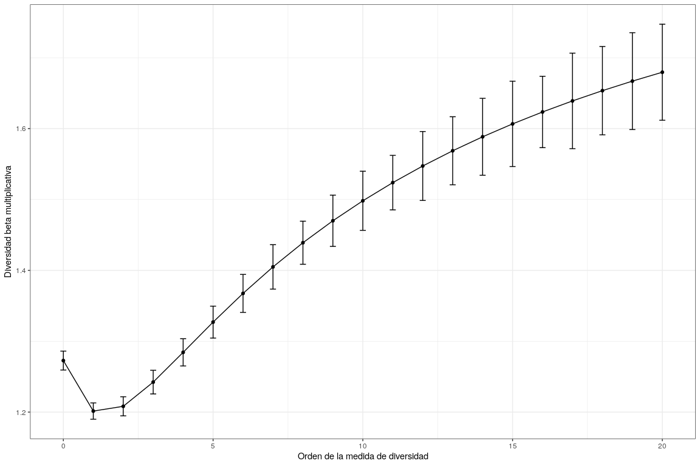
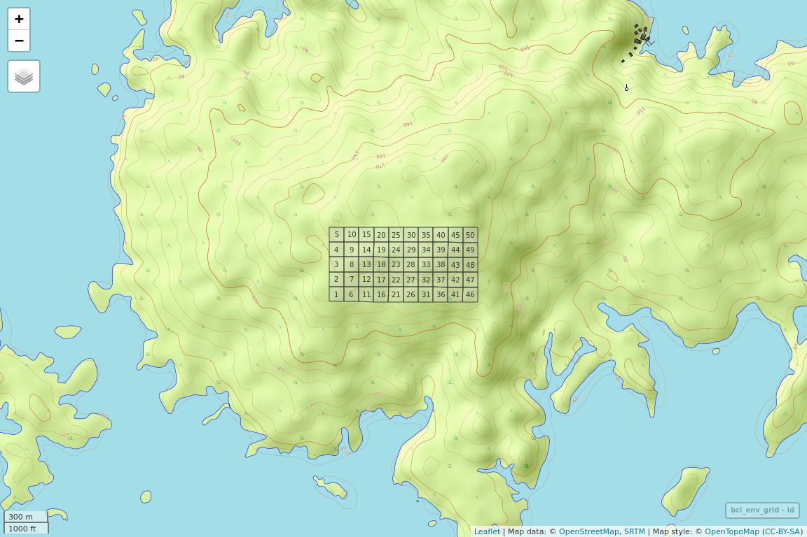

Análisis de diversidad. <br> Parte 2: Diversidad beta
================
JR
2 de diciembre, 2020

``` r
knitr::opts_chunk$set(fig.width=12, fig.height=8)
```

Preámbulo
---------

### Cargar paquetes

``` r
library(vegan)
```

    ## Loading required package: permute

    ## Loading required package: lattice

    ## This is vegan 2.5-6

``` r
library(adespatial)
```

    ## Registered S3 methods overwritten by 'adegraphics':
    ##   method         from
    ##   biplot.dudi    ade4
    ##   kplot.foucart  ade4
    ##   kplot.mcoa     ade4
    ##   kplot.mfa      ade4
    ##   kplot.pta      ade4
    ##   kplot.sepan    ade4
    ##   kplot.statis   ade4
    ##   scatter.coa    ade4
    ##   scatter.dudi   ade4
    ##   scatter.nipals ade4
    ##   scatter.pco    ade4
    ##   score.acm      ade4
    ##   score.mix      ade4
    ##   score.pca      ade4
    ##   screeplot.dudi ade4

    ## Registered S3 method overwritten by 'spdep':
    ##   method   from
    ##   plot.mst ape

    ## Registered S3 methods overwritten by 'adespatial':
    ##   method             from       
    ##   plot.multispati    adegraphics
    ##   print.multispati   ade4       
    ##   summary.multispati ade4

``` r
library(plyr)
library(tidyverse)
```

    ## ── Attaching packages ─── tidyverse 1.2.1 ──

    ## ✔ ggplot2 3.2.1     ✔ purrr   0.3.3
    ## ✔ tibble  2.1.3     ✔ dplyr   0.8.3
    ## ✔ tidyr   1.0.0     ✔ stringr 1.4.0
    ## ✔ readr   1.3.1     ✔ forcats 0.4.0

    ## ── Conflicts ────── tidyverse_conflicts() ──
    ## ✖ dplyr::arrange()   masks plyr::arrange()
    ## ✖ purrr::compact()   masks plyr::compact()
    ## ✖ dplyr::count()     masks plyr::count()
    ## ✖ dplyr::failwith()  masks plyr::failwith()
    ## ✖ dplyr::filter()    masks stats::filter()
    ## ✖ dplyr::id()        masks plyr::id()
    ## ✖ dplyr::lag()       masks stats::lag()
    ## ✖ dplyr::mutate()    masks plyr::mutate()
    ## ✖ dplyr::rename()    masks plyr::rename()
    ## ✖ dplyr::summarise() masks plyr::summarise()
    ## ✖ dplyr::summarize() masks plyr::summarize()

``` r
library(sf)
```

    ## Linking to GEOS 3.8.0, GDAL 3.0.4, PROJ 7.0.0

``` r
library(vegetarian)
library(mapview)
source('biodata/funciones.R')
```

### Cargar datos

``` r
load('biodata/Myrtaceae.Rdata')
load('biodata/matriz_ambiental.Rdata')
mi_fam <- mc_myrtc
bci_env_grid %>% tibble
```

    ## # A tibble: 50 x 1
    ##     .$id $categoria_de_e… $geologia $habitat $quebrada $heterogeneidad…
    ##    <dbl> <fct>            <fct>     <fct>    <fct>                <dbl>
    ##  1     1 c3               Tb        OldSlope Yes                 0.627 
    ##  2     2 c3               Tb        OldLow   Yes                 0.394 
    ##  3     3 c3               Tb        OldLow   No                  0     
    ##  4     4 c3               Tb        OldLow   No                  0     
    ##  5     5 c3               Tb        OldSlope No                  0.461 
    ##  6     6 c3               Tb        OldLow   No                  0.0768
    ##  7     7 c3               Tb        OldLow   Yes                 0.381 
    ##  8     8 c3               Tb        OldLow   Yes                 0.211 
    ##  9     9 c3               Tb        OldLow   No                  0     
    ## 10    10 c3               Tb        OldLow   No                  0     
    ## # … with 40 more rows, and 33 more variables: $UTM.EW <dbl>,
    ## #   $UTM.NS <dbl>, $geomorf_llanura_pct <dbl>, $geomorf_pico_pct <dbl>,
    ## #   $geomorf_interfluvio_pct <dbl>, $geomorf_hombrera_pct <dbl>,
    ## #   $`geomorf_espolón/gajo_pct` <dbl>, $geomorf_vertiente_pct <dbl>,
    ## #   $geomorf_vaguada_pct <dbl>, $geomorf_piedemonte_pct <dbl>,
    ## #   $geomorf_valle_pct <dbl>, $geomorf_sima_pct <dbl>, $Al <dbl>,
    ## #   $B <dbl>, $Ca <dbl>, $Cu <dbl>, $Fe <dbl>, $K <dbl>, $Mg <dbl>,
    ## #   $Mn <dbl>, $P <dbl>, $Zn <dbl>, $N <dbl>, $N.min. <dbl>, $pH <dbl>,
    ## #   $elevacion_media <dbl>, $pendiente_media <dbl>,
    ## #   $orientacion_media <dbl>, $curvatura_perfil_media <dbl>,
    ## #   $curvatura_tangencial_media <dbl>, $geometry <POLYGON [m]>,
    ## #   $abundancia_global <dbl>, $riqueza_global <int>

Diversidad beta
---------------

En la concepción de Whittaker, la diversidad alfa es la local o de sitio, la diversidad beta es la variación espacial de la diversidad entre sitios, y la diversidad gamma es la regional. Se escribe fácilmente, pero definirlo o establecer límites entre una y otra es más complejo.

La diversidad alfa la medimos usando métricas que ponderan comúnmente la riqueza y la equidad. En la diversidad gamma normalmente realizamos el mismo procedimiento, pero aplicado a muestras representativas a escala regional. Sin embargo, la diversidad beta no es tan simple. Dado que la variación espacial de la composición de especies entre sitios se puede abordar de múltiples maneras, la diversidad beta es sin duda un gran desafío.

### Diversidad beta con un único número

``` r
beta_multiplicativa <- calcular_beta_multiplicativa(
  mc = mi_fam,
  orden = 0:20)
```

    ## Warning: Ignoring unknown aesthetics: y

``` r
beta_multiplicativa
```

    ## $beta_multiplicativa
    ## # A tibble: 21 x 3
    ##    orden  beta  error
    ##    <int> <dbl>  <dbl>
    ##  1     0  1.27 0.0133
    ##  2     1  1.20 0.0115
    ##  3     2  1.21 0.0135
    ##  4     3  1.24 0.0167
    ##  5     4  1.28 0.0192
    ##  6     5  1.33 0.0225
    ##  7     6  1.37 0.0268
    ##  8     7  1.40 0.0313
    ##  9     8  1.44 0.0304
    ## 10     9  1.47 0.0362
    ## # … with 11 more rows
    ## 
    ## $grafico



Notar que, para esta matriz de comunidad, la diversidad beta multiplicativa disminuye en escenarios donde se le otorga más importancia a la equidad que a la riqueza. En los datos de mi familia, y en general en cualquier conjunto de datos, esto puede atribuirse a la gran similaridad global entre sitios; en el contexto actual, con composiciones de especies autocorrelacionadas espacialmente, el reemplazo es bajo.

### Contribución de especies a la diversidad beta (SCBD, *species contribution to beta diversity*) y contribución local a la diversidad beta (LCBD *local contribution to beta diversity*)

``` r
determinar_contrib_local_y_especie(
  mc = mi_fam,
  alpha = 0.05,
  nperm = 9999,
  metodo = 'hellinger')
```

    ## $betadiv
    ## $beta
    ##    SStotal    BDtotal 
    ## 4.63346768 0.09456056 
    ## 
    ## $SCBD
    ##          Chamguava schippii       Eugenia coloradoensis 
    ##                  0.39129504                  0.10315994 
    ##        Eugenia galalonensis           Eugenia nesiotica 
    ##                  0.12132302                  0.08307379 
    ##         Eugenia oerstediana           Myrcia gatunensis 
    ##                  0.14756292                  0.08890554 
    ## Psidium friedrichsthalianum 
    ##                  0.06467975 
    ## 
    ## $LCBD
    ##           1           2           3           4           5           6 
    ## 0.034502324 0.021083593 0.016380978 0.017149450 0.010164031 0.030451557 
    ##           7           8           9          10          11          12 
    ## 0.013237353 0.009794359 0.018989300 0.005199322 0.013617440 0.008757331 
    ##          13          14          15          16          17          18 
    ## 0.025849901 0.064059698 0.042113692 0.016894631 0.015254314 0.026597337 
    ##          19          20          21          22          23          24 
    ## 0.126128710 0.027468149 0.022053327 0.003464883 0.016789843 0.016345389 
    ##          25          26          27          28          29          30 
    ## 0.009980862 0.017176982 0.013462996 0.016069545 0.018294037 0.013863527 
    ##          31          32          33          34          35          36 
    ## 0.008251546 0.004859232 0.019761132 0.007171961 0.023576947 0.031075930 
    ##          37          38          39          40          41          42 
    ## 0.018137036 0.008327898 0.010559381 0.012717132 0.009648519 0.006194592 
    ##          43          44          45          46          47          48 
    ## 0.013694652 0.010827300 0.020328969 0.011361467 0.017637132 0.011136593 
    ##          49          50 
    ## 0.015408352 0.048129370 
    ## 
    ## $p.LCBD
    ##      1      2      3      4      5      6      7      8      9     10 
    ## 0.1119 0.2661 0.4203 0.3914 0.7267 0.1331 0.5615 0.7577 0.3245 0.9579 
    ##     11     12     13     14     15     16     17     18     19     20 
    ## 0.5492 0.8291 0.1918 0.0352 0.0781 0.3871 0.4641 0.1707 0.0121 0.1412 
    ##     21     22     23     24     25     26     27     28     29     30 
    ## 0.2280 0.9877 0.3792 0.3967 0.7413 0.3718 0.5444 0.4130 0.3403 0.5188 
    ##     31     32     33     34     35     36     37     38     39     40 
    ## 0.8449 0.9688 0.2876 0.9015 0.2112 0.1089 0.3496 0.8399 0.7111 0.5906 
    ##     41     42     43     44     45     46     47     48     49     50 
    ## 0.7644 0.9383 0.5366 0.6968 0.2860 0.6618 0.3727 0.6893 0.4641 0.0585 
    ## 
    ## $p.adj
    ##     1     2     3     4     5     6     7     8     9    10    11    12 
    ## 1.000 1.000 1.000 1.000 1.000 1.000 1.000 1.000 1.000 1.000 1.000 1.000 
    ##    13    14    15    16    17    18    19    20    21    22    23    24 
    ## 1.000 1.000 1.000 1.000 1.000 1.000 0.605 1.000 1.000 1.000 1.000 1.000 
    ##    25    26    27    28    29    30    31    32    33    34    35    36 
    ## 1.000 1.000 1.000 1.000 1.000 1.000 1.000 1.000 1.000 1.000 1.000 1.000 
    ##    37    38    39    40    41    42    43    44    45    46    47    48 
    ## 1.000 1.000 1.000 1.000 1.000 1.000 1.000 1.000 1.000 1.000 1.000 1.000 
    ##    49    50 
    ## 1.000 1.000 
    ## 
    ## $method
    ## [1] "hellinger" NA         
    ## 
    ## $note
    ## [1] "Info -- This coefficient is Euclidean"
    ## 
    ## $D
    ## [1] NA
    ## 
    ## attr(,"class")
    ## [1] "beta.div"
    ## 
    ## $especies_contribuyen_betadiv
    ##  Chamguava schippii Eugenia oerstediana 
    ##           0.3912950           0.1475629 
    ## 
    ## $sitios_contribuyen_betadiv
    ## [1] "14" "19"
    ## 
    ## $valor_de_ajustado_lcbd
    ##     1     2     3     4     5     6     7     8     9    10    11    12 
    ## 1.000 1.000 1.000 1.000 1.000 1.000 1.000 1.000 1.000 1.000 1.000 1.000 
    ##    13    14    15    16    17    18    19    20    21    22    23    24 
    ## 1.000 1.000 1.000 1.000 1.000 1.000 0.605 1.000 1.000 1.000 1.000 1.000 
    ##    25    26    27    28    29    30    31    32    33    34    35    36 
    ## 1.000 1.000 1.000 1.000 1.000 1.000 1.000 1.000 1.000 1.000 1.000 1.000 
    ##    37    38    39    40    41    42    43    44    45    46    47    48 
    ## 1.000 1.000 1.000 1.000 1.000 1.000 1.000 1.000 1.000 1.000 1.000 1.000 
    ##    49    50 
    ## 1.000 1.000 
    ## 
    ## $sitios_contribuyen_betadiv_ajustado
    ## character(0)

``` r
mapa_cuadros <- mapView(
  bci_env_grid,
  col.regions = 'grey80',
  alpha.regions = 0.3,
  map.types = 'OpenTopoMap',
  legend = F, zoom = 14,
  zcol = 'id') %>% addStaticLabels() %>%
  leaflet::setView(
    lng = -79.85136,
    lat = 9.15097,
    zoom = 15)
```

Utilizar el mapa de cuadros para identificar aquellos que contribuyen más a la diversidad beta. Explorar mapas de variables ambientales (aec\_6).

``` r
mapa_cuadros
```


