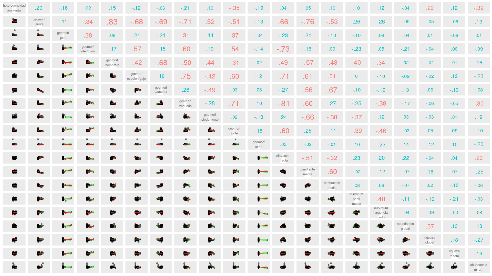
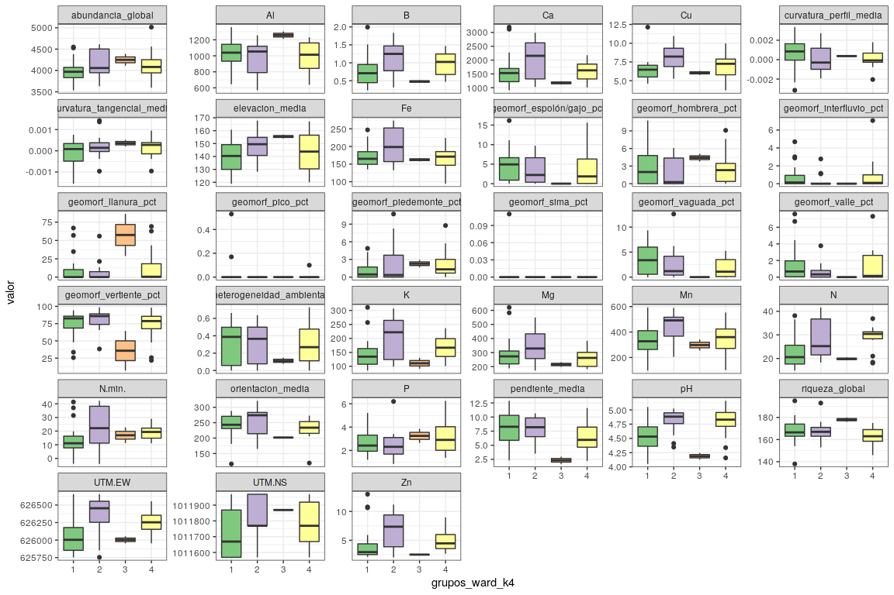

```{r, include=FALSE}
source("aed_1.R", local = knitr::knit_global())
```

# Introducción

La isla de Barro Colorado (BCI, por sus siglas en inglés) se formó al término del canal de Panamá en 1974, desde su creación se ha utilizado como centro de investigación debido a su gran reserva natural. Se considera monumento natural protegido por el gobierno de Panamá junto a las penínsulas Peña Blanca, Bohío, Buena Vista, Frijoles y Gigante. La parcela permanente de 50 hectáreas se encuentra en el bosque húmedo tropical de la isla de Barro Colorado. Se estableció en 1980, desde entonces se han realizado 8 censos (aprox. 1 cada 5 años) en cual se toman en cuenta árboles de tallos leñosos con un diámetro a la altura del pecho (DAP) mayor a 10 mm, y como resultado en cada censo, se han identificado, censado y mapeado más de 350, 000 árboles individuales[@webcenso].

Se ha seleccionado el censo número 8 de esta reserva natural por ser el más reciente y a esta reserva natural en particular debido a la gran cantidad disponible de datos censales que a través de la Ecología numérica nos permitirán conocer rasgos básicos de la estructura y composición de la comunidad de plantas mirtáceas en relación con factores ambientales.

Las mirtáceas ( Myrtaceae Juss) son una familia de  plantas leñosas del orden Myrtales. La mayoría de las especies son árboles, también hay muchas que son arbustos o subarbustos. Algunas especies producen flores y frutos, otras raíces adventicias. Se distribuyen principalmente en zonas tropicales y templadas, con poca representación en la región africana. La familia cuenta con unos 142 géneros y más de 5.500 especies, incluyendo _Psiloxylon_ y _Heteropyxis_, también pueden ser citadas por otros autores como familias monogenéricas Psiloxylaceae y Heteropyxidaceae. Cabe destacar que la familia integra los árboles más altos (110-140 m) del planeta ( _Eucalyptus_) y al género más numeroso (1200‒1800 especies) que existe ( _Syzygium_), los subarbustos rizomatosos de los géneros de la sabana ( _Psidium_, _Campomanesia_ y _Eugenia_), el género _Metrosideros_ que contiene especies arbóreas con muchas raíces adventicias, y otros géneros son lianas trepadoras de raíces. También hay un mangle, el monotípico _Osbornia_, un pequeño árbol que carece de neumatóforos [@wilson2010myrtaceae].

R

En este trabajo se harán estudios de asociación, agrupamiento, diversidad y ecología espacial en relación a factores ambientales con los datos disponibles del censo número de 8 de la parcela permanente de 50-ha con ecología numérica en R para comprender mejor la estructura y composición de la comunidad de mirtáceas en la foresta tropical de Barro Colorado.

# Metodología


Ambito geográfico


La parcela permanente de 50 hectáreas es un bosque húmedo tropical que fue establecido en 1980 por Stephen Hubbell y Robin Foster en la meseta central de la isla de Barro Colorado (latitud 9$^\circ$&nbsp;9'N, longitud 79$^\circ$&nbsp;50'O). Posee 1,000 m de largo por 500 m de ancho, se divide en 1250 cuadrantes de 20x20 m (ver figura \ref{fig:mapa_cuadros_bci}). En la parcela, todos los tallos leñosos con un DAP mayor o igual a 1 cm se encuentran marcados, enumerados, mapeados e identicados hasta el nivel de especie. Cada 5 años, esta parcela es censada para evaluar el cremiento, la mortalidad y el reclutamiento de nuevas generaciones de plantas. Como resultado de estos censos se han registrado mas de 300 especies de árboles, arbustos y palmas con el próposito de conocer la historia de vida de las especies, interacciones y dinámica de la comunidad [@perez2005metodologia].

{width=50%}


Materiales y Métodos


Se exploraron los datos del censo número 8 disponibles en la página web del censo [@webcenso], organizados en dos matrices: la matriz de comunidad, la cual recopila la información referente a las especies de la parcela permanente de 50-ha, y la matriz ambiental, que contiene la información referente a las variables de suelo, geomorfológicas, litológicas y de tipo de habitat. Los análisis, tablas, figuras y gráficos se realizaron con los scripts de análisis de José R. Martínez [@jose_ramon_martinez_batlle_2020_4402362] y con ayuda de los paquetes de R para análisis estadísticos y ecológicos [@citadeR], cabe destacar los paquetes `vegan` [@vegan], `tidyverse` [@tidyverse], `sf` [@sf], `mapview` [@mapview] y `leaflet` [@leaflet] que fueron los más utilizados.


# Resultados

La familia Myrtaceae está presente en la parcela permanente de 50-ha de BCI con una abundancia de 5,579 individuos pertenecientes a 7 especies, de las cuales las más abundantes son *Eugenia galalonensis* y *Eugenia oerstediana*, representadas con 1,975 y 1,838 individuos cada una, y las especies más raras son *Psidium friedrichsthalianum* y *Myrcia gatunensis*, con 58 y 56 individuos respectivamente (ver tabla \ref{tab:abun_sp}).

```{r, echo=FALSE}
knitr::kable(abun_sp,
             caption = "\\label{tab:abun_sp}Abundancia por especie de la familia Myrtaceae")
```

```{r, echo=FALSE, fig.cap="\\label{fig:abun_sp_q}Abundancia de especies por quadrat"}
abun_sp_q
```


<!-- A. Medición de asociación:

¿Se detectan especies asociadas dentro de mi familia seleccionada?
¿Existe asociación entre variables ambientales/atributos? ¿Cuáles variables? -->

La distancia de chi-cuadradado y la distancia de Jacard infieren que las especies del genéro *Eugenia* presentan un patrón de dependencia (*E. oerstediana*, *E. galalonensis*, *E. nesiotica* y  *E. coloradoensis*), debido a que tienen distancias euclideas muy pequeñas, es decir, altos grados de asociación; y las especies *Psidium friedrichsthalianum*, *Myrcia gatunensis* y *Changuava schippii* presentan un posible patrón independiente, no parecen asociarse con otras (ver \ref{fig:matriz_Jacard}). El índice de correlación de Pearson y de Spearman infieren que estos patrones pueden estar produciéndose debido a la disponibilidad de Al, P y escasez de Ca, y a la presencia de los atributos del terreno geomorfología de llanura, elevación media y a una relación negativa con la heterogeneidad ambiental, geomorfología de vertiente, geomorfología de vaguada y pendiente media (ver correlogramas \ref{fig:matriz_pearson} y \ref{fig:matriz_spearman}).


 




<!-- B. Agrupamiento (cluster analysis):
Los cuadros (o quadrats) de 1 hectárea, ¿se organizan en grupos discontinuos según la composición de las especies de mi familia seleccionada?
Si existe algún patrón, ¿es consistente con alguna variable ambiental/atributo?
¿Hay especies indicadoras o con preferencia por determinadas condiciones ambientales/atributos?-->
El método de agrupamiento Ward de varianza mínima en comparación con el mapa de calor sugiere que las mirtáceas de la parcela permanente de 50-ha de BCI se distribuyen en 4 grupos, de 2, 13, 15 y 20 sitios, respectivamente (ver mapa \ref{fig:mapa_ward}). Los métodos de agrupamiento aglomerativos por enlace simple, por enlace completo y por enlace promedio (grupos de pares no ponderados con media aritmética, UPGMA por sus siglas en inglés) destacan la singularidad de este grupo formado por dos sitios (14 y 19), en suma, el muestreo de bootstrap multiescalar respalda este grupo con un probabilidad de bootstrap (BP) de 76 % y probabilidad de valores aproximadamente insesgados (AU) de 99 %, de que se un grupo real (ver dendrograma \ref {fig:bootstrap_multiescalar}). No hay patrones consistentes con alguna variable ambiental o atributo, aunque las mirtáceas tienen claras preferencias por el conjunto de variables (Al, Fe, Mn, N. min., etc ) y atributos del terreno (curvatura perfil media, curvatura tangencial media, elevación media, etc.) (ver correlograma \ref{fig:ward_con_variables}). 

{width=50%}





Para este agrupamiento, el análisis de especies indicadoras mediante IndVal para una significancia menor de 0.005, propuso como especie asociada como indicadora del grupo 3 a *Chamguava schippii*, para el conjunto de grupos 1+2 *Eugenia coloradoensis* y para el conjunto de grupos 3+4 *Eugenia oerstediana*; y el análisis de especies con preferencia por hábitat mediante el coeficiente de correlación biserial puntual para una significancia menor de 0.005, sugirió que *Eugenia coloradoensis* tiene preferencia por el grupo 2, *Chamguava schippii* por el grupo 3 y *Eugenia oerstediana* por el grupo 4.

<!-- C. Diversidad:
Según los análisis de estimación de riqueza, ¿está suficientemente representada mi familia? Consideremos como buena representación un 85%
¿Existe asociación de la diversidad alpha con variables ambientales/atributos? ¿Con cuáles?
¿Existe contribución local o por alguna especie a la diversidad beta?-->


<!-- E. Ecología espacial:
¿Alguna(s) especies de mi familia presenta(n) patrón aglomerado? ¿Cuál(es)? ¿Se asocia con alguna variable?
¿Predicen bien la ocurrencia de dicha(s) especie(s) los modelos de distribución de especies (SDM)? -->


# Discusión


# Agradecimientos

# Información de soporte

\ldots

# *Script* reproducible

\ldots

# Referencias
