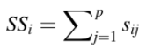
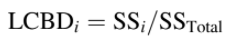
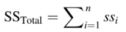
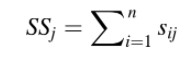
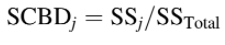
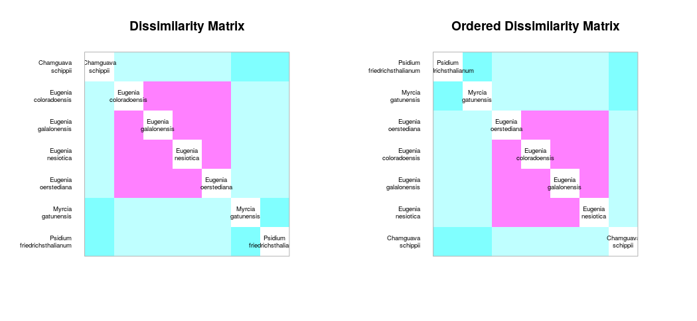
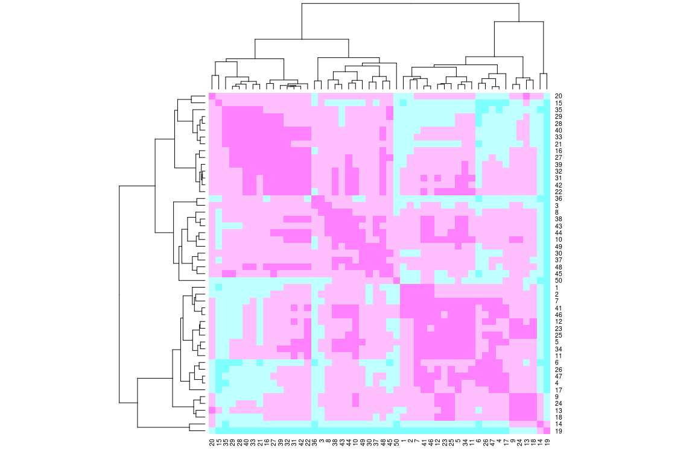
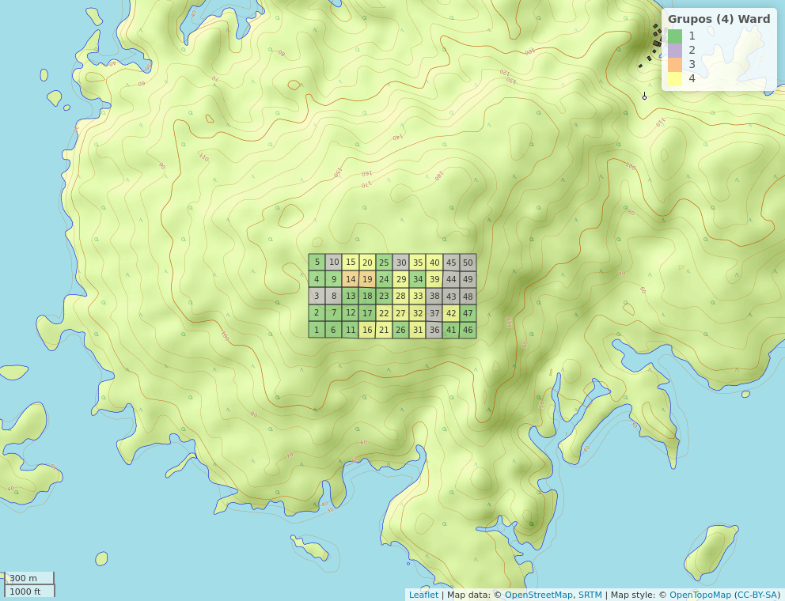
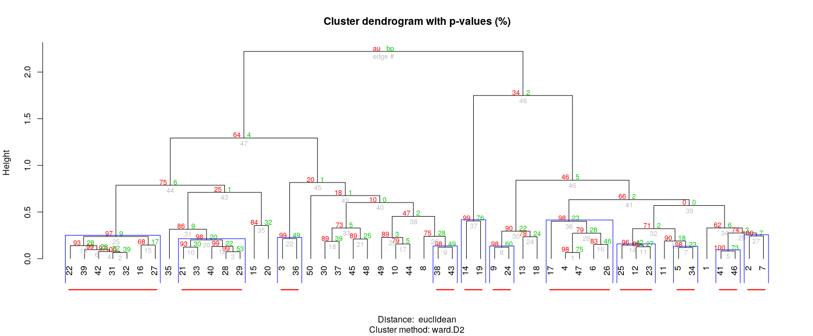

```{r, include=FALSE}
source("aed_1.R", local = knitr::knit_global())
```

# Introducción


Uno de los temas centrales en la ecología de comunidades es cómo controlar la diversidad alfa, es decir, el número de especies que pueden coexistir a escalas localizadas (eg. 1 ha de una parcela). En las plantas esta diversidad puede alcanzar niveles extraordinarios en los bosques ecuatoriales. En el caso de los árboles, la diversidad alpha en pequeños bosques tropicales puede competir con la diversidad de árboles de los bosques templados de todo un hemisferio. Otras formas de vida aumentan la diversidad alfa en los bosques tropicales, especialmente las selvas tropicales, donde los árboles representan sólo el 25% de las especies vegetales. Ésta de las plantas es mayor en las selvas tropicales ecuatoriales que en cualquier otro tipo de vegetación [@wright2002plant].

La isla de Barro Colorado (BCI, por sus siglas en inglés) es un bosque tropical, ésta se formó al término del canal de Panamá en 1914, desde su creación se ha utilizado como centro de investigación debido a su gran reserva natural. Se considera monumento natural protegido por el gobierno de Panamá junto a las penínsulas Peña Blanca, Bohío, Buena Vista, Frijoles y Gigante [@bci_video]. La parcela permanente de 50 hectáreas se encuentra en el bosque caducifolio húmedo tropical de la isla de Barro Colorado. Se estableció en 1980, desde entonces se han realizado 8 censos (aprox. 1 cada 5 años), en los cuales se toman en cuenta árboles de tallos leñosos con un diámetro a la altura del pecho (DAP) mayor a 10 mm, y como resultado en cada censo, se han identificado, censado y mapeado más de 350,000 árboles individuales [@webcenso].

Las mirtáceas (Myrtaceae Juss) son una familia de  plantas leñosas del orden Myrtales, presentes en la parcela permanente de BCI. La mayoría de las especies son árboles, también hay muchas que son arbustos o subarbustos. Algunas especies producen flores y frutos, otras raíces adventicias. Se distribuyen principalmente en zonas tropicales y templadas, con poca representación en la región africana. La familia cuenta con unos 142 géneros y más de 5.500 especies, incluyendo _Psiloxylon_ y _Heteropyxis_, también pueden ser citadas por otros autores como familias monogenéricas Psiloxylaceae y Heteropyxidaceae. Cabe destacar que la familia integra los árboles más altos (110-140 m) del planeta (*Eucalyptus*) y al género más númeroso (1200‒1800 especies) que existe (*Syzygium*), los subarbustos rizomatosos de los géneros de la sabana (*Psidium*, _Campomanesia_ y _Eugenia_), el género _Metrosideros_ que contiene especies arbóreas con muchas raíces adventicias, y otros géneros son lianas trepadoras de raíces. También hay un mangle, el monotípico _Osbornia_, un pequeño árbol que carece de neumatóforos [@wilson2010myrtaceae].

Las mirtaceas de BCI pertenecen a la subtribu Myrteae. Esta subtribu posee especies que son ecológicamente importantes en muchos entornos neotropicales debido a las bayas carnosas que comen aves y mamíferos, y a las flores blancas generalistas que suministran polen y recursos a las abejas. Debido a su importancia ecológica, los investigadores muestran cada vez más interés en las Myrteae como grupo modelo para estudios evolutivos, ecológicos y de conservación en biomas neotropicales. Cerca del 70% de la diversidad de especies descritas se encuentran en solo dos géneros, *Eugenia* y *Myrcia*, y son dos de los géneros de angiospermas más grandes con 1000 y 700 especies, respectivamente. Además, se ha demostrado sistemáticamente que estos dos géneros son hermanos de linajes pobres en especies de la tribu, lo que aumenta la disparidad de la diversidad existente entre clados estrechamente relacionados. La mayor parte de la biodiversidad existente de Myrteae está restringida al Neotrópico. En el continente americano la mayor diversidad de especies se encuentra en las selvas tropicales y la sabana del centro, y el este de Brasil, el escudo de Guayana y el Caribe; una biodiversidad menor, pero aún significativa, se encuentra en la América Central continental y en la cuenca del Amazonas de tierras bajas. La diversidad de especies es relativamente baja en las zonas subtropicales y templadas del sur de Sudamérica (Patagonia) y en los Andes de gran altitud, pero con una importante variedad de géneros endémicos.

En BCI, durante los repetidos censos que se han realizado en la parcela permanente de 50-ha desde 1981 [@webcenso], se han reportado varias especies de mirtáceas, siendo su representatividad relativamente importante en dicho enclave.

Mediante análisis exploratorios preliminares, se detectaron patrones singulares de distribución espacial y de diversidad. Algunas especies mostraron una distribución espacial concentrada (e.g. *Changuava schipii*). Igualmente, varias especies mostraron preliminarmente asociación con variables de suelo y geomorfólógicas. Ninguna investigación ha reportado ni analizado estos patrones a la fecha. El objetivo de este estudio es caracterizar la comunidad de mirtáceas de BCI, con ayuda de técnicas de ecología numérica (e.g. análisis de asociación, agrupamiento, diversidad y ecología espacial en relación a factores ambientales), utilizando como fuente los datos disponibles del censo número de 8 de la parcela permanente de 50-ha.


# Metodología


##Preguntas de investigación

Medición de asociación:
¿Se detectan especies asociadas dentro de las mirtaceas de BCI?
¿Existe asociación entre variables ambientales/atributos? ¿Cuáles variables?

Agrupamiento:
Los cuadros (o quadrats) de 1 hectárea, ¿se organizan en grupos discontinuos según la composición de las especies de mirtáceas?
Si existe algún patrón, ¿es consistente con alguna variable ambiental/atributo?
¿Hay especies indicadoras o con preferencia por determinadas condiciones ambientales/atributos?

Diversidad:
Según los análisis de estimación de riqueza, ¿están representadas suficientemente las mirtáceas en la parcela permanente de 50-ha de BCI?
¿Existe asociación de la diversidad alpha con variables ambientales/atributos? ¿Con cuáles?
¿Existe contribución local o por alguna especie a la diversidad beta?

Ecología espacial:
¿Alguna(s) especies de mirtáceas presenta(n) patrón aglomerado? ¿Cuál(es)? ¿Se asocia con alguna variable?
¿Predicen bien la ocurrencia de dicha(s) especie(s) los modelos de distribución de especies (SDM)?


## Ámbito geográfico

Los datos analizados fueron colectados en la parcela permanente de 50 hectáreas de la isla Barro Colorado (BCI en lo adelante). La parcela está situada en la meseta central de la isla (latitud 9$^\circ$&nbsp;9'N, longitud 79$^\circ$&nbsp;51'O), y fue establecida en 1980 por Stephen Hubbell y Robin Foster. Posee 1,000 m de largo por 500 m de ancho, se divide en 1250 cuadrantes de 20x20 m (ver figura \ref{fig:mapa_cuadros_bci}). En la parcela, todos los tallos leñosos con un diámetro a la altura de pecho (DAP) mayor o igual a 1 cm se encuentran marcados, enumerados, mapeados e identicados hasta el nivel de especie. Cada 5 años, esta parcela es censada para evaluar el crecimiento, la mortalidad y  para el reclutamiento de nuevas generaciones de plantas. Como resultado de estos censos se han registrado mas de 300 especies de árboles, arbustos y palmas con el próposito de conocer la historia de vida de las especies, interacciones y dinámica de la comunidad [@perez2005metodologia]. 

{width=50%}


## Materiales y Métodos

Se ha seleccionado el censo número 8 de esta reserva natural por ser el más reciente y a esta reserva natural en particular debido a la gran cantidad disponible de datos censales que a través de la Ecología numérica que nos permitirán conocer rasgos básicos de la estructura y composición de la comunidad de plantas mirtáceas en relación con factores ambientales.

Se exploraron los datos del censo número 8 disponibles en la página web del censo [@webcenso], organizados en dos matrices: la matriz de comunidad, la cual recopila la información referente a las especies de la parcela permanente de 50-ha, y la matriz ambiental, que contiene la información referente a las variables de suelo, geomorfológicas, litológicas y de tipo de habitat. Los análisis, tablas, figuras y gráficos se realizaron con los scripts de análisis de José R. Martínez [@jose_ramon_martinez_batlle_2020_4402362] y con ayuda de los paquetes de R para análisis estadísticos y ecológicos [@citadeR], cabe destacar los paquetes `vegan` [@vegan], `tidyverse` [@tidyverse], `sf` [@sf], `mapview` [@mapview] y `leaflet` [@leaflet] que fueron los más utilizados.

En los análisis de medición de asociación en modo Q, se utilizaron varias distancias, como  ji-cuadrado, normalizada, Hellinger y Jaccard. Las tres primeras son distancias euclideas, calculadas sobre los datos transformados, apropiadas tanto para los datos cuantitativos como para los datos de presencia-ausencia; y la última, la distancia de Jaccard ($D_J$) se puede expresar como la proporción de especies no compartidas. La distancia de Jaccard es el complemento a 1 de la similaridad de Jaccard ($S_J$), es decir, $D_J$ = 1- $S_J$ , de esta manera para obtener la similaridad, sólo hay que restarle el valor de distancia a 1 ($S_J$ = 1- $D_J$). Se puede usar para evaluar la distancia entre especies, usando como fuente la matriz de comunidad transpuesta convertida a binaria (presencia / ausencia) [@borcard2018numerical].

Para el análisis de medición de asociación en modo R se utilizó el coeficiente de correlación de Pearson, el cual tiene como objetivo medir la fuerza o grado de asociación entre dos variables aleatorias cuantitativas que poseen una distribución normal bivariada conjunta. Alternativamente cuando este no cumple con los supuestos se utiliza coeficiente de correlación no paramétrico de Spearman, se define como el coeficiente de correlación lineal entre los rangos Ri(x) y Ri(y) [@restrepo2007pearson].

Se realizaron análisis de agrupamiento utilizando distintos métodos (e.g. UPGMA, Ward) para explorar la estructura de la comunidad en función de su composición. Para elegir entre métodos se utilizó la correlación cofenética; se consideró al agrupamiento con la correlación más alta como aquel que retiene la mayor parte de la información contenida en la matriz de disimilitud; no obstante, esto no significa necesariamente que este método sea el más adecuado para el objetivo del investigador.  Luego para escoger una cantidad óptima de clusters para cada agrupamiento se utilizó la anchura de la silueta, ésta es una medida del grado de pertenencia de un objeto a su clúster, basada en la disimilitud media entre este objeto y el clúster al que pertenece, comparada con la misma medida del clúster más próximo [@borcard2018numerical].

Los métodos aglomerativos utilizados para constatar y evaluar los grupos que hacían sentido para las mirtáceas de este estudio son desarrollados a continuación:

-El método aglomerativo por enlace simple (*single*), conocido como la clasificación por vecinos más cercanos, aglomera objetos en función de sus disimilitudes más cortas entre pares: la fusión de un objeto con un grupo en un nivel de disimilitud determinado sólo requiere que un objeto de cada grupo que se aglomerare esté vinculado al otro en ese nivel. En consecuencia, el dendrograma resultante de una aglomeración de enlace simple suele mostrar encadenamiento de objetos. La lista de las primeras conexiones que hacen a un objeto miembro de un clúster, o que permite la fusión de dos clústeres, se denomina cadena de conexiones primarias; esta cadena forma el árbol de expansión mínima (MST).

-El método aglomerativo por enlace completo (*complete*), conocido como la clasificación del vecino más lejano, permite que un objeto se agrupe con otro grupo sólo en la disimilitud correspondiente a la del par de objetos más distante; de esta manera con mayor motivo, todos los miembros de los dos grupos están vinculados. Un grupo admite un nuevo miembro sólo a una disimilitud correspondiente al objeto más lejano del grupo. De ello se deduce que cuánto más grande es un grupo, más difícil es aglomerarse con él. La vinculación completa resulta en muchos grupos pequeños separados que se aglomeran a grandes distancias, por lo que este método es interesante para buscar e identificar discontinuidades en los datos.

-El método de grupos de pares no ponderados con media aritmética (UPGMA, por sus siglas en inglés) es el más conocido de la familia métodos aglomerativos por enlace promedio, éstos se basan en las disimilitudes medias entre los objetos o en los centroides de los grupos. El método UPGMA permite que un objeto se una a un grupo en la media de las disimilitudes entre este objeto y todos los miembros del grupo. Cuando dos grupos se unen, lo hacen a la media de las disimilitudes entre todos los miembros de un grupo y todos los miembros del otro.

-El método de agrupación de varianza mínima de Ward se basa en el criterio del modelo lineal de mínimos cuadrados. Su objetivo es definir los grupos de tal manera que la suma de cuadrados dentro del grupo (es decir, el error cuadrático del ANOVA) se minimiza. La suma de errores al cuadrado dentro del grupo puede calcularse como la suma de las distancias al cuadrado entre los miembros de un grupo dividido por el número de objetos. Este método fue seleccionado porque produce grupos con números de elementos más equilibrados, o que evita los grupos de pocos elementos [@borcard2018numerical].

El remuestreo *bootstrap* consiste en muestrear aleatoriamente subconjuntos de los datos y calcular la agrupación en estos subconjuntos. Luego de repetir este proceso un gran número de veces, se cuenta la proporción de los resultados de clustering replicados en los que aparece un cluster determinado. Esta proporción se denomina probabilidad *bootstrap* (BP) del cluster. Adicionalmente, se aplicó el remuestreo *bootstrap* multiescalar, utiliza muestras *bootstrap* de varios tamaños diferentes para estimar el valor p de cada conglomerado. Esta mejora produce valores p "aproximadamente insesgados" (AU) [@borcard2018numerical].

Para evaluar homogeneidad de promedios de las variables ambientales entre los grupos Ward y las variables ambientales fueron ANOVA, que evalúa homogeneidad de medias, y Kruskal-Wallis, que evalúa la homogeneidad de medianas; los cuales hacen sentido para agrupamientos de 3 grupos o más [@jose_ramon_martinez_batlle_2020_4402362].

El análisis de especies indicadoras de los grupos Ward se hizo mediante el método del Valor Indicador (en lo adelante, IndVal), el cual se calcula como el producto de la especificidad de una especie para el grupo objetivo por su fidelidad al grupo objetivo. La especificidad se define por la abundancia media de la especie dentro del grupo objetivo comparada con su abundancia media en todos los grupos; la fidelidad es la proporción de sitios del grupo objetivo en el que está presente la especie. Y el análisis de especies con preferencia por hábitat se realizó mediante el coeficiente de correlación biserial puntual [@borcard2018numerical].

Para medir la diversidad alpha se utilizaron los índices de diversidad, descritos a continuación:


-La equidad de Pielou (denominada también equidad de Shannon) equivale a $J=H_1/H_0$.


-Los tres primeros números de diversidad de Hill : $N_0 =q$ (la riqueza de especies), $N_1 = e^H$ (número de especies abundantes), y $N_1 = 1/$$\lambda$ (inverso de Simpson).


-Los ratios de Hill: $E_1 = N_1/N_0$ (versión de la equidad de Shannon) y $E_2 = N_2/N_0$ (versión de la equidad de Simpson).

La equidad puede relacionarse con la forma de los modelos de abundancia de especies, estos últimos son funciones que describen la forma de los gráficos de rango/abundancia en los que la abscisa clasifica las especies en orden de abundancia decreciente y la ordenada representa las abundancias transformadas en logaritmos. Los cuatro modelos principales son las series geométricas, logarítmicas y lognormales, y el modelo de barra rota. En este orden, la uniformidad aumenta de un modelo a otro en esta secuencia.

Para estimar la riqueza se utilizaron los modelos de enfoque asintótico: a) paramétricos: Modelo homogéneo (estándar y MLE), este asume que todas las especies tienen las mismas probabilidades de incidencia o detección; y no paramétricos: Chao1, el cual utiliza las frecuencias de únicos y duplicados para estimar el número de especies no detectadas, Chao1-bc (forma corregida de sesgo para el estimador Chao1) e iChao1 (estimador Chao1 mejorado); ICE (Estimador de cobertura basado en la incidencia) e ICE-1 (ICE modificado para casos altamente heterogéneos); Jackknife de primer orden, el cual utiliza la frecuencia de los ejemplares únicos para estimar el número de especies no detectadas y jackknife de 2º orden, que utiliza las frecuencias de los únicos y los duplicados para estimar el número de especies no detectadas. Los cuales contienen un intervalo de confianza del 95%, para el cual se utiliza una transformación logarítmica, de modo que el límite inferior del intervalo resultante sea al menos el número de especies observadas. 

Basado en los supuestos de Whittaker, según los cuales la diversidad beta es la variación espacial de la diversidad entre sitios dentro de un área geográfica de interés. Existen diferentes ecuaciones para medir esa variación. De la investigación sobre la diversidad beta dos enfoques: (1) La diversidad beta puede interpretarse como una rotación, es decir, el cambio direccional en la composición de la comunidad a lo largo de un gradiente espacial, temporal o ambiental predefinido. (2) La diversidad beta también puede definirse como la variación de la composición de la comunidad entre unidades de muestreo, sin referencia a un gradiente explícito. Ambos conceptos entran en el ámbito de la definición de Whittaker.
Contribuciones locales a la diversidad beta (LCBD)
La contribución del sitio i a la diversidad beta global es la suma (SSi) de los valores centrados y al cuadrado del sitio (o fila) i en la matriz S:

 

La contribución relativa del sitio i a la diversidad beta, denominada contribución local a la diversidad beta (LCBD), es:



donde 

Contribuciones de las especies a la diversidad beta (SCBD)
La descomposición de la diversidad beta en contribuciones de las especies sólo puede calcularse a partir de una tabla de datos sitio por sitio, y no a partir de una matriz de disimilitud, ya que las abundancias de las especies en los sitios se han perdido en el cálculo de las disimilitudes.
La contribución de la especie j a la diversidad beta global es la suma (SSj) de los valores centrados y al cuadrado de la especie (o columna) j en la matriz S:



La contribución relativa de la especie j a la diversidad beta, denominada contribución de la especie a la diversidad beta (SCBD), es:



donde 


Uno de los estadisticos mas utilizados para medir la correlación espacial es el I de Moran, se construye de la siguiente manera:


Su valor esperado para la uasencia de correlación espacial es:


Para medir los patrones espaciales de las especies y las variables ambientales se utilizaron tanto el correlograma, es un gráfico de los valores de correlación espacial frente a las clases de distancia. Combinado con pruebas estadísticas, un correlograma permite evaluar rápidamente el tipo y el alcance de la estructura de correlación espacial de una variable. 
 La correlación espacial en el ámbito multivariante puede evaluarse y comprobarse mediante un correlograma de Mantel. Básicamente, se calcula un estadístico de Mantel estandarizado rM (análogo al coeficiente r de Pearson) entre una matriz de disimilitud entre sitios y una matriz donde los pares de sitios que pertenecen a la misma clase de distancia reciben el valor 0 y los demás pares, el valor 1. El proceso se repite para cada clase de distancia. Cada valor de rM puede probarse mediante permutaciones. La expectativa del estadístico de Mantel para la ausencia de correlación espacial es rM  0.
como la prueba Mantel, el índice de autocorrelación I de Moran y los mapas de indicadores locales de autocorrelación espacial (en lo adelante Mapas LISA). Primero se aplicó la prueba I de Moran que está contenida en la función `calcular_autocorrelacion`. Luego, se aplicó a las variables ambientales y las abundancias de especies transformadas sin tendencia, lo que resultó en unos clusters LISA que mostraron los patrones significativos de los que se pueden inferir las dependencias inducidas.


# Resultados

La familia Myrtaceae está presente en la parcela permanente de 50-ha de BCI con una abundancia de 5,579 individuos pertenecientes a 7 especies, de las cuales las más abundantes fueron *Eugenia galalonensis* y *Eugenia oerstediana*, representadas con 1,975 y 1,838 individuos cada una, y las especies más raras fueron *Psidium friedrichsthalianum* y *Myrcia gatunensis*, con 58 y 56 individuos respectivamente (ver figura \ref{tab:abun_sp}).

```{r, echo=FALSE}
knitr::kable(abun_sp,
             caption = "\\label{tab:abun_sp}Abundancia por especie de la familia Myrtaceae")
```

```{r, echo=FALSE, fig.cap="\\label{fig:abun_sp_q}Abundancia de especies por quadrat"}
abun_sp_q
```


<!-- A. Medición de asociación:

¿Se detectan especies asociadas dentro de mi familia seleccionada?
¿Existe asociación entre variables ambientales/atributos? ¿Cuáles variables? -->
La distancia de *ji*-cuadradado y la distancia de Jacard resultaron pequeñas entre especies del genéro *Eugenia* (*E. oerstediana*, *E. galalonensis*, *E. nesiotica* y  *E. coloradoensis*), lo cual sugiere un patrón de dependencia, debido a que tienen altos grados de asociación; y las especies *Psidium friedrichsthalianum*, *Myrcia gatunensis* y *Changuava schippii* presentan un posible patrón independiente, no parecen asociarse con otras (ver figura \ref{fig:matriz_Jacard}). La riqueza de la familia presentó asociación estadística, a través del índice de Spearman, en términos positivos con *Al*, * P* y en términos negativos con *Ca*; y la abundancia de mi familia presentó asociación estadística, a través del índice de Spearman y el índice de Pearson, en términos positivos con *Al* y elevación media, y en términos negativos con *Ca*, heterogeneidad ambiental y geomorfología de vaguada (ver figuras \ref{fig:matriz_spearman} y \ref{fig:matriz_pearson}).


 


<!-- B. Agrupamiento (cluster analysis):
Los cuadros (o quadrats) de 1 hectárea, ¿se organizan en grupos discontinuos según la composición de las especies de mi familia seleccionada?
Si existe algún patrón, ¿es consistente con alguna variable ambiental/atributo?
¿Hay especies indicadoras o con preferencia por determinadas condiciones ambientales/atributos?-->
El método de agrupamiento Ward de varianza mínima, conjuntamente con el mapa de calor (ver figura \ref{fig:mapadecalor_ward}), mostró que las mirtáceas de la parcela permanente de 50-ha de BCI se distribuyen en 4 grupos, de 2, 13, 15 y 20 sitios, respectivamente (ver figura \ref{fig:mapa_ward}). Los métodos de agrupamiento aglomerativos por enlace simple, por enlace completo y por enlace promedio (grupos de pares no ponderados con media aritmética, UPGMA por sus siglas en inglés) destacaron la singularidad de este grupo formado por dos sitios (14 y 19). Además, el muestreo de *bootstrap* multiescalar respalda este grupo con un probabilidad de *bootstrap* (BP) de 76 % y probabilidad de valores aproximadamente insesgados (AU) de 99 %, de que sea un grupo real (ver figura \ref {fig:*bootstrap*_multiescalar}). Las mirtáceas presentaron asociación estadística, según el diagrama de cajas, con un conjunto de variables de suelo (*Al, Fe, Mn, N. min.*, etc.) y atributos del terreno (curvatura perfil media, curvatura tangencial media, elevación media, etc.) (ver figura \ref{fig:ward_con_variables}). ANOVA, Kruskal-Walis*


{width=50%}


{width=50%}





Para este agrupamiento, el análisis de especies indicadoras mediante IndVal para una significancia menor de 0.05, propuso como especie asociada como indicadora del grupo 3 a *Chamguava schippii*, para el conjunto de grupos 1+2 *Eugenia coloradoensis* y para el conjunto de grupos 3+4 *Eugenia oerstediana*; y el análisis de especies con preferencia por hábitat mediante el coeficiente de correlación biserial puntual para una significancia menor de 0.005, sugirió que *Eugenia coloradoensis* tiene preferencia por el grupo 2, *Chamguava schippii* por el grupo 3 y *Eugenia oerstediana* por el grupo 4.

<!-- C. Diversidad:
Según los análisis de estimación de riqueza, ¿está suficientemente representada mi familia? Consideremos como buena representación un 85%
¿Existe asociación de la diversidad alpha con variables ambientales/atributos? ¿Con cuáles?
¿Existe contribución local o por alguna especie a la diversidad beta?-->
Según los modelos de estimación de riqueza (*Homogeneous model*, estándar y MLE; los Chao y los Jacknife), la completitud de muestra se alcanzó al 100% para las mirtáceas de este ámbito geográfico por lo que no sería necesario aumentar el esfuerzo de muestreo ya que no se espera encontrar otras especies en BCI*. La diversidad alpha para el agrupamiento Ward, los cuatro grupos presentaban la riqueza máxima (7 especies) con diferentes abundancias (1882, 1205, 553 y 1939, respectivamente). Para los grupos Ward, la riqueza máxima fue estimada y observada, por lo que también se alcanzó la completitud de muestra al 100% y al 98% para el grupo 3 (grupo con la menor abundancia), y no será necesario aumentar los esfuerzos de muestreo.

La riqueza ($N_0$), $E_2$ y $N_2$ de Hill sugieren que la diversidad de mirtáceas presenta una correlación positiva importante con *Al, P, Ca y Fe*, en suma la equidad de Pielou (J), los ratios de Hill ($E_1$ y $E_2$) y $N_2$ infieren una correlación positiva notable con la presencia de la geomorfología de pendiente media.

*Changuava schipii* y *Eugenia oerstediana* son las especies que hacen contribución a la diversidad beta, éstas están bien representadas (la primera con gran dominancia) en los sitios 14 y 19 (grupo 3 Ward) que hacen contribución a la diversidad beta; el 14 fue uno de los cinco sitios que poseen la riqueza máxima (los demás sitios son 13, 17, 22 y 40) y el 19 fue el sitio más abundante con 399 individuos, de los cuales 261 pertenecían a *C. schipii* (ver figura \ref{fig:abun_sp_q}). Además, los sitios 14 y 19 están ubicados uno al lado del otro. El modelo de abundancia de especies muestra que el 56% de la comunidad presenta mayores valores de equidad (log normal 10% y null 46%).

<!-- E. Ecología espacial:
¿Alguna(s) especies de mi familia presenta(n) patrón aglomerado? ¿Cuál(es)? ¿Se asocia con alguna variable?
¿Predicen bien la ocurrencia de dicha(s) especie(s) los modelos de distribución de especies (SDM)? -->
La prueba I de Moran sugiere que las mirtáceas de esta localización presentan patrones aglomerados al menos con la vecindad de primer orden, con excepción de *M. gatunensis* y *E. galalonensis* que muestran un patrón espacial aleatorio. Cabe destacar que para *C. schipii* existe una autocorrelación espacial positiva también para los vecinos de segundo orden y en términos negativos del cuarto al sexto orden; para *E. nesiotica* y *E. oerstediana* una autocorrelacion negativa con vecinos de tercer a cuarto orden y de cuarto a quinto orden, respectivamente, es decir, su abundancia disminuye en esas vecindades cuando aumenta en la de primer orden y viceversa.
 
La autocorrelación mediante la prueba de Mantel muestra que hay una correlación espacial inducida por alguna variable en términos positivos para el primer orden y en términos negativos para el tercer y sexto orden (hasta 500 metros). La prueba Yo de Moran evidencia que *C. schipii* muestra un posible patrón de correlación inversa con el *B, Ca, Zn, N y pH*; para *E. coloradoensis* infiere un patrón en términos positivos con *Ca* y *N. min.* y de igual manera para *E. galalonensis* con la geomorfología de vaguada pct y pendiente media.


# Discusión

La comunidad de mirtáceas de la parcela permante de BCI posee una riqueza de 7 especies con una abundancia de 5579 individuos, la mayor abundancia se registró para las especies *E. galalonensis* (35.40%) y *E. oerstediana* (32.94%) y la menor abundancia para las especies *P. friedrichsthalianum* (1.04%) y *M. gatunensis* (1.004%). En cada quadrat de la parcela BCI podemos encontrar un mínimo de 58 y un máximo de 399 mirtáceas para un promedio de 112 individuos por quadrat.

El 57% de la riqueza, las especies del género *Eugenia*, presentaron altos grados de asociación entre ellas, por lo que supone un patrón de dependencia, a diferencia de las especies *P. friedriechsthalianum*, *M. gatunensis* y *C. schipii* mostraron un posible patrón independiente, por lo que supone que se presentan aleatoriamente en la muestra sin asociarse a las otras especies. 

Las mirtáceas de esta muestra, según el método Ward, se dividen en 4 grupos, cada uno con 2, 13, 15 y 20 sitios respectivamente; el grupo con 2 sitios es respaldado por los métodos de agrupamiento aglomerativo y el *bootstrap* multiescalar (BP de 76% y un AU de 99%) esto infiere que es un grupo natural y real dentro de la localidad. Este agrupamiento no se relaciona específicamente con alguna variable sino por la preferencia de un conjunto de éstas, como lo son *Al* y *Fe*.

Según el análisis de especies indicadoras (IndVal), las especies asociadas como diagnósticas para el agrupamiento Ward, fueron *C. schipii* para el grupo 3, *E. coloradoensis* para el conjunto 1+2 y *E. oerstediana* para el grupo 3+4, esto puede ser debido a sus altas abundancias presentes en estos grupos.

Los estimadores de riqueza demostraron que la completitud de muestra para las mirtáceas en estudio fue alcanzda 100%, lo mismo para los grupos Ward, por lo que inferimos que el esfuerzo de muestreo surtió las necesidas de lugar y no se espera encontrar más especies de en de esta familia en BCI.

Los equidad de Pielou, los números de Hill destacan que la diversidad de mirtáceas posee una correlación positiva con *Al, P, Ca, Fe* y la geomorfología de pendiente media.

Las especies que hacen contribución a la diversidad beta son *C. schipii* y *E. oerstediana*, y los sitios que hacen contribución a esta diversidad son el grupo 14 y 19, coincidencialmente un grupo Ward que posee altas abundancias de las especies antes mencionadas, por lo que este grupo guarda una estrecha relación con la presencia de estas especies.

Las mirtáceas de esta localidad, según el I de Moran, presentan patrones aglomerados para vecinos de primer orden que implican hasta 50 sitios, con excepción de *M. gatunencis*, que como había mencionado antes, presentó un patrón aleatorio; en el caso de *C. schipii*, presenta patrón más aglomerado que las demás debido a que presenta una correlación positiva también con los vecinos de segundo orden y en términos negativos con los vecinos del cuarto al sexto orden, es decir que aumenta o disminuye de forma inversa en estos lugares en relación con el primer y segundo orden.

El modelo de abundancia de especies muestra que el 56% de la comunidad presenta mayores valores de equidad (log normal 10% y null 46%), parece una cifra razonable debido a que el 48% de los quadrats poseen valores 7 y 6 de riqueza,  lo que infiere que los modelos de distribución de especies (SDM) parecen estar prediciendo bien la ocurrencia de dichas especies.


# Agradecimientos

# Información de soporte

\ldots

# *Script* reproducible

\ldots

# Referencias
