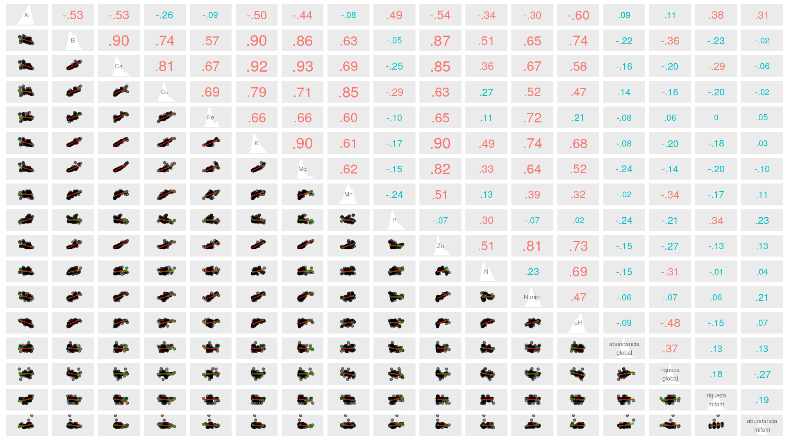

```{r, include=FALSE}
source("aed_1.R", local = knitr::knit_global())
```

# Introducción

La isla de Barro Colorado (BCI, por sus siglas en inglés) se formó al término del canal de Panamá en 1974, desde su creación se ha utilizado como centro de investigación debido a su gran reserva natural. Se considera monumento natural protegido por el gobierno de Panamá junto a las penínsulas Peña Blanca, Bohío, Buena Vista, Frijoles y Gigante. La parcela permanente de 50 hectáreas se encuentra en el bosque húmedo tropical de la isla de Barro Colorado. Se estableció en 1980, desde entonces se han realizado 8 censos (aprox. 1 cada 5 años) en los cuales se toman en cuenta árboles de tallos leñosos con un diámetro a la altura del pecho (DAP) mayor a 10 mm, y como resultado en cada censo, se han identificado, censado y mapeado más de 350, 000 árboles individuales[@webcenso].

Se ha seleccionado el censo número 8 de esta reserva natural por ser el más reciente y a esta reserva natural en particular debido a la gran cantidad disponible de datos censales que a través de la Ecología numérica nos permitirán conocer rasgos básicos de la estructura y composición de la comunidad de plantas mirtáceas en relación con factores ambientales.

Las mirtáceas ( Myrtaceae Juss) son una familia de  plantas leñosas del orden Myrtales. La mayoría de las especies son árboles, también hay muchas que son arbustos o subarbustos. Algunas especies producen flores y frutos, otras raíces adventicias. Se distribuyen principalmente en zonas tropicales y templadas, con poca representación en la región africana. La familia cuenta con unos 142 géneros y más de 5.500 especies, incluyendo _Psiloxylon_ y _Heteropyxis_, también pueden ser citadas por otros autores como familias monogenéricas Psiloxylaceae y Heteropyxidaceae. Cabe destacar que la familia integra los árboles más altos (110-140 m) del planeta ( _Eucalyptus_) y al género más númeroso (1200‒1800 especies) que existe ( _Syzygium_), los subarbustos rizomatosos de los géneros de la sabana ( _Psidium_, _Campomanesia_ y _Eugenia_), el género _Metrosideros_ que contiene especies arbóreas con muchas raíces adventicias, y otros géneros son lianas trepadoras de raíces. También hay un mangle, el monotípico _Osbornia_, un pequeño árbol que carece de neumatóforos [@wilson2010myrtaceae].

Según los análisis exploratorios, las mirtáceas tienen una importante representación en BCI y presentan algunas especies raras de las que muy poco o tal vez nunca hemos escuchado hablar como *Changuava schipii*, que poseen unos patrones de distribución y preferencias por variables ambientales (como *Al* y *P*) muy poco estudiados que sería interesante conocer. Con ayuda de la ecología numérica podemos dar a conocer estos patrones en términos estadísticos con algunos métodos novedosos en el espacio y lenguaje de programación R que esta diseñado para estos fines.

En este trabajo se harán estudios de asociación, agrupamiento, diversidad y ecología espacial en relación a factores ambientales con los datos disponibles del censo número de 8 de la parcela permanente de 50-ha con ecología numérica en R para comprender mejor la estructura y composición de la comunidad de mirtáceas en la foresta tropical de Barro Colorado.


# Metodología


Ambito geográfico

La parcela permanente de 50 hectáreas es un bosque húmedo tropical, fue establecida en 1980 por Stephen Hubbell y Robin Foster en la meseta central de la isla de Barro Colorado (latitud 9$^\circ$&nbsp;9'N, longitud 79$^\circ$&nbsp;51'O). Posee 1,000 m de largo por 500 m de ancho, se divide en 1250 cuadrantes de 20x20 m (ver figura \ref{fig:mapa_cuadros_bci}). En la parcela, todos los tallos leñosos con un DAP mayor o igual a 1 cm se encuentran marcados, enumerados, mapeados e identicados hasta el nivel de especie. Cada 5 años, esta parcela es censada para evaluar el crecimiento, la mortalidad y  para el reclutamiento de nuevas generaciones de plantas. Como resultado de estos censos se han registrado mas de 300 especies de árboles, arbustos y palmas con el próposito de conocer la historia de vida de las especies, interacciones y dinámica de la comunidad [@perez2005metodologia].

{width=50%}


Materiales y Métodos


Se exploraron los datos del censo número 8 disponibles en la página web del censo [@webcenso], organizados en dos matrices: la matriz de comunidad, la cual recopila la información referente a las especies de la parcela permanente de 50-ha, y la matriz ambiental, que contiene la información referente a las variables de suelo, geomorfológicas, litológicas y de tipo de habitat. Los análisis, tablas, figuras y gráficos se realizaron con los scripts de análisis de José R. Martínez [@jose_ramon_martinez_batlle_2020_4402362] y con ayuda de los paquetes de R para análisis estadísticos y ecológicos [@citadeR], cabe destacar los paquetes `vegan` [@vegan], `tidyverse` [@tidyverse], `sf` [@sf], `mapview` [@mapview] y `leaflet` [@leaflet] que fueron los más utilizados.


A. Medición de asociación

Para calcular la asociación entre especies, se utilizó distancia chi-cuadrado y la distancia de Jacard: 
la primera es la distancia euclidiana calculada sobre los datos transformados, la cual es apropiada tanto para los datos cuantitativos como para los de presencia-ausencia;
y la segunda, la distancia de Jaccard (D <sub> J </sub>) se puede expresar como la proporción de especies no compartidas. La distancia de Jaccard es el complemento a 1 de la similaridad de Jaccard (S <sub> J </sub>), es decir, D <sub> J </sub> = 1-S <sub> J </sub> , de esta manera para obtener la similaridad, sólo hay que restarle el valor de distancia a 1 (S <sub> J </sub> = 1-D <sub> J </sub>). Se puede usar para evaluar la distancia entre especies, usando como fuente la matriz de comunidad transpuesta convertida a binaria (presencia / ausencia) [@jose_ramon_martinez_batlle_2020_4402362].

El coeficiente de correlación de Pearson tiene como objetivo medir la fuerza o grado de asociación entre dos variables aleatorias cuantitativas que poseen una distribución normal bivariada conjunta. Alternativamente cuando este no cumple con los supuestos se utiliza coeficiente de correlación no paramétrico de Spearman, se define como el coeficiente de correlación lineal entre los rangos Ri(x) y Ri(y) [@restrepo2007pearson}.


B. Agrupamiento (cluster analysis)

El método con la correlación cofenética se utilizó para escoger los métodos de agrupamiento, bajo el criterio de que el agrupamiento con la correlación cofenética más alta puede considerarse como el que produce el modelo de agrupación que retiene la mayor parte de la información contenida en la matriz de disimilitud, no obstante, esto no significa necesariamente que este método sea el más adecuado para el objetivo del investigador.  Luego para escoger una cantidad óptima de clusters para cada agrupamiento se utilizó la anchura de la silueta, ésta es una medida del grado de pertenencia de un objeto a su clúster, basada en la disimilitud media entre este objeto y del clúster al que pertenece, comparada con la misma medida del clúster más próximo [@borcard2018numerical].

Los métodos aglomerativos utilizados para constatar y evaluar los grupos que hacían sentido para las mirtáceas de este estudio son desarrollados a continuación:

-El método aglomerativo por enlace simple (single), conocido como la clasificación por vecinos más cercanos, aglomera objetos en función de sus disimilitudes más cortas entre pares: la fusión de un objeto con un grupo en un nivel de disimilitud determinado sólo requiere que un objeto de cada grupos que van a aglomerarse esté vinculado al otro en ese nivel. En consecuencia, el dendrograma resultante de una aglomeración de enlace simple suele mostrar encadenamiento de objetos. La lista de las primeras conexiones que hacen a un objeto miembro de un clúster, o que permite la fusión de dos clústeres, se denomina cadena de conexiones primarias; esta cadena forma el árbol de expansión mínima (MST).

-El método aglomerativo por enlace completo (complete), conocido como la clasificación del vecino más lejano, permite que un objeto se agrupe con otro grupo sólo en la disimilitud correspondiente a la del par de objetos más distante; de esta manera con mayor motivo, todos los miembros de los dos grupos están vinculados. Un grupo admite un nuevo miembro sólo a una disimilitud correspondiente al objeto más lejano del grupo. De ello se deduce que cuánto más grande es un grupo, más difícil es aglomerarse con él. La vinculación completa resulta en muchos grupos pequeños separados que se aglomeran a grandes distancias, por lo que este método es interesante para buscar e identificar discontinuidades en los datos.

-El método de grupos de pares no ponderados con media aritmética (UPGMA, por sus siglas en inglés) es el más conocido de la familia métodos aglomerativos por enlace promedio, éstos se basan en las disimilitudes medias entre los objetos o en los centroides de los grupos. El método UPGMA permite que un objeto se una a un grupo en la media de las disimilitudes entre este objeto y todos los miembros del grupo. Cuando dos grupos se unen, lo hacen a la media de las disimilitudes entre todos los miembros de un grupo y todos los miembros del otro.

-El método de agrupación de varianza mínima de Ward se basa en el criterio del modelo lineal de mínimos cuadrados. Su objetivo es definir los grupos de tal manera que la suma de cuadrados dentro del grupo (es decir, el error cuadrado del ANOVA) se minimiza. La suma de errores al cuadrado dentro del grupo puede calcularse como la suma de las distancias al cuadrado entre los miembros de un grupo dividido por el número de objetos. Este método fue seleccionado porque hace más sentido ecológico para el estudio[@borcard2018numerical].

El remuestreo *bootstrap* consiste en muestrear aleatoriamente subconjuntos de los datos y calcular la agrupación en estos subconjuntos. Luego de repetir este proceso un gran número de veces, se cuenta la proporción de los resultados de clustering replicados en los que aparece un cluster determinado. Esta proporción se denomina probabilidad *bootstrap* (BP) del cluster. El remuestreo *bootstrap* multiescalar utiliza muestras *bootstrap* de varios tamaños diferentes para estimar el valor p de cada conglomerado. Esta mejora produce valores p "aproximadamente insesgados" (AU) [@borcard2018numerical].

Las pruebas que se utilizaron para hacer el correlograma entre los grupos Ward y las variables ambientales fueron ANOVA, que evalúa homogeneidad de medias, y Kruskal-Wallis, que evalúa la homogeneidad de medianas; los cuales hacen sentido para agrupamientos de 3 grupos o más[@jose_ramon_martinez_batlle_2020_4402362].

El análisis de especies indicadoras de los grupos Ward se hizo mediante el índice IndVal, el cual se calcula como el producto de la especificidad de una especie para el grupo objetivo por su fidelidad al grupo objetivo. La especificidad se define por la abundancia media de la especie dentro del grupo objetivo comparada con su abundancia media en todos los grupos; la fidelidad es la proporción de sitios del grupo objetivo en el que está presente la especie. Y el análisis de especies con preferencia por hábitat se realizó mediante el coeficiente de correlación biserial puntual[@borcard2018numerical].


C. Diversidad
Para medir la diversidad alpha se utilizaron los índices de diversidad, descritos a continuación:
-La equidad de Pielou (denominada también equidad de Shannon) equivale a *J=H<sub>1</sub>/H<sub>0</sub>*.
-Los tres primeros números de diversidad de Hill : *N<sub>0</sub>=q* (la riqueza de especies), *N<sub>1</sub>=exp(H)*(número de especies abundantes), y *N<sub>1</sub>=1/$\lambda$* (inverso de Simpson). 
-Los ratios de Hill: *E<sub>1</sub>=N<sub>1</sub>/N<sub>0</sub>* (versión de la **equidad de Shannon**) y *E<sub>2</sub>=N<sub>2</sub>/N<sub>0</sub>* (versión de la **equidad de Simpson**).

Basándonos en los supuestos de Whittaker, que dicen que la diversidad beta es la variación espacial de la diversidad entre sitios, medimos la diversidad beta en función de las especies y sitios que contribuían a ésta con la función `determinar_contrib_local_y_especie` de R del script fuente [@jose_ramon_martinez_batlle_2020_4402362].


E. Ecología espacial
Para medir los patrones de ecología espacial de las especies y las variables ambientales se utilizaron los modelos de distribución de especies. Primero se aplicó la prueba I de Moran que está contenida en la función `calcular_autocorrelacion`. Luego, se aplicó  la prueba Yo de Moran a las variables ambientales y las abundancias de especies transformadas sin tendencia, lo que resultó en unos clusters lisa que mostraron los patrones significativos de los que se pueden inferir las dependencias inducidas.


# Resultados

La familia Myrtaceae está presente en la parcela permanente de 50-ha de BCI con una abundancia de 5,579 individuos pertenecientes a 7 especies, de las cuales las más abundantes son *Eugenia galalonensis* y *Eugenia oerstediana*, representadas con 1,975 y 1,838 individuos cada una, y las especies más raras son *Psidium friedrichsthalianum* y *Myrcia gatunensis*, con 58 y 56 individuos respectivamente (ver tabla \ref{tab:abun_sp}).

```{r, echo=FALSE}
knitr::kable(abun_sp,
             caption = "\\label{tab:abun_sp}Abundancia por especie de la familia Myrtaceae")
```

```{r, echo=FALSE, fig.cap="\\label{fig:abun_sp_q}Abundancia de especies por quadrat"}
abun_sp_q
```


<!-- A. Medición de asociación:

¿Se detectan especies asociadas dentro de mi familia seleccionada?
¿Existe asociación entre variables ambientales/atributos? ¿Cuáles variables? -->
La distancia de chi-cuadradado y la distancia de Jacard infieren que las especies del genéro *Eugenia* presentan un patrón de dependencia (*E. oerstediana*, *E. galalonensis*, *E. nesiotica* y  *E. coloradoensis*), debido a que tienen distancias euclideas muy pequeñas, es decir, altos grados de asociación; y las especies *Psidium friedrichsthalianum*, *Myrcia gatunensis* y *Changuava schippii* presentan un posible patrón independiente, no parecen asociarse con otras (ver \ref{fig:matriz_Jacard}). El índice de correlación de Pearson y de Spearman infieren que estos patrones pueden estar produciéndose debido a la disponibilidad de *Al, P* y escasez de *Ca*, y a la presencia de los atributos del terreno geomorfología de llanura, elevación media y a una relación negativa con la heterogeneidad ambiental, geomorfología de vertiente, geomorfología de vaguada y pendiente media (ver correlogramas \ref{fig:matriz_pearson} y \ref{fig:matriz_spearman}).


 




<!-- B. Agrupamiento (cluster analysis):
Los cuadros (o quadrats) de 1 hectárea, ¿se organizan en grupos discontinuos según la composición de las especies de mi familia seleccionada?
Si existe algún patrón, ¿es consistente con alguna variable ambiental/atributo?
¿Hay especies indicadoras o con preferencia por determinadas condiciones ambientales/atributos?-->
El método de agrupamiento Ward de varianza mínima en comparación con el mapa de calor sugiere que las mirtáceas de la parcela permanente de 50-ha de BCI se distribuyen en 4 grupos, de 2, 13, 15 y 20 sitios, respectivamente (ver mapa \ref{fig:mapa_ward}). Los métodos de agrupamiento aglomerativos por enlace simple, por enlace completo y por enlace promedio (grupos de pares no ponderados con media aritmética, UPGMA por sus siglas en inglés) destacan la singularidad de este grupo formado por dos sitios (14 y 19), en suma, el muestreo de *bootstrap* multiescalar respalda este grupo con un probabilidad de *bootstrap* (BP) de 76 % y probabilidad de valores aproximadamente insesgados (AU) de 99 %, de que se un grupo real (ver dendrograma \ref {fig:*bootstrap*_multiescalar}). No hay patrones consistentes con alguna variable ambiental o atributo, aunque las mirtáceas tienen claras preferencias por el conjunto de variables (*Al, Fe, Mn, N. min.*, etc.) y atributos del terreno (curvatura perfil media, curvatura tangencial media, elevación media, etc.) (ver correlograma \ref{fig:ward_con_variables}). 

{width=50%}


Para este agrupamiento, el análisis de especies indicadoras mediante IndVal para una significancia menor de 0.005, propuso como especie asociada como indicadora del grupo 3 a *Chamguava schippii*, para el conjunto de grupos 1+2 *Eugenia coloradoensis* y para el conjunto de grupos 3+4 *Eugenia oerstediana*; y el análisis de especies con preferencia por hábitat mediante el coeficiente de correlación biserial puntual para una significancia menor de 0.005, sugirió que *Eugenia coloradoensis* tiene preferencia por el grupo 2, *Chamguava schippii* por el grupo 3 y *Eugenia oerstediana* por el grupo 4.

<!-- C. Diversidad:
Según los análisis de estimación de riqueza, ¿está suficientemente representada mi familia? Consideremos como buena representación un 85%
¿Existe asociación de la diversidad alpha con variables ambientales/atributos? ¿Con cuáles?
¿Existe contribución local o por alguna especie a la diversidad beta?-->
Según los análisis de estimación de riqueza (Homogeneous model, Homogeneous, los Chao y los Jacknife), la completitud de muestra se alcanzó al 100% para las mirtáceas de este ámbito geográfico por lo que no sería necesario aumentar el esfuerzo de muestreo ya que no se espera encontrar otras especies en BCI. La diversidad alpha para los grupos Ward, los cuatro presentaban la riqueza máxima (7 especies) con diferentes abundancias (1882, 1205, 553 y 1939, respectivamente). Para los grupos Ward, la riqueza máxima fue estimada y observada, por lo que también se alcanzó la completitud de muestra al 100% y al 98% para el grupo 3 (grupo con la menor abundancia), y no será necesario aumentar los esfuerzos de muestreo.

La riqueza (N<sub>0</sub>), E<sub>2</sub> y N<sub>2 de Hill sugieren que la diversidad de mirtáceas presenta una correlación positiva importante con *Al, P, Ca y Fe*, en suma la equidad de Pielou (J), los ratios de Hill (E<sub>1</sub> y E<sub>2</sub>) y N<sub>2 infieren una correlación positiva notable con la presencia de la geomorfología de pendiente media.

*Changuava schipii* y *Eugenia oerstediana* son las especies que hacen contribución a la diversidad beta, éstas están bien representadas (la primera con gran dominancia) en los sitios 14 y 19 (grupo 3 Ward) que hacen contribución a la diversidad beta, el 14 es uno de los cinco sitios que poseen la riqueza máxima (los demás sitios son 13, 17, 22 y 40). Este patrón puede estar relacionado con las preferencias de este grupo.

<!-- E. Ecología espacial:
¿Alguna(s) especies de mi familia presenta(n) patrón aglomerado? ¿Cuál(es)? ¿Se asocia con alguna variable?
¿Predicen bien la ocurrencia de dicha(s) especie(s) los modelos de distribución de especies (SDM)? -->
La prueba I de Moran sugiere que las mirtáceas de esta localización presentan patrones aglomerados al menos con la vecindad de primer orden que implica hasta 50 sitios, con excepción de *M. gatunensis* que muestra un patrón espacial aleatorio. Cabe destacar que para *C. schipii* existe una autocorrelación espacial en términos positivos también para los vecinos de segundo orden y en términos negativos del cuarto al sexto orden; para *E. nesiotica* y *E. oerstediana* una autocorrelacion negativa con vecinos de tercer a cuarto orden y de cuarto a quinto orden, respectivamente, es decir, su abundancia disminuye en esas vecindades cuando aumenta en la de primer orden y viceversa. El modelo de abundancia de especies muestra que el 56% de la comunidad presenta mayores valores de equidad (log normal 10% y null 46%).
 
La autocorrelación mediante la prueba de Mantel muestra que hay una correlación espacial inducida por alguna variable en términos positivos para el primer orden y en términos negativos para el tercer y sexto orden (hasta 500 metros). La prueba Yo de Moran evidencia que *C. schipii* muestra un posible patrón de correlación inversa con el *B, Ca, Zn, N y pH*; para *E. coloradoensis* infiere un patrón en términos positivos con *Ca* y *N. min.* y de igual manera para *E. galalonensis* con la geomorfología de vaguada pct y pendiente media.


# Discusión

La comunidad de mirtáceas de la parcela permante de BCI posee una riqueza de 7 especies con una abundancia de 5579 individuos, la mayor abundancia se registró para las especies *E. galalonensis* (35.40%) y *E. oerstediana* (32.94%) y la menor abundancia para las especies *P. friedrichsthalianum* (1.04%) y *M. gatunensis* (1.004%). En cada quadrat de la parcela BCI podemos encontrar un mínimo de 58 y un máximo de 399 mirtáceas para un promedio de 112 individuos por quadrat.

El 57% de la riqueza, las especies del género *Eugenia*, presentaron altos grados de asociación entre ellas, por lo que supone un patrón de dependencia, a diferencia de las especies *P. friedriechsthalianum*, *M. gatunensis* y *C. schipii* mostraron un posible patrón independiente, por lo que supone que se presentan aleatoriamente en la muestra sin asociarse a las otras especies. 

Las mirtáceas de esta muestra, según el método Ward, se dividen en 4 grupos, cada uno con 2, 13, 15 y 20 sitios respectivamente; el grupo con 2 sitios es respaldado por los métodos de agrupamiento aglomerativo y el *bootstrap* multiescalar (BP de 76% y un AU de 99%) esto infiere que es un grupo natural y real dentro de la localidad. Este agrupamiento no se relaciona específicamente con alguna variable sino por la preferencia de un conjunto de éstas, como lo son *Al* y *Fe*.

Según el análisis de especies indicadoras (IndVal), las especies asociadas como diagnósticas para el agrupamiento Ward, fueron *C. schipii* para el grupo 3, *E. coloradoensis* para el conjunto 1+2 y *E. oerstediana* para el grupo 3+4, esto puede ser debido a sus altas abundancias presentes en estos grupos.

Los estimadores de riqueza demostraron que la completitud de muestra para las mirtáceas en estudio fue alcanzda 100%, lo mismo para los grupos Ward, por lo que inferimos que el esfuerzo de muestreo surtió las necesidas de lugar y no se espera encontrar más especies de en de esta familia en BCI.

Los equidad de Pielou, los números de Hill destacan que la diversidad de mirtáceas posee una correlación positiva con *Al, P, Ca, Fe* y la geomorfología de pendiente media.

Las especies que hacen contribución a la diversidad beta son *C. schipii* y *E. oerstediana*, y los sitios que hacen contribución a esta diversidad son el grupo 14 y 19, coincidencialmente un grupo Ward que posee altas abundancias de las especies antes mencionadas, por lo que este grupo guarda una estrecha relación con la presencia de estas especies.

Las mirtáceas de esta localidad, según el I de Moran, presentan patrones aglomerados para vecinos de primer orden que implican hasta 50 sitios, con excepción de *M. gatunencis*, que como había mencionado antes, presentó un patrón aleatorio; en el caso de *C. schipii*, presenta patrón más aglomerado que las demás debido a que presenta una correlación positiva también con los vecinos de segundo orden y en términos negativos con los vecinos del cuarto al sexto orden, es decir que aumenta o disminuye de forma inversa en estos lugares en relación con el primer y segundo orden.

El modelo de abundancia de especies muestra que el 56% de la comunidad presenta mayores valores de equidad (log normal 10% y null 46%), parece una cifra razonable debido a que el 48% de los quadrats poseen valores 7 y 6 de riqueza,  lo que infiere que los modelos de distribución de especies (SDM) parecen estar prediciendo bien la ocurrencia de dichas especies.


# Agradecimientos

# Información de soporte

\ldots

# *Script* reproducible

\ldots

# Referencias
