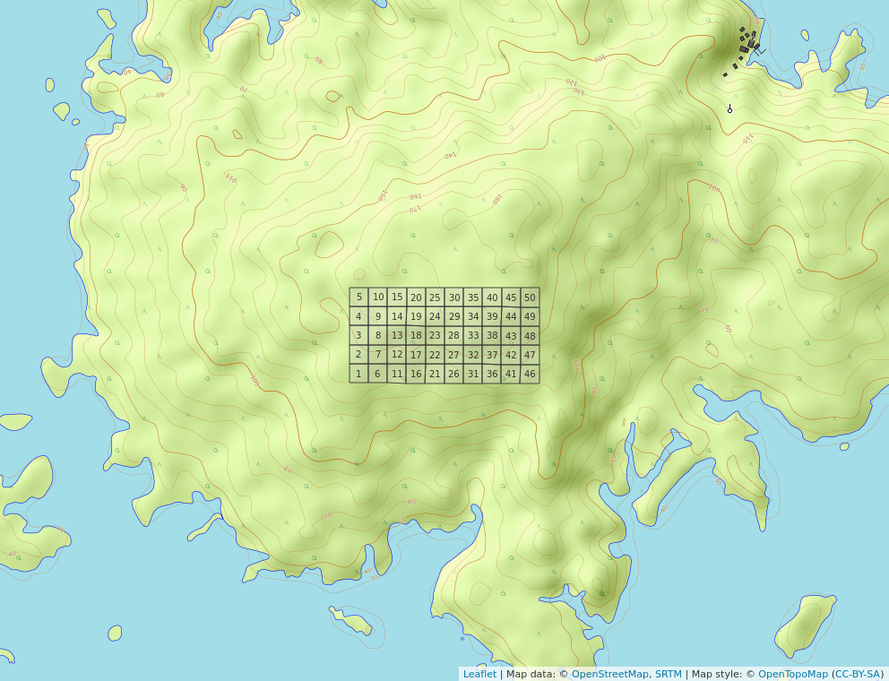
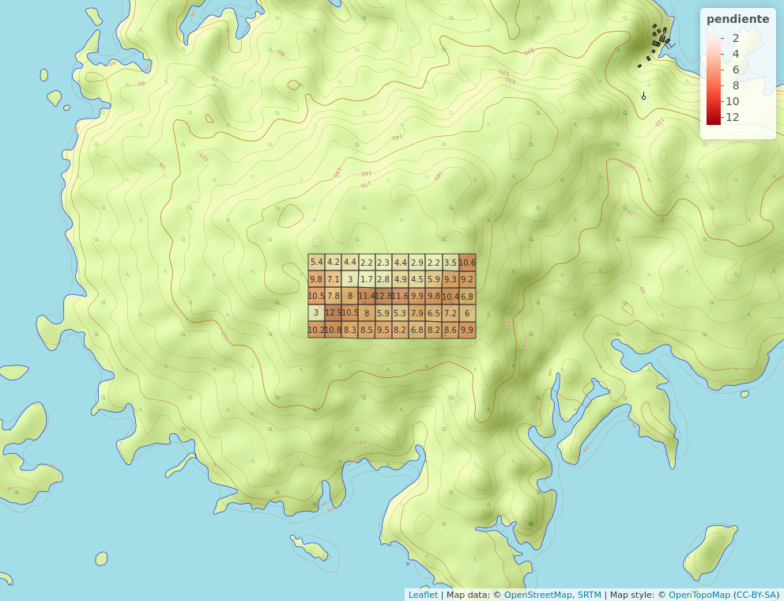

```{r, include=FALSE}
source("aed_1.R", local = knitr::knit_global())
```

# Introducción

La isla de Barro Colorado (BCI, por sus siglas en inglés) se formó al término del canal de Panamá en 1974, desde su creación se ha utilizado como centro de investigación debido a su gran reserva natural. Se considera monumento natural protegido por el gobierno de Panamá junto a las penínsulas Peña Blanca, Bohío, Buena Vista, Frijoles y Gigante. La parcela permanente de 50 hectáreas se encuentra en el bosque húmedo tropical de la isla de Barro Colorado. Se estableció en 1980, desde entonces se han realizado 8 censos (aprox. 1 cada 5 años) en cual se toman en cuenta árboles de tallos leñosos con un diámetro a la altura del pecho (DAP) mayor a 10 mm, y como resultado en cada censo, se han identificado, censado y mapeado más de 350, 000 árboles individuales[@webcenso].

Se ha seleccionado el censo número 8 de esta reserva natural por ser el más reciente y a esta reserva natural en particular debido a la gran cantidad disponible de datos censales que a través de la Ecología numérica nos permitirán conocer rasgos básicos de la estructura y composición de la comunidad de plantas mirtáceas en relación con factores ambientales.

Las mirtáceas ( _Myrtaceae_ Juss) son una familia de  plantas leñosas del orden Myrtales. La mayoría de las especies son árboles, también hay muchas que son arbustos o subarbustos. Algunas especies producen flores y frutos, otras raíces adventicias. Se distribuyen principalmente en zonas tropicales y templadas, con poca representación en la región africana. La familia cuenta con unos 142 géneros y más de 5.500 especies, incluyendo _Psiloxylon_ y _Heteropyxis_, también pueden ser citadas por otros autores como familias monogenéricas Psiloxylaceae y Heteropyxidaceae. Cabe destacar que la familia integra los árboles más altos (110-140 m) del planeta ( _Eucalyptus_) y al género más numeroso (1200‒1800 especies) que existe ( _Syzygium_), los subarbustos rizomatosos de los géneros de la sabana ( _Psidium_, _Campomanesia_ y _Eugenia_), el género _Metrosideros_ que contiene especies arbóreas con muchas raíces adventicias, y otros géneros son lianas trepadoras de raíces. También hay un mangle, el monotípico _Osbornia_, un pequeño árbol que carece de neumatóforos [@wilson2010myrtaceae].

R

En este trabajo se harán estudios de asociación, agrupamiento, diversidad y ecología espacial en relación a factores ambientales con los datos disponibles del censo número de 8 de la parcela permanente de 50-ha con ecología numérica en R para comprender mejor la estructura y composición de la comunidad de mirtáceas en la foresta tropical de Barro Colorado.

# Metodología


Ambito geográfico


La parcela permanente de 50 hectáreas es un bosque húmedo tropical que fue establecido en 1980 por Stephen Hubbell y Robin Foster en la meseta central de la isla de Barro Colorado (latitud 9$^\circ$&nbsp;9'N, longitud 79$^\circ$&nbsp;50'O). Posee 1,000 m de largo por 500 m de ancho, se divide en 1250 cuadrantes de 20x20 m (ver figura \ref{fig:mapa_cuadros_bci}). En la parcela, todos los tallos leñosos con un DAP mayor o igual a 1 cm se encuentran marcados, enumerados, mapeados e identicados hasta el nivel de especie. Cada 5 años, esta parcela es censada para evaluar el cremiento, la mortalidad y el reclutamiento de nuevas generaciones de plantas. Como resultado de estos censos se han registrado mas de 300 especies de árboles, arbustos y palmas con el próposito de conocer la historia de vida de las especies, interacciones y dinámica de la comunidad [@perez2005metodologia].

{width=50%}


Materiales y Métodos


Se exploraron los datos del censo número 8 disponibles en la página web del censo [@webcenso], organizados en dos matrices: la matriz de comunidad, la cual recopila la información referente a las especies de la familia _Myrtaceae_, y la matriz ambiental, que contiene la información referente a las variables de suelo, geomorfologicas, litologicas y de tipo de habitat [@jose_ramon_martinez_batlle_2020_4402362]. Los análisis, tablas, figuras y gráficos se realizaron con ayuda de los paquetes de R para análisis estadísticos y ecológicos [@citadeR], cabe destacar los paquetes `vegan` [@vegan], `tidyverse` [@tidyverse], `sf` [@sf], `mapview` [@mapview] y `leaflet` [@leaflet] que fueron los más utilizados.

<!-- Analisis exploratorio de datos -->
El análisis exploratorio de datos (AED) permite obtener una visión general de los datos, transformar o recodificar algunas variables y orientar los análisis posteriores. Se exploraron la matriz de comunidad y la matriz ambiental para obtener la riqueza numérica y abundacia de especies por quadrat y de la comunidad global, y estos parámetros se correlacionaron con las variables ambientales para obtener una visión general de cómo se distribuyen las mirtáceas en la parcela permanente de BCI, lo cual ayudó a seleccionar correctamente los análisis más avanzados [@borcard2018numerical].

A. Medición de asociación

Modo Q para datos cuantitativos de especies (abundancia):
Matriz de distancia euclídea, utilizando la transformación * Hellinger *
La distancia de cuerda es una distancia euclidiana calculada sobre vectores de sitio normalizados a la longitud 1; esta normalización se denomina transformación de cuerda. La normalización se realiza mediante la función decostand() de vegan, argumento normalize. La distancia de cuerda también puede calcularse en un solo paso utilizando la función dist.ldc() del paquete adespatial con el argumento chord.
La distancia Hellinger es una distancia euclidiana entre vectores de sitios en la que los valores de abundancia se dividen primero por la abundancia total del sitio, y el resultado se transforma en raíz cuadrada; esto se llama la transformación Hellinger. La transformación de Hellinger es también la transformación de cuerda de los datos de abundancia transformados en raíz cuadrada. La transformación de Hellinger se obtiene en un solo paso por decostado con el argumento hellinger. La distancia Hellinger también se puede calcular en un solo paso utilizando la función dist.ldc() del paquete adespatial, cuyo argumento hellinger es el predeterminado.

Modo Q para datos binarios (presencia / ausencia):
La índice de disimilaridad de Jaccard o distancia de Jaccard (** D <sub> J </sub> **) se puede expresar como "la proporción de especies no compartidas".
Como la distancia de Jaccard ( D J ) es el complemento a 1 de la similaridad de Jaccard ( S J ), es decir, D J = 1-S J , y dado que arriba calculamos la distancia, para obtener la similaridad, sólo hay que restarle el valor de distancia a 1 ( S J = 1-D J ).
La fórmula de la similaridad de Jaccard es S J = a / (a + b + c) , donde a es el número de especies compartidas (presentes en ambos sitios comparados), b el número de especies exclusivas del sitio 2, y c el número de especies exclusivas del sitio 1.
Mapa de calor

Modo Q para datos cuantitativos, NO de abundancia de especies (variables ambientales)
variables de suelo, todas cuantitativas, puntuaciones z.
distancia euclidiana D1. "Se calcula mediante la fórmula de Pitágoras, a partir de puntos situados en un espacio p-dimensional llamado espacio métrico o euclidiano" (Legendre y Legendre 2012, p. 299).
la D1 se calcula sobre variables estandarizadas (puntuaciones z). La normalización Aquí se podría calcular una matriz de distancias euclidianas sobre las variables ambientales (estandarizadas) de nuestro conjunto de datos env.

Modo Q para datos cualitativos y cuantitativos (mixtos), NO de abundancia de especies (variables ambientales)
hetereogeneidad_ambiental, habitat y quebrada. 

Modo R para datos cuantitativos de especies (abundancia)
grado de asociación entre especies, NO entre sitios
transformación Chi a la matriz de comunidad transpuesta, se calcula la distancia euclidea y se crea el mapa de calor.
transformación chi-cuadrado: la distancia euclidiana calculada sobre los datos transformados de esa manera produce la distancia chi-cuadrado, que es apropiada tanto para los datos cuantitativos como para los de presencia-ausencia. de presencia y ausencia.


Modo R para datos cuantitativos, NO de abundancia de especies (variables ambientales)
índice de correlación de Pearson. Sin embargo, si los datos no presentan distribución normal, puedes emplear métricas más flexibles, como el índice rho de Spearman

B. Agrupamiento (cluster analysis):
Correlación cofenética
Anchura de silueta
UPGMA
WARD
Remuestro de bootstrap y BP
Remuestreo pro medio de Bootstrap multiescalar y AU
Para UPGMA:
Homogeneidad de promedios, pruebas t (medias), distribucion t de student, suma de rangos de wilcoxon (medianas)
Para WARD:
ANOVA y Kruskal-Wallis
Analisis de especies indicadoras INDVal
Especies con preferencia de habitat: coeficiente de correlacion biserial puntual

C. Diversidad:
Diversidad alpha
Matriz de correlacion de Pearson
Modelos de abundancia de especie
Rarefaccion- Curva de rarefaccion
Riqueza de especies estimación y comparación, completitud de muestra
Enfoques ansioticos- Chao
Enfoques no ansioticos- Chao

E. Ecología espacial:
Autocorrelacion espacial mediante correlograma
Autocorrelacion mediante Prueba de Mantel (Matrices de distancia)
I de Moran global aplicado a abundancia de especies transformadas sin tendencia
Yo de Moran local


# Resultados

Preguntas de investigación
A. Medición de asociación:

¿Se detectan especies asociadas dentro de mi familia seleccionada?
¿Existe asociación entre variables ambientales/atributos? ¿Cuáles variables?

B. Agrupamiento (cluster analysis):
Los cuadros (o quadrats) de 1 hectárea, ¿se organizan en grupos discontinuos según la composición de las especies de mi familia seleccionada?
Si existe algún patrón, ¿es consistente con alguna variable ambiental/atributo?
¿Hay especies indicadoras o con preferencia por determinadas condiciones ambientales/atributos?

C. Diversidad:
Según los análisis de estimación de riqueza, ¿está suficientemente representada mi familia? Consideremos como buena representación un 85%
¿Existe asociación de la diversidad alpha con variables ambientales/atributos? ¿Con cuáles?
¿Existe contribución local o por alguna especie a la diversidad beta?

E. Ecología espacial:
¿Alguna(s) especies de mi familia presenta(n) patrón aglomerado? ¿Cuál(es)? ¿Se asocia con alguna variable?
¿Predicen bien la ocurrencia de dicha(s) especie(s) los modelos de distribución de especies (SDM)? 

La tabla \ref{tab:abun_sp} y la figura \ref{fig:abun_sp_q} visualiza estos resultados a continuación.


```{r, echo=FALSE}
knitr::kable(abun_sp,
             caption = "\\label{tab:abun_sp}Abundancia por especie de la familia Myrtaceae")
```

```{r, echo=FALSE, fig.cap="\\label{fig:abun_sp_q}Abundancia de especies por quadrat"}
abun_sp_q
```

Patrón de riqueza... (ver Figura \ref{fig:mapa_cuadros_riq_mi_familia})

{width=50%}

Rangos de ph... (ver Figuras \ref{fig:mapa_cuadros_ph} y \ref{fig:mapa_cuadros_pendiente}).

{width=50%}


{width=50%}

En la matriz, ... (ver figura \ref{fig:matriz_disimilaridad_jacard})


![]
# Discusión


# Agradecimientos

# Información de soporte

\ldots

# *Script* reproducible

\ldots

# Referencias
