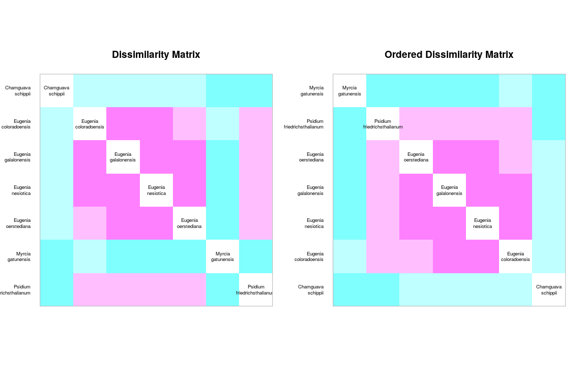
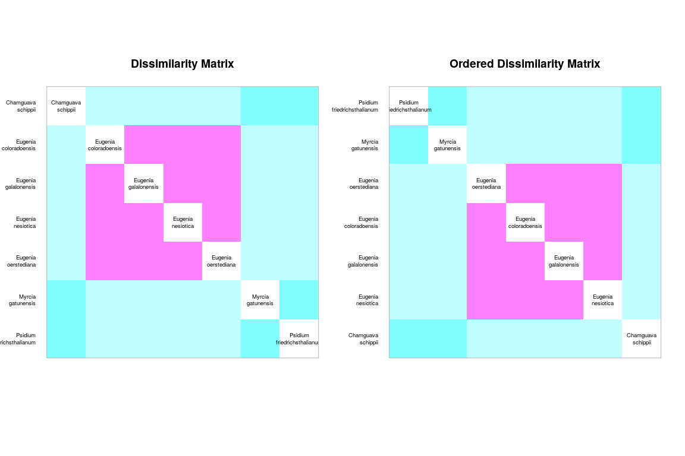
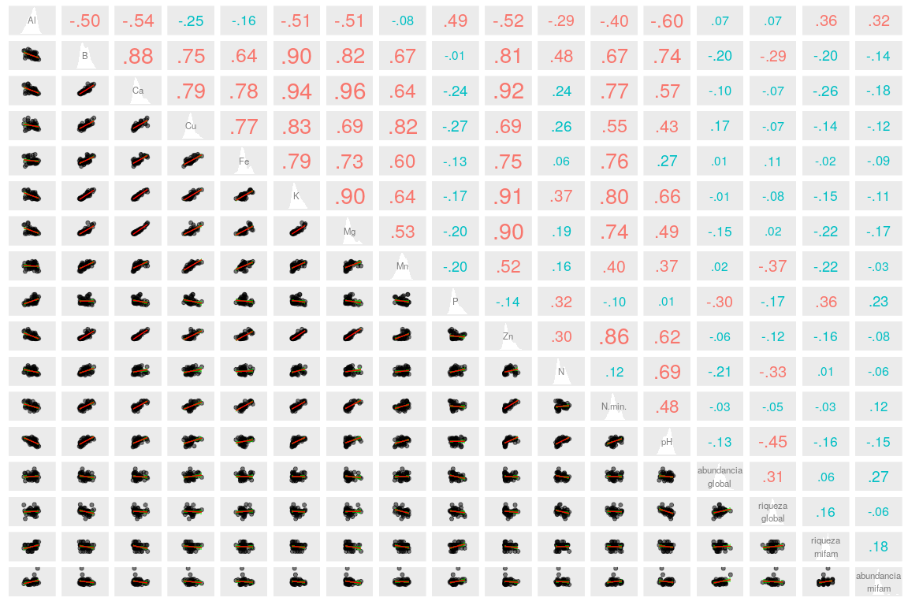
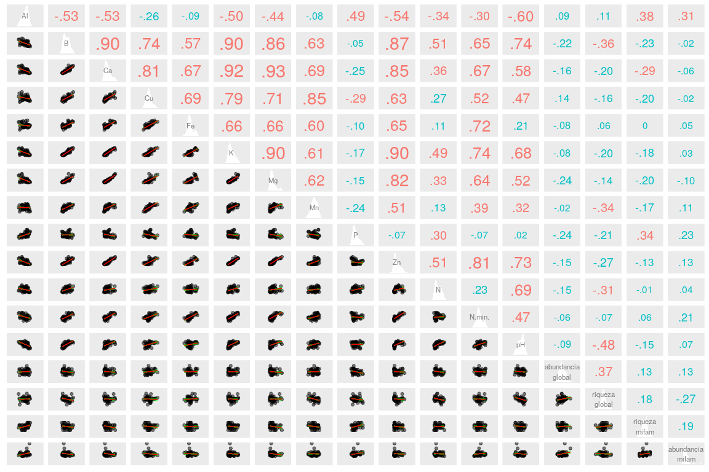
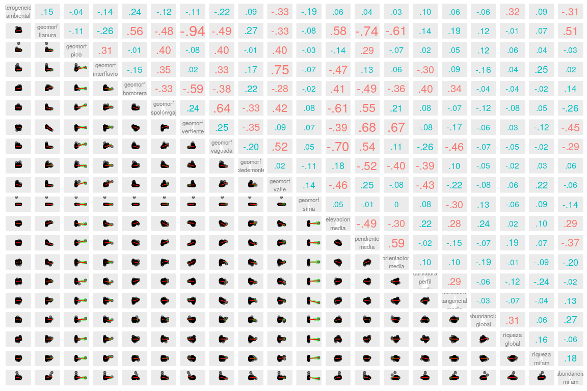
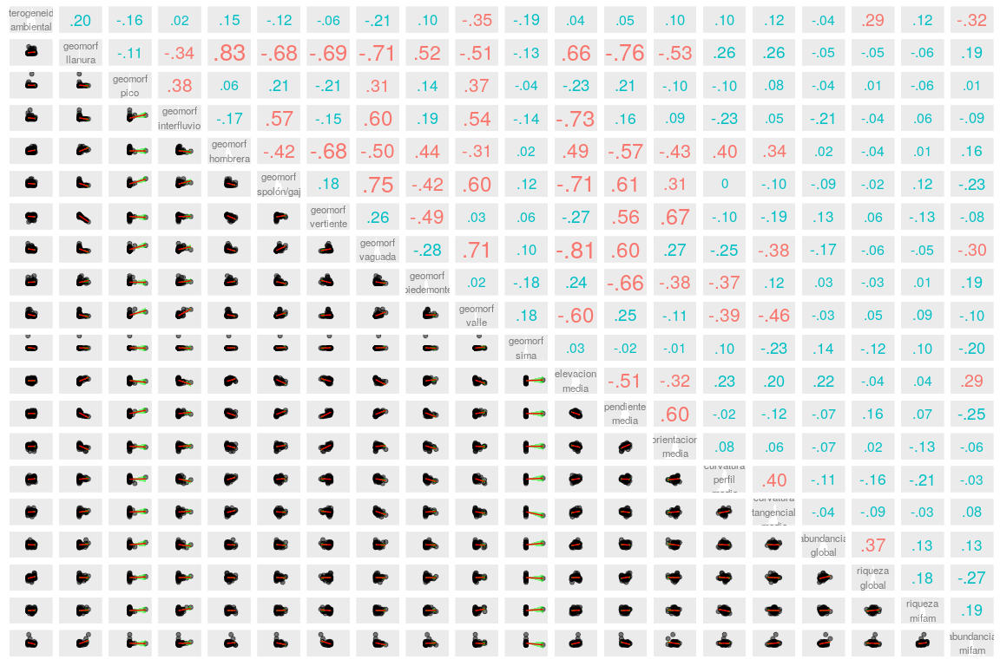

Medición de asociación. Modo R aplicado a mi familia asignada
================
JR
3 de noviembre, 2020

``` r
knitr::opts_chunk$set(fig.width=12, fig.height=8)
```

Preámbulo
---------

### Cargar paquetes

``` r
library(vegan)
```

    ## Loading required package: permute

    ## Loading required package: lattice

    ## This is vegan 2.5-6

``` r
library(adespatial)
```

    ## Registered S3 methods overwritten by 'adegraphics':
    ##   method         from
    ##   biplot.dudi    ade4
    ##   kplot.foucart  ade4
    ##   kplot.mcoa     ade4
    ##   kplot.mfa      ade4
    ##   kplot.pta      ade4
    ##   kplot.sepan    ade4
    ##   kplot.statis   ade4
    ##   scatter.coa    ade4
    ##   scatter.dudi   ade4
    ##   scatter.nipals ade4
    ##   scatter.pco    ade4
    ##   score.acm      ade4
    ##   score.mix      ade4
    ##   score.pca      ade4
    ##   screeplot.dudi ade4

    ## Registered S3 method overwritten by 'spdep':
    ##   method   from
    ##   plot.mst ape

    ## Registered S3 methods overwritten by 'adespatial':
    ##   method             from       
    ##   plot.multispati    adegraphics
    ##   print.multispati   ade4       
    ##   summary.multispati ade4

``` r
library(broom)
library(tidyverse)
```

    ## ── Attaching packages ─────────────── tidyverse 1.2.1 ──

    ## ✔ ggplot2 3.2.1     ✔ purrr   0.3.3
    ## ✔ tibble  2.1.3     ✔ dplyr   0.8.3
    ## ✔ tidyr   1.0.0     ✔ stringr 1.4.0
    ## ✔ readr   1.3.1     ✔ forcats 0.4.0

    ## ── Conflicts ────────────────── tidyverse_conflicts() ──
    ## ✖ dplyr::filter() masks stats::filter()
    ## ✖ dplyr::lag()    masks stats::lag()

``` r
library(sf)
```

    ## Linking to GEOS 3.8.0, GDAL 3.0.4, PROJ 7.0.0

``` r
library(gclus)
```

    ## Loading required package: cluster

    ## Registered S3 method overwritten by 'gclus':
    ##   method         from 
    ##   reorder.hclust vegan

``` r
source('biodata/funciones.R')
```

### Cargar datos

``` r
load('biodata/matriz_ambiental.Rdata')
load('biodata/Myrtaceae.Rdata')
```

Modo R: matrices de dependencia entre variables (índice de correlación)
-----------------------------------------------------------------------

### Modo R para datos cuantitativos de especies (abundancia)

En este caso, las variables usaré los valores de abundancias de especies como variables. Es decir, **compararé el grado de asociación entre especies, NO entre sitios**.

Aunque se podría usar el índice de correlación como métrica de la dependencia (tal como mostré en el script `aed_5_correlaciones_variables_ambientales.R`), tanto los doble-ceros (ausencias de una misma especie en dos lugares), como los *outliers* de abundancia, contribuirían a aumentar de manera ficticia el índice de correlación de Pearson.

Por tal razón, es recomendable aplicar la transformación *Chi* a la matriz de comunidad transpuesta. Al utilizar una matriz transpuesto, lograrás comparar especies, NO sitios (recuerda que en modo R comparamos descriptores, no objetos). Explico el procedimiento a continuación, paso a paso.

Primero, sustituyo el caracter de espacio por un <enter> en los nombres de las especies (caracter \\n), para facilitar la lectura de los nombres en la diagonal del mapa de calor. Luego transpongo la matriz.

``` r
mi_fam_t <- mc_myrtc %>% 
  rename_all(gsub, pattern = ' ', replacement = '\n') %>% 
  t()
mi_fam_t %>% tibble
```

    ## # A tibble: 7 x 1
    ##   .[,"1"] [,"2"] [,"3"] [,"4"] [,"5"] [,"6"] [,"7"] [,"8"] [,"9"] [,"10"]
    ##     <dbl>  <dbl>  <dbl>  <dbl>  <dbl>  <dbl>  <dbl>  <dbl>  <dbl>   <dbl>
    ## 1       0      0      2      2      0      1      4      3      8       6
    ## 2       5      4      6     14     13      6      5      7      9      24
    ## 3      21     27     12     51     35     79     51     20     20      54
    ## 4       9     14     15      4      5     11     13     15      6      10
    ## 5       7     11     24     14     22     12     23     20     12      42
    ## 6       6      0      1      0      0      0      4      0      2       0
    ## 7       0      0      0      0      0      0      0      1      0       0
    ## # … with 40 more variables: [,"11"] <dbl>, [,"12"] <dbl>, [,"13"] <dbl>,
    ## #   [,"14"] <dbl>, [,"15"] <dbl>, [,"16"] <dbl>, [,"17"] <dbl>,
    ## #   [,"18"] <dbl>, [,"19"] <dbl>, [,"20"] <dbl>, [,"21"] <dbl>,
    ## #   [,"22"] <dbl>, [,"23"] <dbl>, [,"24"] <dbl>, [,"25"] <dbl>,
    ## #   [,"26"] <dbl>, [,"27"] <dbl>, [,"28"] <dbl>, [,"29"] <dbl>,
    ## #   [,"30"] <dbl>, [,"31"] <dbl>, [,"32"] <dbl>, [,"33"] <dbl>,
    ## #   [,"34"] <dbl>, [,"35"] <dbl>, [,"36"] <dbl>, [,"37"] <dbl>,
    ## #   [,"38"] <dbl>, [,"39"] <dbl>, [,"40"] <dbl>, [,"41"] <dbl>,
    ## #   [,"42"] <dbl>, [,"43"] <dbl>, [,"44"] <dbl>, [,"45"] <dbl>,
    ## #   [,"46"] <dbl>, [,"47"] <dbl>, [,"48"] <dbl>, [,"49"] <dbl>,
    ## #   [,"50"] <dbl>

Segundo, transformo la matriz transpuesta usando estandarización *Chi*.

``` r
mi_fam_t_chi <- decostand(mi_fam_t, "chi.square")
mi_fam_t_chi %>% tibble
```

    ## # A tibble: 7 x 1
    ##   .[,"1"] [,"2"] [,"3"] [,"4"] [,"5"] [,"6"] [,"7"] [,"8"] [,"9"] [,"10"]
    ##     <dbl>  <dbl>  <dbl>  <dbl>  <dbl>  <dbl>  <dbl>  <dbl>  <dbl>   <dbl>
    ## 1  0      0      0.0356 0.0300 0      0.0132 0.0552 0.0510 0.146   0.0710
    ## 2  0.0885 0.0656 0.0950 0.186  0.184  0.0705 0.0613 0.106  0.146   0.252 
    ## 3  0.115  0.136  0.0586 0.209  0.153  0.286  0.193  0.0931 0.100   0.175 
    ## 4  0.193  0.278  0.288  0.0646 0.0859 0.157  0.193  0.275  0.118   0.128 
    ## 5  0.0411 0.0597 0.126  0.0617 0.103  0.0467 0.0935 0.100  0.0646  0.146 
    ## 6  1.16   0      0.172  0      0      0      0.534  0      0.353   0     
    ## 7  0      0      0      0      0      0      0      0.159  0       0     
    ## # … with 40 more variables: [,"11"] <dbl>, [,"12"] <dbl>, [,"13"] <dbl>,
    ## #   [,"14"] <dbl>, [,"15"] <dbl>, [,"16"] <dbl>, [,"17"] <dbl>,
    ## #   [,"18"] <dbl>, [,"19"] <dbl>, [,"20"] <dbl>, [,"21"] <dbl>,
    ## #   [,"22"] <dbl>, [,"23"] <dbl>, [,"24"] <dbl>, [,"25"] <dbl>,
    ## #   [,"26"] <dbl>, [,"27"] <dbl>, [,"28"] <dbl>, [,"29"] <dbl>,
    ## #   [,"30"] <dbl>, [,"31"] <dbl>, [,"32"] <dbl>, [,"33"] <dbl>,
    ## #   [,"34"] <dbl>, [,"35"] <dbl>, [,"36"] <dbl>, [,"37"] <dbl>,
    ## #   [,"38"] <dbl>, [,"39"] <dbl>, [,"40"] <dbl>, [,"41"] <dbl>,
    ## #   [,"42"] <dbl>, [,"43"] <dbl>, [,"44"] <dbl>, [,"45"] <dbl>,
    ## #   [,"46"] <dbl>, [,"47"] <dbl>, [,"48"] <dbl>, [,"49"] <dbl>,
    ## #   [,"50"] <dbl>

Tercero, calculo la distancia euclídea.

``` r
mi_fam_t_chi_d <- dist(mi_fam_t_chi)
mi_fam_t_chi_d %>% tidy
```

    ## # A tibble: 21 x 3
    ##    item1                          item2                    distance
    ##    <fct>                          <fct>                       <dbl>
    ##  1 "Eugenia\ncoloradoensis"       "Chamguava\nschippii"       2.19 
    ##  2 "Eugenia\ngalalonensis"        "Chamguava\nschippii"       2.03 
    ##  3 "Eugenia\nnesiotica"           "Chamguava\nschippii"       2.08 
    ##  4 "Eugenia\noerstediana"         "Chamguava\nschippii"       2.08 
    ##  5 "Myrcia\ngatunensis"           "Chamguava\nschippii"       3.04 
    ##  6 "Psidium\nfriedrichsthalianum" "Chamguava\nschippii"       2.64 
    ##  7 "Eugenia\ngalalonensis"        "Eugenia\ncoloradoensis"    0.694
    ##  8 "Eugenia\nnesiotica"           "Eugenia\ncoloradoensis"    0.776
    ##  9 "Eugenia\noerstediana"         "Eugenia\ncoloradoensis"    0.792
    ## 10 "Myrcia\ngatunensis"           "Eugenia\ncoloradoensis"    2.14 
    ## # … with 11 more rows

Finalmente, creo el "mapa de calor".

``` r
coldiss(mi_fam_t_chi_d, diag = TRUE)
```



En el mapa de calor **ordenado** (el de la derecha), se identifica al menos un patrón de dependencia entre las especies relacionadas en la diagonal desde *Chrysophyllum cainito* hasta *Trichilia pallida* (cuadros de color rosa centrales). También se observan las especies que no parecen asociarse con otras, situadas en los extremos de la diagonal, y relacionadas con otras por medio de valores pequeños de distancia (cuadros azules), como *Rauvolfia littoralis* y *Pouteria fossicola* y *Cedrela odorata*.

### Modo R para datos binarios (presencia/ausencia)

Arriba usé la distancia de Jaccard para evaluar asociación entre sitios. Dicha métrica también se puede usar para evaluar la distancia entre especies, usando como fuente la matriz de comunidad transpuesta convertida a binaria (presencia/ausencia)

``` r
mi_fam_t_jac <- vegdist(mi_fam_t, "jaccard", binary = TRUE)
mi_fam_t_jac %>% tidy
```

    ## # A tibble: 21 x 3
    ##    item1                          item2                    distance
    ##    <fct>                          <fct>                       <dbl>
    ##  1 "Eugenia\ncoloradoensis"       "Chamguava\nschippii"       0.5  
    ##  2 "Eugenia\ngalalonensis"        "Chamguava\nschippii"       0.5  
    ##  3 "Eugenia\nnesiotica"           "Chamguava\nschippii"       0.5  
    ##  4 "Eugenia\noerstediana"         "Chamguava\nschippii"       0.5  
    ##  5 "Myrcia\ngatunensis"           "Chamguava\nschippii"       0.649
    ##  6 "Psidium\nfriedrichsthalianum" "Chamguava\nschippii"       0.750
    ##  7 "Eugenia\ngalalonensis"        "Eugenia\ncoloradoensis"    0    
    ##  8 "Eugenia\nnesiotica"           "Eugenia\ncoloradoensis"    0    
    ##  9 "Eugenia\noerstediana"         "Eugenia\ncoloradoensis"    0    
    ## 10 "Myrcia\ngatunensis"           "Eugenia\ncoloradoensis"    0.5  
    ## # … with 11 more rows

``` r
coldiss(mi_fam_t_jac, diag = TRUE)
```



### Modo R para datos cuantitativos, NO de abundancia de especies (variables ambientales)

En modo R evalúas asociación entre descriptores, es decir, entre variables. La métrica comúnmente usada es el índice de correlación de Pearson. Sin embargo, si los datos no presentan distribución normal, puedes emplear métricas más flexibles, como el índice *rho* de Spearman o **tau** de Kendall.

En este ejemplo, mostraré la correlación entre variables de suelo y la abundancia y riqueza globales y de mi familia asignada. Haré lo propio con variables geomorfológicas. Ya tuviste ocasión de usar estos métodos en el [*script* de análisis exploratorio de datos, sección correlación](aed_5_correlaciones_variables_ambientales.md). En este *script*, añadirás al análisis el índice *rho* de Spearman.

``` r
env_num <- bci_env_grid %>%
  dplyr::select_if(is.numeric) %>%
  dplyr::select(-id, -matches('^U.*')) %>% 
  st_drop_geometry %>% 
  mutate(
    riqueza_mifam = specnumber(mc_myrtc),
    abundancia_mifam = rowSums(mc_myrtc)) %>% 
  rename_all(gsub, pattern = '_pct$', replacement = '') %>% 
  rename_all(gsub, pattern = '_| ', replacement = '\n')
env_num %>% tibble
```

    ## # A tibble: 50 x 1
    ##    .$`heterogeneid… $`geomorf\nllan… $`geomorf\npico` $`geomorf\ninte…
    ##               <dbl>            <dbl>            <dbl>            <dbl>
    ##  1           0.627             10.0              0                0.83
    ##  2           0.394             34.8              0                0.36
    ##  3           0                  0                0                0   
    ##  4           0                  0                0                0.16
    ##  5           0.461              2.58             0                0   
    ##  6           0.0768             0                0.17             3.01
    ##  7           0.381              0                0.53             2.87
    ##  8           0.211              0                0                0   
    ##  9           0                  0                0                0   
    ## 10           0                  1.03             0                0   
    ## # … with 40 more rows, and 29 more variables: $`geomorf\nhombrera` <dbl>,
    ## #   $`geomorf\nespolón/gajo` <dbl>, $`geomorf\nvertiente` <dbl>,
    ## #   $`geomorf\nvaguada` <dbl>, $`geomorf\npiedemonte` <dbl>,
    ## #   $`geomorf\nvalle` <dbl>, $`geomorf\nsima` <dbl>, $Al <dbl>, $B <dbl>,
    ## #   $Ca <dbl>, $Cu <dbl>, $Fe <dbl>, $K <dbl>, $Mg <dbl>, $Mn <dbl>,
    ## #   $P <dbl>, $Zn <dbl>, $N <dbl>, $N.min. <dbl>, $pH <dbl>,
    ## #   $`elevacion\nmedia` <dbl>, $`pendiente\nmedia` <dbl>,
    ## #   $`orientacion\nmedia` <dbl>, $`curvatura\nperfil\nmedia` <dbl>,
    ## #   $`curvatura\ntangencial\nmedia` <dbl>, $`abundancia\nglobal` <dbl>,
    ## #   $`riqueza\nglobal` <int>, $`riqueza\nmifam` <int>,
    ## #   $`abundancia\nmifam` <dbl>

``` r
p_cor_suelo_ar <- env_num %>%
  dplyr::select(matches('^[A-T,Z]|abundancia|riqueza|^pH$', ignore.case = F)) %>%
  ezCorM(r_size_lims = c(4,8), label_size = 3, method = 'pearson')
```

    ## -------------------------------------------------------------------------

    ## You have loaded plyr after dplyr - this is likely to cause problems.
    ## If you need functions from both plyr and dplyr, please load plyr first, then dplyr:
    ## library(plyr); library(dplyr)

    ## -------------------------------------------------------------------------

    ## 
    ## Attaching package: 'plyr'

    ## The following objects are masked from 'package:dplyr':
    ## 
    ##     arrange, count, desc, failwith, id, mutate, rename, summarise,
    ##     summarize

    ## The following object is masked from 'package:purrr':
    ## 
    ##     compact

    ## 
    ## Attaching package: 'reshape2'

    ## The following object is masked from 'package:tidyr':
    ## 
    ##     smiths

``` r
p_cor_suelo_ar
```



``` r
p_cor_suelo_ar_spearman <- env_num %>%
  dplyr::select(matches('^[A-T,Z]|abundancia|riqueza|^pH$', ignore.case = F)) %>%
  ezCorM(r_size_lims = c(4,8), label_size = 3, method = 'spearman')
p_cor_suelo_ar_spearman
```



``` r
png(
  filename = 'matriz_correlacion_suelo_abun_riq_spearman.png',
  width = 1920, height = 1080, res = 125
)
p_cor_suelo_ar_spearman
dev.off() #NO OLVIDAR ESTA IMPORTANTE SENTENCIA
```

    ## png 
    ##   2

``` r
p_cor_geomorf_ar <- env_num %>%
  dplyr::select(-matches('^[A-T,Z]|pH', ignore.case = F)) %>%
  ezCorM(r_size_lims = c(4,8), label_size = 3, method = 'pearson')
p_cor_geomorf_ar
```



``` r
p_cor_geomorf_ar_spearman <- env_num %>%
  dplyr::select(-matches('^[A-T,Z]|pH', ignore.case = F)) %>%
  ezCorM(r_size_lims = c(4,8), label_size = 3, method = 'spearman')
p_cor_geomorf_ar_spearman
```



``` r
png(
  filename = 'matriz_correlacion_geomorf_abun_riq_spearman.png',
  width = 1920, height = 1080, res = 110
)
p_cor_geomorf_ar_spearman
dev.off() #NO OLVIDAR ESTA IMPORTANTE SENTENCIA
```

    ## png 
    ##   2
