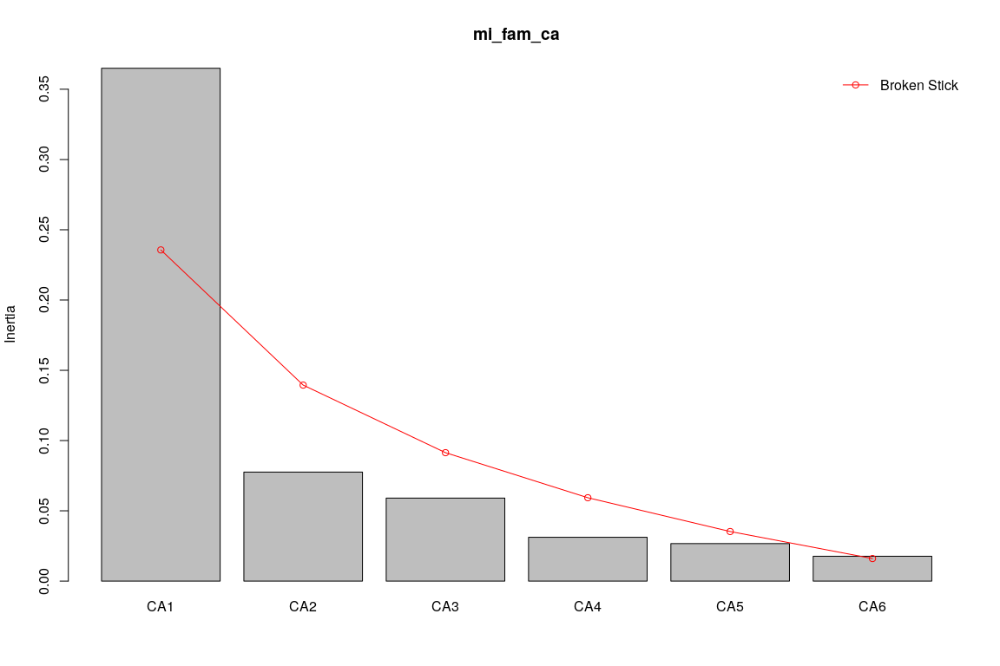

Técnicas de ordenación. <br> Parte 1: Ordenación no restringida. <br> PCA, CA y PCoA
================
JR
21 de noviembre, 2020

``` r
knitr::opts_chunk$set(fig.width=12, fig.height=8)
```

Preámbulo
---------

### Cargar paquetes

``` r
library(vegan)
```

    ## Loading required package: permute

    ## Loading required package: lattice

    ## This is vegan 2.5-6

``` r
library(tidyverse)
```

    ## ── Attaching packages ─────────────── tidyverse 1.2.1 ──

    ## ✔ ggplot2 3.2.1     ✔ purrr   0.3.3
    ## ✔ tibble  2.1.3     ✔ dplyr   0.8.3
    ## ✔ tidyr   1.0.0     ✔ stringr 1.4.0
    ## ✔ readr   1.3.1     ✔ forcats 0.4.0

    ## ── Conflicts ────────────────── tidyverse_conflicts() ──
    ## ✖ dplyr::filter() masks stats::filter()
    ## ✖ dplyr::lag()    masks stats::lag()

``` r
library(sf)
```

    ## Linking to GEOS 3.8.0, GDAL 3.0.4, PROJ 7.0.0

``` r
library(mapview)
source('biodata/funciones.R')
```

### Cargar datos

``` r
load('biodata/Myrtaceae.Rdata')
load('biodata/matriz_ambiental.Rdata')
mi_fam <- mc_myrtc
(colnames(mi_fam) <- make.cepnames(colnames(mi_fam)))
```

    ## [1] "Chamschi" "Eugecolo" "Eugegala" "Eugenesi" "Eugeoers" "Myrcgatu"
    ## [7] "Psidfrie"

``` r
(df_equivalencias <- data.frame(
  nombre_original = colnames(mc_myrtc),
  colnames(mi_fam)))
```

    ##               nombre_original colnames.mi_fam.
    ## 1          Chamguava schippii         Chamschi
    ## 2       Eugenia coloradoensis         Eugecolo
    ## 3        Eugenia galalonensis         Eugegala
    ## 4           Eugenia nesiotica         Eugenesi
    ## 5         Eugenia oerstediana         Eugeoers
    ## 6           Myrcia gatunensis         Myrcgatu
    ## 7 Psidium friedrichsthalianum         Psidfrie

``` r
bci_env_grid %>% tibble
```

    ## # A tibble: 50 x 1
    ##     .$id $categoria_de_e… $geologia $habitat $quebrada $heterogeneidad…
    ##    <dbl> <fct>            <fct>     <fct>    <fct>                <dbl>
    ##  1     1 c3               Tb        OldSlope Yes                 0.627 
    ##  2     2 c3               Tb        OldLow   Yes                 0.394 
    ##  3     3 c3               Tb        OldLow   No                  0     
    ##  4     4 c3               Tb        OldLow   No                  0     
    ##  5     5 c3               Tb        OldSlope No                  0.461 
    ##  6     6 c3               Tb        OldLow   No                  0.0768
    ##  7     7 c3               Tb        OldLow   Yes                 0.381 
    ##  8     8 c3               Tb        OldLow   Yes                 0.211 
    ##  9     9 c3               Tb        OldLow   No                  0     
    ## 10    10 c3               Tb        OldLow   No                  0     
    ## # … with 40 more rows, and 33 more variables: $UTM.EW <dbl>,
    ## #   $UTM.NS <dbl>, $geomorf_llanura_pct <dbl>, $geomorf_pico_pct <dbl>,
    ## #   $geomorf_interfluvio_pct <dbl>, $geomorf_hombrera_pct <dbl>,
    ## #   $`geomorf_espolón/gajo_pct` <dbl>, $geomorf_vertiente_pct <dbl>,
    ## #   $geomorf_vaguada_pct <dbl>, $geomorf_piedemonte_pct <dbl>,
    ## #   $geomorf_valle_pct <dbl>, $geomorf_sima_pct <dbl>, $Al <dbl>,
    ## #   $B <dbl>, $Ca <dbl>, $Cu <dbl>, $Fe <dbl>, $K <dbl>, $Mg <dbl>,
    ## #   $Mn <dbl>, $P <dbl>, $Zn <dbl>, $N <dbl>, $N.min. <dbl>, $pH <dbl>,
    ## #   $elevacion_media <dbl>, $pendiente_media <dbl>,
    ## #   $orientacion_media <dbl>, $curvatura_perfil_media <dbl>,
    ## #   $curvatura_tangencial_media <dbl>, $geometry <POLYGON [m]>,
    ## #   $abundancia_global <dbl>, $riqueza_global <int>

``` r
grupos_upgma_k2 <- readRDS('grupos_upgma_k2.RDS')
table(grupos_upgma_k2)
```

    ## grupos_upgma_k2
    ##  1  2 
    ## 48  2

``` r
grupos_ward_k4 <- readRDS('grupos_ward_k4.RDS')
table(grupos_ward_k4)
```

    ## grupos_ward_k4
    ##  1  2  3  4 
    ## 20 13  2 15

Ordenación
----------

La ordenación se basa en los mismos principios que la medición de asociación (similaridad) y el agrupamiento: un objeto se caracteriza por sus propiedades en un espacio n-dimensional, donde cada dimensión es una variable, un descriptor. Un simple diagrama de dispersion nos serviría para representar el caso especial de objetos descritos por sólo dos variables, pero no es lo común. Sin embargo, no podremos encontrar patrones consistentes analizando nuestros datos por pares de variables (e.g. paneles de correlación).

A diferencia del análisis de agrupamiento, o como complemento de éste, el análisis de ordenación abarca un conjunto de técnicas que procuran reducir la dimensionalidad de los datos. Se intenta representar, en ejes ortogonales (comúnmente dos), la complejidad de todo un conjunto. Todas las técnicas de ordenación representan las principales tendencias de variación de los datos en un espacio de dimensiones reducidas, ordenando de manera convencional los ejes con grado descendente de varianza explicada en cada eje sucesivo (e.g. en n dimensiones, el eje 1 explica la mayor varianza, el eje n explica la mínima).

El análisis de ordenación puede ser no restringido (o simple) y restringido (o 'canónico'). En el primer caso, las tendencias detectadas en el conjunto de datos de interés, no están restringidas por otro conjunto, por ejemplo, si buscamos tendencias en una matriz de comunidad, y sólo en ella. En el segundo caso, las tendencias detectadas en un conjunto de datos se asocian a otro conjunto, por ejemplo, si buscamos tendencias en una matriz de comunidad pero restringiéndolas a una matriz ambiental. En este script me concentraré en la ordenación no restringida o simple.

Las principales técnicas de ordenación no restringida son análisis de componentes principales o PCA (siglas de *principal components analysis*), análisis de correspondencia o CA (*correspondence analysis*), análisis de correspondencia múltiple o MCA (*multiple correspondence analysis*), análisis de coordenadas principales o PCoA (*principal coordinates analysis*) y escalamiento multidimensional no métrico o NMDS (*non-metric multidimensional scaling*). Salvo el NMDS, todas estas técnicas se basan en la extracción de los vectores propios (*eigenvectors*) de una matriz de asociación. Explicaré PCA, CA y PCoA a continuación.

### Análisis de componentes principales (PCA)

Es el método tradicional basado en vectores propios que comúnmente se aplica a datos cuantitativos no procesados, que preserva la distancia euclídea; también se aplica a datos de especies, previa transformación de los datos. Por esta razón, es más común aplicarlo a variables ambientales (matriz ambiental), pero también se aplica a datos transformados de composición (matriz de comunidad). Un requisito fundamental para garantizar la eficiencia de este método, es que las variables deben tener algún grado de correlación entre sí, un supuesto a veces imposible de lograr con datos no procesados de matrices de comunidad, pero que sí es bastante común en matrices ambientales. Primero explicaré su uso con un subconjunto de variables ambientales (suelo), para luego aplicarlo a una matriz de comunidad.

#### PCA aplicado a datos ambientales

Para aplicar PCA a datos ambientales, es necesario que todas las variables sean numéricas y "comparables" en cuanto a escalas de medición. Esto se consigue "escalándolas" (convirtiéndolas en puntuaciones z). A partir de la matriz escalada, se generará una matriz de correlaciones.

Dado que se requiere que las variables de entrada sean exclusivamente numéricas, el primer paso que realizaré será obtener un conjunto de columnas numéricas y, de éstas, seleccionaré sólo las de suelo.

¡IMPORTANTE! Haré esta demostración sólo con las variables de suelo, **pero puedes (y debes) ordenar los sitios en función de otras variables, por ejemplo, las geomorfológicas combinadas con la de hábitat y la de heterogeneidad ambiental**. Por tal razón, haz también el PCA para las demás variables de la matriz ambiental.

A partir de los datos de suelo, la función `rda`, de `vegan` realizará los siguientes pasos: escalar las variables originales, calcular matriz de correlaciones y obtener vectores propios para el PCA.

``` r
env_suelo <- bci_env_grid %>%
  st_drop_geometry %>%
  dplyr::select(matches('^[A-T,Z]|^pH$', ignore.case = F))
env_suelo %>% tibble
```

    ## # A tibble: 50 x 1
    ##     .$Al    $B   $Ca   $Cu   $Fe    $K   $Mg   $Mn    $P   $Zn    $N
    ##    <dbl> <dbl> <dbl> <dbl> <dbl> <dbl> <dbl> <dbl> <dbl> <dbl> <dbl>
    ##  1  901. 0.794 1680.  6.20  135. 142.   279.  267.  1.95  2.97  18.5
    ##  2  954. 0.670 1503.  6.03  142. 137.   280.  320.  2.25  2.53  21.6
    ##  3 1114. 0.595 1182.  6.80  157.  98.7  230.  445.  1.95  2.25  20.2
    ##  4 1024. 0.568 1558.  6.63  153.  98.4  229.  408.  2.63  2.44  20.8
    ##  5 1002. 0.399 1242.  6.44  149.  94.1  203.  251.  1.86  2.14  16.9
    ##  6 1091. 0.731 1442.  6.50  174. 132.   277.  477.  1.62  2.63  20.3
    ##  7 1184. 0.340 1111.  5.55  138. 117.   242.  301.  2.13  2.16  20.1
    ##  8 1256. 0.322 1029.  6.28  147. 104.   185.  204.  3.11  2.07  21.5
    ##  9 1122. 0.464 1230.  7.18  153. 110.   207.  415.  1.99  2.33  21.4
    ## 10 1172. 0.314 1127.  6.89  133. 105.   172.  330.  1.69  2.05  18.3
    ## # … with 40 more rows, and 2 more variables: $N.min. <dbl>, $pH <dbl>

``` r
env_suelo_pca <- rda(env_suelo, scale = TRUE)
env_suelo_pca
```

    ## Call: rda(X = env_suelo, scale = TRUE)
    ## 
    ##               Inertia Rank
    ## Total              13     
    ## Unconstrained      13   13
    ## Inertia is correlations 
    ## 
    ## Eigenvalues for unconstrained axes:
    ##   PC1   PC2   PC3   PC4   PC5   PC6   PC7   PC8   PC9  PC10  PC11  PC12 
    ## 7.871 1.698 1.378 0.899 0.334 0.298 0.149 0.114 0.101 0.075 0.038 0.029 
    ##  PC13 
    ## 0.017

``` r
summary(env_suelo_pca)
```

    ## 
    ## Call:
    ## rda(X = env_suelo, scale = TRUE) 
    ## 
    ## Partitioning of correlations:
    ##               Inertia Proportion
    ## Total              13          1
    ## Unconstrained      13          1
    ## 
    ## Eigenvalues, and their contribution to the correlations 
    ## 
    ## Importance of components:
    ##                          PC1    PC2    PC3     PC4     PC5     PC6    PC7
    ## Eigenvalue            7.8705 1.6985 1.3777 0.89872 0.33400 0.29828 0.1495
    ## Proportion Explained  0.6054 0.1307 0.1060 0.06913 0.02569 0.02294 0.0115
    ## Cumulative Proportion 0.6054 0.7361 0.8421 0.91119 0.93688 0.95982 0.9713
    ##                            PC8      PC9     PC10     PC11     PC12
    ## Eigenvalue            0.113523 0.100540 0.075125 0.038299 0.028503
    ## Proportion Explained  0.008733 0.007734 0.005779 0.002946 0.002193
    ## Cumulative Proportion 0.980052 0.987786 0.993565 0.996511 0.998703
    ##                           PC13
    ## Eigenvalue            0.016858
    ## Proportion Explained  0.001297
    ## Cumulative Proportion 1.000000
    ## 
    ## Scaling 2 for species and site scores
    ## * Species are scaled proportional to eigenvalues
    ## * Sites are unscaled: weighted dispersion equal on all dimensions
    ## * General scaling constant of scores:  5.023829 
    ## 
    ## 
    ## Species scores
    ## 
    ##            PC1       PC2      PC3      PC4      PC5      PC6
    ## Al      0.7651 -0.303596  1.07416 -0.04457  0.07698 -0.04464
    ## B      -1.2880  0.285829  0.12078 -0.10042 -0.25949 -0.08173
    ## Ca     -1.3475 -0.154936 -0.05566  0.09869 -0.21974  0.10661
    ## Cu     -1.1654 -0.297329  0.28359 -0.50726  0.13822  0.18506
    ## Fe     -1.1094 -0.492148  0.40677  0.19816  0.32966  0.18518
    ## K      -1.3645  0.008666  0.04784  0.03985  0.01269  0.07345
    ## Mg     -1.2703 -0.170100 -0.07264  0.25627 -0.35788  0.20705
    ## Mn     -0.9548 -0.317673  0.44289 -0.74565 -0.12314 -0.31689
    ## P       0.2877  0.748145  0.98749  0.47477 -0.23540 -0.03654
    ## Zn     -1.3040  0.004603 -0.02793  0.32706  0.01696 -0.03240
    ## N      -0.5124  1.155952  0.14154 -0.29652  0.26625  0.33702
    ## N.min. -1.1324 -0.163100  0.03454  0.59856  0.34289 -0.30849
    ## pH     -0.9569  0.846451 -0.23774 -0.15686  0.10741 -0.36153
    ## 
    ## 
    ## Site scores (weighted sums of species scores)
    ## 
    ##         PC1      PC2       PC3      PC4       PC5       PC6
    ## 1   0.50347 -0.39861 -0.798154 -0.32512 -1.705624  1.097611
    ## 2   0.47396 -0.28681 -0.518234 -0.23993 -0.940674  0.556514
    ## 3   0.62571 -0.61177 -0.017990 -1.17056 -0.689271  0.325703
    ## 4   0.48722 -0.36275 -0.122325 -0.53899 -0.492944 -0.192532
    ## 5   0.70142 -0.57473 -0.607379 -0.09754  0.095730  0.096622
    ## 6   0.32387 -0.57941 -0.127142 -0.96126 -0.468442 -0.308392
    ## 7   0.70592 -0.29567 -0.231908 -0.18306 -0.001098 -0.372107
    ## 8   0.89397 -0.16407  0.193673 -0.10215  0.098856  0.724943
    ## 9   0.57971 -0.40666 -0.071601 -1.10761 -0.086292 -0.006721
    ## 10  0.72551 -0.49205 -0.281459 -0.67883  0.394079 -0.616348
    ## 11 -0.21317 -0.50177  0.077290 -0.97703 -1.759653 -1.347073
    ## 12  0.72031 -0.71165  0.452589 -0.03515 -0.284845 -0.876996
    ## 13  1.02666 -0.35257  0.902772  1.42743  0.056272  0.769304
    ## 14  0.71660 -0.80220  0.308626 -0.07447  0.179499  0.319996
    ## 15  0.38786 -1.25976  0.502979 -1.12783  0.489936 -0.004906
    ## 16  0.06081 -0.65839 -0.217405 -0.15093 -0.009161 -0.418417
    ## 17  0.63013 -0.10688  0.461756  0.69800 -0.855514 -0.800082
    ## 18  0.96721 -0.48010  0.768611  1.68547  0.280984  0.804510
    ## 19  0.65612 -0.39287  0.642368  0.81392  0.334820 -0.130497
    ## 20  0.46141 -0.62193 -0.007429 -0.28657  0.574129 -0.059174
    ## 21 -0.33476  0.07816 -0.494215 -0.82582  0.082001  0.466656
    ## 22  0.37375  0.39755  0.354272  0.65129  0.466086 -0.169757
    ## 23  0.68109 -0.03137  0.521714  1.37446  0.819763  1.100024
    ## 24  0.12448  0.29626  0.059695 -0.01573  0.236925  0.723204
    ## 25  0.08692  0.66652 -0.374643 -0.06148 -0.269650  1.201049
    ## 26 -0.06428  0.72854 -1.263340 -0.34008  0.931914 -0.269882
    ## 27  0.35229  0.90701 -0.793591  0.27022  0.822847 -0.974726
    ## 28  0.69848  1.15175 -1.855664  0.48677  0.412453 -0.297122
    ## 29  0.19286  1.08572  0.087991  0.11127  0.042980  0.495350
    ## 30  0.34849  0.97558 -0.862374  0.01778  0.495742  0.840577
    ## 31 -0.27158  0.72562 -0.688703 -0.30711  0.513849 -0.289476
    ## 32 -0.23882  1.06756  0.284612  0.39185 -0.583222 -1.160850
    ## 33  0.45683  1.33454 -1.222664  0.21290  0.043306 -0.906784
    ## 34 -0.06262  1.32157  0.707260 -0.38230 -0.554752  0.096821
    ## 35 -0.12287  0.56386  0.842747 -0.37166  0.215049 -0.170818
    ## 36 -0.77718  0.81121 -0.017228 -0.75987  0.240578  0.996530
    ## 37 -0.36979  0.78099  0.600582 -0.68959  0.433235  0.023059
    ## 38 -0.46379  1.17932  1.466360 -0.34391 -0.858632  0.095262
    ## 39 -0.52517  0.80160  1.526464  0.17949 -1.074136 -1.051545
    ## 40 -0.21649  0.62426  1.199057  0.71392 -0.023249 -0.665797
    ## 41 -1.67247  0.07797  0.320315 -0.42982 -0.542412  1.926398
    ## 42 -0.79902 -0.40933  0.170367 -0.68347  0.962695  0.340097
    ## 43 -0.86973 -0.46973  0.977941 -0.73908  1.841802  0.388190
    ## 44 -0.87106 -0.51244  0.510545  0.11302  1.520391 -0.888169
    ## 45 -1.21483 -0.12869  0.318452  0.59274 -0.206188 -0.656346
    ## 46 -1.15473 -0.77489 -0.740832  1.60533 -1.220076  0.792066
    ## 47 -0.53188 -1.10833 -0.737304  1.09916 -0.007989 -1.090101
    ## 48 -1.25160 -1.07535 -0.391085  0.26679  0.818315 -0.567806
    ## 49 -1.60947 -0.72664 -0.790057  0.20147 -0.148172  0.030082
    ## 50 -1.32772 -0.27816 -1.026309  1.09364 -0.622240  0.081856

``` r
env_geomorf <- bci_env_grid %>%
  select(curvatura_perfil_media, curvatura_tangencial_media, elevacion_media, geomorf_hombrera_pct, heterogeneidad_ambiental, orientacion_media, abundancia_global, riqueza_global, UTM.NS) %>%
  st_drop_geometry()
env_geomorf %>% tibble
```

    ## # A tibble: 50 x 1
    ##    .$curvatura_per… $curvatura_tang… $elevacion_media $geomorf_hombre…
    ##               <dbl>            <dbl>            <dbl>            <dbl>
    ##  1         0.00284          0.000520             137.            10.8 
    ##  2         0.00133          0.000751             142.            10.6 
    ##  3        -0.000850        -0.000965             137.             1.36
    ##  4         0.000199        -0.000159             143.             0   
    ##  5         0.00176          0.000394             154.             1.74
    ##  6        -0.00315         -0.000368             124.             0.86
    ##  7         0.00184          0.000302             139.             2.99
    ##  8         0.00118          0.000140             146.             0.26
    ##  9         0.00107         -0.00114              149.             2.24
    ## 10         0.000333        -0.000190             155.             5.83
    ## # … with 40 more rows, and 5 more variables:
    ## #   $heterogeneidad_ambiental <dbl>, $orientacion_media <dbl>,
    ## #   $abundancia_global <dbl>, $riqueza_global <int>, $UTM.NS <dbl>

``` r
env_geomorf_pca <- rda(env_geomorf, scale = TRUE)
env_geomorf_pca
```

    ## Call: rda(X = env_geomorf, scale = TRUE)
    ## 
    ##               Inertia Rank
    ## Total               9     
    ## Unconstrained       9    9
    ## Inertia is correlations 
    ## 
    ## Eigenvalues for unconstrained axes:
    ##    PC1    PC2    PC3    PC4    PC5    PC6    PC7    PC8    PC9 
    ## 2.6055 1.7043 1.3271 1.0145 0.7794 0.6971 0.4909 0.3392 0.0420

``` r
summary(env_geomorf_pca)
```

    ## 
    ## Call:
    ## rda(X = env_geomorf, scale = TRUE) 
    ## 
    ## Partitioning of correlations:
    ##               Inertia Proportion
    ## Total               9          1
    ## Unconstrained       9          1
    ## 
    ## Eigenvalues, and their contribution to the correlations 
    ## 
    ## Importance of components:
    ##                          PC1    PC2    PC3    PC4    PC5     PC6     PC7
    ## Eigenvalue            2.6055 1.7043 1.3271 1.0145 0.7794 0.69712 0.49089
    ## Proportion Explained  0.2895 0.1894 0.1475 0.1127 0.0866 0.07746 0.05454
    ## Cumulative Proportion 0.2895 0.4789 0.6263 0.7390 0.8256 0.90310 0.95764
    ##                           PC8      PC9
    ## Eigenvalue            0.33924 0.041988
    ## Proportion Explained  0.03769 0.004665
    ## Cumulative Proportion 0.99533 1.000000
    ## 
    ## Scaling 2 for species and site scores
    ## * Species are scaled proportional to eigenvalues
    ## * Sites are unscaled: weighted dispersion equal on all dimensions
    ## * General scaling constant of scores:  4.582576 
    ## 
    ## 
    ## Species scores
    ## 
    ##                                PC1      PC2     PC3     PC4      PC5
    ## curvatura_perfil_media     -0.4799  1.01010 -0.1226  0.2632 -0.48754
    ## curvatura_tangencial_media -0.5386  0.86897 -0.1059  0.6198 -0.03992
    ## elevacion_media            -1.3897 -0.07344  0.2058  0.2579  0.46675
    ## geomorf_hombrera_pct       -0.9807  0.69662 -0.1497 -0.5695 -0.36701
    ## heterogeneidad_ambiental   -0.2579  0.23744 -1.2178 -0.4596  0.40090
    ## orientacion_media           0.7856  0.47662 -0.3588  0.9391  0.43469
    ## abundancia_global          -0.5407 -0.85987 -0.1795  0.6041 -0.77472
    ## riqueza_global             -0.1834 -0.66754 -1.1408  0.1752 -0.14585
    ## UTM.NS                     -1.2869 -0.49213  0.2449  0.1845  0.50551
    ##                                 PC6
    ## curvatura_perfil_media      0.80126
    ## curvatura_tangencial_media -0.91153
    ## elevacion_media             0.13649
    ## geomorf_hombrera_pct       -0.13841
    ## heterogeneidad_ambiental    0.07321
    ## orientacion_media           0.26016
    ## abundancia_global           0.01375
    ## riqueza_global             -0.07996
    ## UTM.NS                      0.19052
    ## 
    ## 
    ## Site scores (weighted sums of species scores)
    ## 
    ##         PC1       PC2       PC3       PC4       PC5       PC6
    ## 1  -0.15960  1.278060 -1.523189 -0.085501 -1.076171  0.202094
    ## 2  -0.50358  1.093521 -0.057649 -1.153802 -0.814078 -0.811645
    ## 3   0.08498 -1.375364  0.561885 -0.500421 -1.179603  0.229268
    ## 4   0.11639 -0.300314  0.835524  0.082362  0.276847  0.211801
    ## 5  -0.68789 -0.212053 -0.490385  0.915791 -0.099883  0.489079
    ## 6   1.16864 -0.459635  0.450612 -0.667817  0.410314 -1.078505
    ## 7  -0.11087  0.045620 -0.495204  0.256025 -1.274272  0.106306
    ## 8  -0.15493 -0.416960 -0.092771  0.383714 -0.676572  0.134215
    ## 9  -0.07242 -0.634611  0.762388  0.114337 -0.398805  1.524135
    ## 10 -0.41642 -0.002303  0.679691  0.385589  0.385563  0.486077
    ## 11  1.11429  0.230590  0.090051 -0.589828 -0.103959  0.884038
    ## 12  0.78335 -0.410094  0.350198  0.309247 -0.038416 -0.055743
    ## 13 -0.52521  0.720826 -0.755289 -0.503489 -0.016072  0.021049
    ## 14 -0.52047 -0.363788 -0.007623  0.008657 -0.179230 -0.255542
    ## 15 -0.52541 -1.093627  0.518437  0.336097 -0.351248  0.221936
    ## 16  0.88899  0.602121 -0.117479  0.002592 -0.099279 -0.367975
    ## 17  0.81008 -0.126479  0.707315 -0.252327  0.701087 -1.352657
    ## 18 -0.21270  0.888945 -1.214636 -0.004769  0.541502  0.541770
    ## 19 -0.73679 -0.288990  0.165762  0.338417 -0.626801 -0.522947
    ## 20 -1.28556 -1.103263  0.369821 -0.642510 -1.609700 -0.251415
    ## 21  1.11906  0.072869 -0.223081 -0.151608  0.056637 -0.057035
    ## 22  0.43099 -0.197165 -0.203634 -0.060943 -0.475946 -0.439985
    ## 23  0.36830 -0.960090 -1.468288  0.023106  0.864547  0.431200
    ## 24 -0.83611  0.484266 -0.078670 -0.557089 -0.050428  0.080994
    ## 25 -1.09695 -0.878467 -0.537429 -1.137567 -0.285903 -0.361006
    ## 26  0.93816  0.847034  0.825834 -1.259450  0.114081  0.592696
    ## 27  0.33449  0.208334  0.564007 -0.032916 -0.493241 -1.266865
    ## 28  0.29258 -0.772358  0.070856  0.105274  0.001946  0.968762
    ## 29 -0.76437  0.920936 -0.275567 -1.062911  0.732009  0.130267
    ## 30 -0.44877 -0.711085 -0.178022 -1.079701  1.369009  0.032669
    ## 31  0.42777  0.305195 -0.611057 -0.163806 -0.788957 -0.316098
    ## 32  0.32809 -0.261775 -0.492078 -0.516719  0.430876 -1.224852
    ## 33 -0.01711  0.275115  0.748041  0.866020 -0.254461  0.389545
    ## 34 -0.48617  0.320210  1.027524  0.328405  0.103300  0.220943
    ## 35 -0.90913  0.387182  0.873803 -0.385409  0.509418  0.024878
    ## 36  0.79895  0.317883 -0.354226  0.289873 -0.222230  0.187055
    ## 37  0.30224  0.012451  0.132333 -0.648382  0.250675 -1.058831
    ## 38  0.16351  0.751813  0.955586  0.780155  0.395933  0.583437
    ## 39 -0.29094  0.637738  1.369297  0.277318  0.826791  0.283583
    ## 40 -0.82454 -0.311991 -0.043325 -0.214942  0.829959  0.313271
    ## 41  1.03352 -0.484200 -0.500776 -0.709307 -0.303549  1.511341
    ## 42  0.37738  0.266933  0.024761  0.791825 -0.115378 -1.011029
    ## 43 -0.04613 -0.016020  0.185111  1.776497 -0.168625 -1.224068
    ## 44 -0.96545  1.074218 -0.595801  1.157777  0.015638 -0.126054
    ## 45 -0.87492  0.779739  0.592072 -0.139241  0.984937  0.221467
    ## 46  0.77059  0.956916 -0.068897  0.645244 -0.807998  0.801638
    ## 47  0.65129 -0.017354 -0.148050 -0.106780  0.212879  0.421596
    ## 48  0.24366 -0.529346 -0.505703  0.931780  0.142033 -0.308603
    ## 49  0.15806 -0.728281 -0.535150  1.063246  0.965986 -0.151705
    ## 50 -0.23291 -0.822903 -1.286930  0.457884  1.388839 -0.004549

Para agilizar la producción de scripts analíticos de referencia, trasladaré las explicaciones de cada resultado a los vídeos regulares que alojo en el repositorio de la asignatura. En ellos explicaré cómo interpretar éste y otros resultados.

En el vídeo asociado, explico el significado de:

-   Inercia, *Inertia*
-   Valores propios, autovalores, *Eigenvalues*
-   Escalamiento, *Scaling*
-   Puntuaciones de "especies", *Species scores*
-   Puntuaciones de "sitios", *Site scores*

``` r
screeplot(env_suelo_pca, bstick = TRUE)
```


``` r
screeplot(env_geomorf_pca, bstick = TRUE)
```


Usando función `cleanplot.pca`

``` r
par(mfrow = c(1, 2))
cleanplot.pca(env_suelo_pca, scaling = 1, mar.percent = 0.08, cex.char1 = 0.8)
cleanplot.pca(env_suelo_pca, scaling = 2, mar.percent = 0.04, cex.char1 = 0.8)
```


``` r
par(mfrow = c(1, 1))
```

``` r
par(mfrow = c(1, 2))
cleanplot.pca(env_geomorf_pca, scaling = 1, mar.percent = 0.08, cex.char1 = 0.8)
cleanplot.pca(env_geomorf_pca, scaling = 2, mar.percent = 0.04, cex.char1 = 0.8)
```


``` r
par(mfrow = c(1, 1))
```

Comparar distribución de los sitios en biplots con distribución real en el mapa:

### Generar mapa de cuadros sin simbología

``` r
mapa_cuadros <- mapView(
  bci_env_grid,
  col.regions = 'grey80',
  alpha.regions = 0.3,
  map.types = 'OpenTopoMap',
  legend = F, zoom = 14,
  zcol = 'id') %>% addStaticLabels() %>%
  leaflet::setView(
    lng = -79.85136,
    lat = 9.15097,
    zoom = 15)
mapa_cuadros
```


Comparar con resultados de un análisis de agrupamiento del mismo conjunto de datos. Primero agrupo mis sitios basado en la misma matriz ambiental fuente del PCA (`env_suelo`), escalándola.

``` r
(env_agrupamiento <- hclust(dist(scale(env_suelo)), 'ward.D'))
```

    ## 
    ## Call:
    ## hclust(d = dist(scale(env_suelo)), method = "ward.D")
    ## 
    ## Cluster method   : ward.D 
    ## Distance         : euclidean 
    ## Number of objects: 50

``` r
(env_grupos <- cutree(env_agrupamiento, k = 3))
```

    ##  1  2  3  4  5  6  7  8  9 10 11 12 13 14 15 16 17 18 19 20 21 22 23 24 25 
    ##  1  1  1  1  1  1  1  1  1  1  2  1  1  1  1  2  1  1  1  1  2  1  1  2  2 
    ## 26 27 28 29 30 31 32 33 34 35 36 37 38 39 40 41 42 43 44 45 46 47 48 49 50 
    ##  2  2  2  2  2  2  2  2  2  2  2  2  2  2  2  3  3  3  3  3  3  3  3  3  3

``` r
(mi_cluster <- factor(env_grupos))
```

    ##  1  2  3  4  5  6  7  8  9 10 11 12 13 14 15 16 17 18 19 20 21 22 23 24 25 
    ##  1  1  1  1  1  1  1  1  1  1  2  1  1  1  1  2  1  1  1  1  2  1  1  2  2 
    ## 26 27 28 29 30 31 32 33 34 35 36 37 38 39 40 41 42 43 44 45 46 47 48 49 50 
    ##  2  2  2  2  2  2  2  2  2  2  2  2  2  2  2  3  3  3  3  3  3  3  3  3  3 
    ## Levels: 1 2 3

``` r
(mi_cluster_l <- levels(mi_cluster))
```

    ## [1] "1" "2" "3"

``` r
(mi_cluster_l_seq <- 1:length(mi_cluster_l))
```

    ## [1] 1 2 3

``` r
(env_agrupamiento <- hclust(dist(scale(env_geomorf)), 'ward.D'))
```

    ## 
    ## Call:
    ## hclust(d = dist(scale(env_geomorf)), method = "ward.D")
    ## 
    ## Cluster method   : ward.D 
    ## Distance         : euclidean 
    ## Number of objects: 50

``` r
(env_grupos <- cutree(env_agrupamiento, k = 4))
```

    ##  1  2  3  4  5  6  7  8  9 10 11 12 13 14 15 16 17 18 19 20 21 22 23 24 25 
    ##  1  1  2  3  2  3  2  2  2  4  3  3  1  2  2  3  3  1  2  2  3  3  2  1  2 
    ## 26 27 28 29 30 31 32 33 34 35 36 37 38 39 40 41 42 43 44 45 46 47 48 49 50 
    ##  3  3  2  1  2  3  3  4  4  4  3  3  4  4  2  3  3  2  2  4  3  3  2  2  2

``` r
(mi_cluster <- factor(env_grupos))
```

    ##  1  2  3  4  5  6  7  8  9 10 11 12 13 14 15 16 17 18 19 20 21 22 23 24 25 
    ##  1  1  2  3  2  3  2  2  2  4  3  3  1  2  2  3  3  1  2  2  3  3  2  1  2 
    ## 26 27 28 29 30 31 32 33 34 35 36 37 38 39 40 41 42 43 44 45 46 47 48 49 50 
    ##  3  3  2  1  2  3  3  4  4  4  3  3  4  4  2  3  3  2  2  4  3  3  2  2  2 
    ## Levels: 1 2 3 4

``` r
(mi_cluster_l <- levels(mi_cluster))
```

    ## [1] "1" "2" "3" "4"

``` r
(mi_cluster_l_seq <- 1:length(mi_cluster_l))
```

    ## [1] 1 2 3 4

Observa que estoy generando un agrupamiento basado en los datos de suelo. No estoy comparando un agrupamiento externo o anterior (e.g. como los creados en los scripts "aa\_analisis\_de\_agrupamiento\*"). Sin embargo, dicha comparación es deseable y posible.

Luego calculo las puntuaciones de los sitios para usarlas luego como coordenadas de los puntos que añadires al gráfico:

``` r
(puntuaciones <- scores(env_suelo_pca, display = 'wa', scaling = 1))
```

    ##            PC1         PC2
    ## 1   0.39174510 -0.14407979
    ## 2   0.36878719 -0.10367009
    ## 3   0.48685902 -0.22112748
    ## 4   0.37909774 -0.13111921
    ## 5   0.54576828 -0.20773969
    ## 6   0.25199854 -0.20942963
    ## 7   0.54926902 -0.10687106
    ## 8   0.69558882 -0.05930492
    ## 9   0.45106847 -0.14698808
    ## 10  0.56450991 -0.17785248
    ## 11 -0.16586882 -0.18136857
    ## 12  0.56046370 -0.25723110
    ## 13  0.79883126 -0.12743768
    ## 14  0.55758047 -0.28995916
    ## 15  0.30178903 -0.45534568
    ## 16  0.04731375 -0.23797984
    ## 17  0.49029611 -0.03863153
    ## 18  0.75257803 -0.17353606
    ## 19  0.51051696 -0.14200354
    ## 20  0.35902048 -0.22479886
    ## 21 -0.26047083  0.02825202
    ## 22  0.29081497  0.14369533
    ## 23  0.52994887 -0.01133905
    ## 24  0.09685586  0.10708545
    ## 25  0.06763353  0.24091762
    ## 26 -0.05001680  0.26333581
    ## 27  0.27411641  0.32784310
    ## 28  0.54347823  0.41630466
    ## 29  0.15006273  0.39243810
    ## 30  0.27115559  0.35262894
    ## 31 -0.21131378  0.26227860
    ## 32 -0.18582397  0.38587422
    ## 33  0.35545742  0.48237789
    ## 34 -0.04872498  0.47768948
    ## 35 -0.09560728  0.20380867
    ## 36 -0.60471858  0.29321598
    ## 37 -0.28773331  0.28229391
    ## 38 -0.36087173  0.42627111
    ## 39 -0.40862742  0.28974135
    ## 40 -0.16844745  0.22564349
    ## 41 -1.30133161  0.02818187
    ## 42 -0.62171296 -0.14795567
    ## 43 -0.67672756 -0.16978708
    ## 44 -0.67776192 -0.18522268
    ## 45 -0.94524751 -0.04651670
    ## 46 -0.89848343 -0.28008841
    ## 47 -0.41385309 -0.40061278
    ## 48 -0.97385861 -0.38869065
    ## 49 -1.25231536 -0.26264706
    ## 50 -1.03308844 -0.10054309
    ## attr(,"const")
    ## [1] 5.023829

``` r
(puntuaciones <- scores(env_geomorf_pca, display = 'wa', scaling = 1))
```

    ##             PC1          PC2
    ## 1  -0.085874798  0.556171811
    ## 2  -0.270951199  0.475865889
    ## 3   0.045721746 -0.598515125
    ## 4   0.062624336 -0.130687027
    ## 5  -0.370119464 -0.092278702
    ## 6   0.628786059 -0.200018701
    ## 7  -0.059651703  0.019852220
    ## 8  -0.083362341 -0.181448083
    ## 9  -0.038966326 -0.276162801
    ## 10 -0.224056279 -0.001002148
    ## 11  0.599539835  0.100345668
    ## 12  0.421477961 -0.178459898
    ## 13 -0.282589615  0.313680767
    ## 14 -0.280040373 -0.158308933
    ## 15 -0.282695778 -0.475912290
    ## 16  0.478317167  0.262023997
    ## 17  0.435860494 -0.055039775
    ## 18 -0.114445163  0.386841191
    ## 19 -0.396427747 -0.125759553
    ## 20 -0.691694391 -0.480105653
    ## 21  0.602109334  0.031710287
    ## 22  0.231891824 -0.085799903
    ## 23  0.198165896 -0.417801184
    ## 24 -0.449865650  0.210737589
    ## 25 -0.590210065 -0.382281356
    ## 26  0.504778093  0.368602730
    ## 27  0.179970529  0.090660238
    ## 28  0.157423637 -0.336105818
    ## 29 -0.411265798  0.400762321
    ## 30 -0.241457677 -0.309441882
    ## 31  0.230159313  0.132811418
    ## 32  0.176528117 -0.113916454
    ## 33 -0.009203836  0.119721369
    ## 34 -0.261583517  0.139345164
    ## 35 -0.489158006  0.168489605
    ## 36  0.429874451  0.138332540
    ## 37  0.162621494  0.005418344
    ## 38  0.087975175  0.327165526
    ## 39 -0.156541851  0.277523715
    ## 40 -0.443642310 -0.135768553
    ## 41  0.556083932 -0.210708573
    ## 42  0.203049159  0.116160937
    ## 43 -0.024820178 -0.006971589
    ## 44 -0.519458517  0.467465864
    ## 45 -0.470750631  0.339318115
    ## 46  0.414617176  0.416420010
    ## 47  0.350425435 -0.007551919
    ## 48  0.131102751 -0.230354615
    ## 49  0.085043683 -0.316924994
    ## 50 -0.125314383 -0.358101787
    ## attr(,"const")
    ## [1] 4.582576

Luego creo el gráfico base, coloco los puntos sobre el gráfico usando las puntuaciones, les coloco rótulos y, finalmente, coloco leyenda:

``` r
grafico_base <- plot(
  env_suelo_pca,
  display = "wa",
  scaling = 1,
  type = "n",
  main = "PCA y grupos"
)
abline(v = 0, lty = "dotted")
abline(h = 0, lty = "dotted")
for (i in mi_cluster_l_seq) {
  points(puntuaciones[mi_cluster == i, ],
         pch = (14 + i),
         cex = 2,
         col = i + 1)
}
text(puntuaciones, row.names(env_suelo), cex = 1, pos = 3)
legend(
  "topright", # Otras alternativas: "bottomleft", "bottomright" y "topleft"
  paste("Grupo", c(mi_cluster_l_seq)),
  pch = 14 + c(mi_cluster_l_seq),
  col = 1 + c(mi_cluster_l_seq),
  pt.cex = 2
)
```


``` r
grafico_base <- plot(
  env_geomorf_pca,
  display = "wa",
  scaling = 1,
  type = "n",
  main = "PCA y grupos"
)
abline(v = 0, lty = "dotted")
abline(h = 0, lty = "dotted")
for (i in mi_cluster_l_seq) {
  points(puntuaciones[mi_cluster == i, ],
         pch = (14 + i),
         cex = 2,
         col = i + 1)
}
text(puntuaciones, row.names(env_geomorf), cex = 1, pos = 3)
legend(
  "topright", # Otras alternativas: "bottomleft", "bottomright" y "topleft"
  paste("Grupo", c(mi_cluster_l_seq)),
  pch = 14 + c(mi_cluster_l_seq),
  col = 1 + c(mi_cluster_l_seq),
  pt.cex = 2
)
```


Es razonable que el análisis cluster y el biplot muestren patrones consistentes, puesto que se basan en la misma matriz ambiental.

Si hago lo mismo, pero usando mi análisis de agrupamiento anterior (*scripts* "aa\_analisis\_de\_agrupamiento\_\*"), no obtengo resultados consistentes, al menos en mi caso.

``` r
(mi_cluster_anterior <- grupos_upgma_k2)
```

    ##  1  2  3  4  5  6  7  8  9 10 11 12 13 14 15 16 17 18 19 20 21 22 23 24 25 
    ##  1  1  1  1  1  1  1  1  1  1  1  1  1  2  1  1  1  1  2  1  1  1  1  1  1 
    ## 26 27 28 29 30 31 32 33 34 35 36 37 38 39 40 41 42 43 44 45 46 47 48 49 50 
    ##  1  1  1  1  1  1  1  1  1  1  1  1  1  1  1  1  1  1  1  1  1  1  1  1  1 
    ## Levels: 1 2

``` r
(mi_cluster_anterior <- grupos_ward_k4)
```

    ##  1  2  3  4  5  6  7  8  9 10 11 12 13 14 15 16 17 18 19 20 21 22 23 24 25 
    ##  1  1  2  1  1  1  1  2  1  2  1  1  1  3  4  4  1  1  3  4  4  4  1  1  1 
    ## 26 27 28 29 30 31 32 33 34 35 36 37 38 39 40 41 42 43 44 45 46 47 48 49 50 
    ##  1  4  4  4  2  4  4  4  1  4  2  2  2  4  4  1  4  2  2  2  1  1  2  2  2 
    ## Levels: 1 2 3 4

``` r
(mi_cluster_anterior_l <- levels(mi_cluster_anterior))
```

    ## [1] "1" "2" "3" "4"

``` r
(mi_cluster_anterior_l_seq <- 1:length(mi_cluster_anterior_l))
```

    ## [1] 1 2 3 4

``` r
grafico_base <- plot(
  env_suelo_pca,
  display = "wa",
  scaling = 1,
  type = "n",
  main = "PCA y grupos"
)
abline(v = 0, lty = "dotted")
abline(h = 0, lty = "dotted")
for (i in mi_cluster_anterior_l_seq) {
  points(puntuaciones[mi_cluster_anterior == i, ],
         pch = (14 + i),
         cex = 2,
         col = i + 1)
}
text(puntuaciones, row.names(env_suelo), cex = 1, pos = 3)
legend(
  "topright", # Otras alternativas: "bottomleft", "bottomright" y "topleft"
  paste("Grupo", c(mi_cluster_anterior_l_seq)),
  pch = 14 + c(mi_cluster_anterior_l_seq),
  col = 1 + c(mi_cluster_anterior_l_seq),
  pt.cex = 2
)
```


``` r
(mi_cluster_anterior_l <- levels(mi_cluster_anterior))
```

    ## [1] "1" "2" "3" "4"

``` r
(mi_cluster_anterior_l_seq <- 1:length(mi_cluster_anterior_l))
```

    ## [1] 1 2 3 4

``` r
grafico_base <- plot(
  env_geomorf_pca,
  display = "wa",
  scaling = 1,
  type = "n",
  main = "PCA y grupos"
)
abline(v = 0, lty = "dotted")
abline(h = 0, lty = "dotted")
for (i in mi_cluster_anterior_l_seq) {
  points(puntuaciones[mi_cluster_anterior == i, ],
         pch = (14 + i),
         cex = 2,
         col = i + 1)
}
text(puntuaciones, row.names(env_geomorf), cex = 1, pos = 3)
legend(
  "topright", # Otras alternativas: "bottomleft", "bottomright" y "topleft"
  paste("Grupo", c(mi_cluster_anterior_l_seq)),
  pch = 14 + c(mi_cluster_anterior_l_seq),
  col = 1 + c(mi_cluster_anterior_l_seq),
  pt.cex = 2
)
```


Esto podría significar que las tendencias/patrones de mi matriz de comunidad (cuadros de 1 Ha de BCI según composición), no se asocian/no son consistentes con variables de suelo según el PCA. Es probable que, usando una combinación diferente de variables ambientales, se puedan extraer patrones. No recomiendo identificar variables ambientales de forma meramente heurística, porque sería equivalente a pescar; recomiendo construir una matriz ambiental de variables seleccionadas a partir de patrones de dependencia identificados en scripts anteriores. Concretamente, en el script [aa\_analisis\_de\_agrupamiento\_3\_variables\_ambientales\_segun\_grupos.R](aa_analisis_de_agrupamiento_3_variables_ambientales_segun_grupos.R) identifiqué posibles variables asociadas según los distintos agrupamientos realizados. Si fuese tu caso, te recomiendo construir una matriz ambiental con dichas variables y probar la consistencia de los métodos de ordenación y agrupamiento.

#### PCA aplicado a datos de comunidad transformados

``` r
mi_fam_hel <- decostand(mi_fam, method = 'hellinger')
mi_fam_hel %>% tibble
```

    ## # A tibble: 50 x 1
    ##    .$Chamschi $Eugecolo $Eugegala $Eugenesi $Eugeoers $Myrcgatu $Psidfrie
    ##         <dbl>     <dbl>     <dbl>     <dbl>     <dbl>     <dbl>     <dbl>
    ##  1     0          0.323     0.661     0.433     0.382     0.354     0    
    ##  2     0          0.267     0.694     0.5       0.443     0         0    
    ##  3     0.183      0.316     0.447     0.5       0.632     0.129     0    
    ##  4     0.153      0.406     0.775     0.217     0.406     0         0    
    ##  5     0          0.416     0.683     0.258     0.542     0         0    
    ##  6     0.0958     0.235     0.851     0.318     0.332     0         0    
    ##  7     0.2        0.224     0.714     0.361     0.480     0.2       0    
    ##  8     0.213      0.326     0.550     0.477     0.550     0         0.123
    ##  9     0.375      0.397     0.592     0.324     0.459     0.187     0    
    ## 10     0.210      0.420     0.630     0.271     0.556     0         0    
    ## # … with 40 more rows

``` r
mi_fam_hel_pca <- rda(mi_fam_hel)
summary(mi_fam_hel_pca)
```

    ## 
    ## Call:
    ## rda(X = mi_fam_hel) 
    ## 
    ## Partitioning of variance:
    ##               Inertia Proportion
    ## Total         0.09456          1
    ## Unconstrained 0.09456          1
    ## 
    ## Eigenvalues, and their contribution to the variance 
    ## 
    ## Importance of components:
    ##                           PC1     PC2     PC3     PC4      PC5      PC6
    ## Eigenvalue            0.04127 0.01963 0.01267 0.00837 0.006541 0.004971
    ## Proportion Explained  0.43640 0.20758 0.13399 0.08851 0.069175 0.052570
    ## Cumulative Proportion 0.43640 0.64397 0.77796 0.86647 0.935648 0.988218
    ##                            PC7
    ## Eigenvalue            0.001114
    ## Proportion Explained  0.011782
    ## Cumulative Proportion 1.000000
    ## 
    ## Scaling 2 for species and site scores
    ## * Species are scaled proportional to eigenvalues
    ## * Sites are unscaled: weighted dispersion equal on all dimensions
    ## * General scaling constant of scores:  1.467157 
    ## 
    ## 
    ## Species scores
    ## 
    ##                PC1      PC2      PC3       PC4      PC5      PC6
    ## Chamschi  0.912813 -0.06460  0.01925 -0.007181  0.04490  0.01598
    ## Eugecolo -0.169827  0.12251  0.31900 -0.123233  0.23536 -0.05723
    ## Eugegala -0.072165  0.41649 -0.25416 -0.072275 -0.05785 -0.03373
    ## Eugenesi -0.113655  0.03472  0.08615  0.386557  0.02411  0.06183
    ## Eugeoers -0.217335 -0.49634 -0.08240 -0.062747 -0.03930 -0.06280
    ## Myrcgatu -0.005349  0.05808  0.30948 -0.088957 -0.27026  0.10144
    ## Psidfrie -0.109145 -0.05691 -0.10814 -0.093752  0.11393  0.30072
    ## 
    ## 
    ## Site scores (weighted sums of species scores)
    ## 
    ##          PC1       PC2       PC3       PC4       PC5       PC6
    ## 1  -0.108746  0.336794  0.342089  0.213825 -0.582938  0.206837
    ## 2  -0.121523  0.243402 -0.125193  0.518011 -0.047065 -0.089288
    ## 3   0.021502 -0.193390  0.243413  0.450609 -0.102858 -0.003887
    ## 4   0.039209  0.353514 -0.106266 -0.169846  0.151091 -0.295561
    ## 5  -0.141121  0.145706 -0.050751 -0.097137  0.127814 -0.348062
    ## 6   0.013228  0.476500 -0.315868  0.142743 -0.130881 -0.143838
    ## 7   0.086511  0.195703 -0.014995  0.142928 -0.458625  0.038058
    ## 8   0.049837 -0.042179 -0.003319  0.383669  0.227542  0.209041
    ## 9   0.243395  0.123166  0.277700  0.009653 -0.061361 -0.008438
    ## 10  0.061542  0.052289  0.013963 -0.065719  0.216042 -0.305242
    ## 11 -0.120884  0.112937 -0.302648 -0.076275 -0.169522 -0.315728
    ## 12  0.162138  0.106420 -0.058615  0.076369 -0.186071 -0.093564
    ## 13  0.304738 -0.043693 -0.024014 -0.359862  0.046524  0.225959
    ## 14  0.532647 -0.092433  0.051126  0.193578 -0.165235  0.356724
    ## 15  0.323861 -0.448306  0.028605  0.047157  0.091799 -0.206205
    ## 16 -0.146050 -0.172234 -0.188084 -0.333571 -0.297661 -0.009919
    ## 17  0.051912  0.310157  0.184173 -0.134741  0.269069  0.084590
    ## 18  0.321414  0.139157  0.064265 -0.201886 -0.219861 -0.054221
    ## 19  0.772246 -0.016976  0.041411  0.057928  0.022149  0.110979
    ## 20  0.337966 -0.170214 -0.038636  0.070107  0.100713 -0.178003
    ## 21 -0.161278 -0.345836 -0.234889  0.155976 -0.116884  0.090103
    ## 22  0.050566 -0.063341 -0.140419 -0.047283 -0.155420  0.023609
    ## 23  0.221451  0.058175 -0.230883 -0.099465  0.159891  0.271209
    ## 24  0.249829  0.036939  0.046470  0.043161  0.250272 -0.208539
    ## 25  0.142873  0.080245 -0.166336 -0.233368  0.184787  0.009227
    ## 26 -0.020443  0.280257 -0.355529 -0.030607  0.011849  0.254230
    ## 27 -0.172248 -0.167384 -0.178152 -0.095900  0.144298  0.262227
    ## 28 -0.002533 -0.346663 -0.075669 -0.063671 -0.279542 -0.241787
    ## 29 -0.066574 -0.361801 -0.150481 -0.259852  0.032068 -0.140301
    ## 30  0.074679 -0.082042  0.232441 -0.079584  0.424230 -0.326889
    ## 31 -0.157376 -0.062670 -0.203427  0.067496  0.016231  0.057131
    ## 32 -0.053784 -0.088758 -0.059445  0.101116 -0.244759 -0.173763
    ## 33 -0.163590 -0.264160 -0.286403  0.057671 -0.045157  0.297935
    ## 34 -0.147128  0.088702 -0.164623 -0.014437  0.063025 -0.090312
    ## 35 -0.173008 -0.358500  0.232463  0.084616 -0.039256 -0.231385
    ## 36 -0.172085 -0.204003  0.291081  0.544628  0.289050 -0.157312
    ## 37 -0.182843 -0.004337  0.229056 -0.123740  0.354093  0.373489
    ## 38 -0.159782  0.063546  0.155452  0.147480 -0.043400  0.094925
    ## 39 -0.156727 -0.133964 -0.245590 -0.019575 -0.034131  0.031233
    ## 40 -0.080446 -0.256426 -0.073189 -0.236774 -0.269142  0.055814
    ## 41 -0.152860  0.166292  0.007926  0.035361 -0.007533  0.297441
    ## 42 -0.158251 -0.066825 -0.053570 -0.048163 -0.108981 -0.013667
    ## 43 -0.168004  0.090135  0.027372  0.210699  0.338290  0.258402
    ## 44 -0.171829  0.029910  0.044576 -0.074855  0.157837  0.383670
    ## 45 -0.166143 -0.169149  0.403097 -0.112980 -0.151768 -0.155530
    ## 46 -0.140968  0.187743 -0.011249  0.229206  0.126153 -0.225643
    ## 47 -0.120168  0.332512 -0.105869 -0.097279  0.104862 -0.310984
    ## 48 -0.179049 -0.086971  0.127701 -0.127001  0.137459  0.257294
    ## 49 -0.163313  0.067721  0.194057 -0.394096  0.146405  0.067113
    ## 50 -0.132789  0.164334  0.725676 -0.386321 -0.275489  0.010827

``` r
screeplot(
  mi_fam_hel_pca,
  bstick = TRUE,
  npcs = length(mi_fam_hel_pca$CA$eig)
)
```


``` r
mi_fam_hel_pca_sc1 <- scores(mi_fam_hel_pca,
                             display = "species", scaling = 1)
mi_fam_hel_pca_sc2 <- scores(mi_fam_hel_pca,
                             display = "species", scaling = 2)
par(mfrow = c(1, 2))
cleanplot.pca(mi_fam_hel_pca, scaling = 1, mar.percent = 0.06, cex.char1 = 0.7)
cleanplot.pca(mi_fam_hel_pca, scaling = 2, mar.percent = 0.06, cex.char1 = 0.7)
```


``` r
par(mfrow = c(1, 1))
```

Si intentáramos realizar el PCA a datos de comunidad no transformados, no recogeríamos apropiadamente las tendencias y patrones, debido a la presencia de doble-ceros y valores extremos.

Las especies que contribuyen mucho a los ejes 1 y 2 del PCA (aquellas cuyos vectores sobresalen el círculo de contribución uniforme), podrían coincidir con aquellas que podríamos considerar como especies indicadoras o que muestran preferencias por determinados hábitats.

Evaluaré el ajuste del PCA de datos de comunidad a datos ambientales, mediante la función `envfit`

``` r
biplot(
  mi_fam_hel_pca,
  main = "PCA, escalamiento 2, ajuste a variables ambientales")
(mi_fam_hel_pca_envfit <- envfit(mi_fam_hel_pca, env_suelo, scaling = 2))
```

    ## 
    ## ***VECTORS
    ## 
    ##             PC1      PC2     r2 Pr(>r)    
    ## Al      0.99983 -0.01820 0.2928  0.001 ***
    ## B      -0.99183 -0.12759 0.4166  0.001 ***
    ## Ca     -0.97705  0.21302 0.3276  0.001 ***
    ## Cu     -0.99489 -0.10093 0.1869  0.016 *  
    ## Fe     -0.98058  0.19614 0.0811  0.143    
    ## K      -0.99938 -0.03529 0.3171  0.001 ***
    ## Mg     -0.92971  0.36828 0.2704  0.002 ** 
    ## Mn     -0.99926  0.03835 0.1794  0.012 *  
    ## P       0.60361 -0.79728 0.0504  0.288    
    ## Zn     -0.99892  0.04647 0.3215  0.001 ***
    ## N      -0.76110 -0.64864 0.2570  0.001 ***
    ## N.min. -0.98564 -0.16883 0.1151  0.058 .  
    ## pH     -0.97190 -0.23541 0.5365  0.001 ***
    ## ---
    ## Signif. codes:  0 '***' 0.001 '**' 0.01 '*' 0.05 '.' 0.1 ' ' 1
    ## Permutation: free
    ## Number of permutations: 999

``` r
plot(mi_fam_hel_pca_envfit, p.max = 0.05 , col = 3)
```


Comento los resultados en el vídeo asociado. También probaré ajuste con todas las numéricas de la matriz ambiental, excluyendo por supuesto la columna `id`:

NOTA: te recomiendo probar otros métodos de selección de variables, como por ejemplo, usando la función `step` para seleccionar fórmulas de modelos basadas en AIC.

``` r
env_num <- bci_env_grid %>%
  select_if(is.numeric) %>%
  select(-id) %>%
  st_drop_geometry
(mi_fam_hel_pca_envfit_num <- envfit(mi_fam_hel_pca, env_num, scaling = 2))
```

    ## 
    ## ***VECTORS
    ## 
    ##                                 PC1      PC2     r2 Pr(>r)    
    ## heterogeneidad_ambiental   -0.97770 -0.21000 0.0129  0.737    
    ## UTM.EW                     -0.93729 -0.34854 0.2750  0.001 ***
    ## UTM.NS                      0.71360 -0.70056 0.1782  0.009 ** 
    ## geomorf_llanura_pct         0.88612 -0.46347 0.2363  0.003 ** 
    ## geomorf_pico_pct            0.18076  0.98353 0.0441  0.289    
    ## geomorf_interfluvio_pct    -0.45833  0.88878 0.0564  0.283    
    ## geomorf_hombrera_pct        0.99425 -0.10707 0.0520  0.297    
    ## geomorf_espolón/gajo_pct   -0.65962  0.75160 0.0937  0.103    
    ## geomorf_vertiente_pct      -0.94928  0.31442 0.1874  0.006 ** 
    ## geomorf_vaguada_pct        -0.50998  0.86018 0.1069  0.070 .  
    ## geomorf_piedemonte_pct     -0.20792 -0.97814 0.0169  0.695    
    ## geomorf_valle_pct           0.35049  0.93657 0.0409  0.372    
    ## geomorf_sima_pct            0.89226  0.45151 0.0353  0.351    
    ## Al                          0.99983 -0.01820 0.2928  0.001 ***
    ## B                          -0.99183 -0.12759 0.4166  0.001 ***
    ## Ca                         -0.97705  0.21302 0.3276  0.002 ** 
    ## Cu                         -0.99489 -0.10093 0.1869  0.008 ** 
    ## Fe                         -0.98058  0.19614 0.0811  0.140    
    ## K                          -0.99938 -0.03529 0.3171  0.001 ***
    ## Mg                         -0.92971  0.36828 0.2704  0.002 ** 
    ## Mn                         -0.99926  0.03835 0.1794  0.012 *  
    ## P                           0.60361 -0.79728 0.0504  0.304    
    ## Zn                         -0.99892  0.04647 0.3215  0.001 ***
    ## N                          -0.76110 -0.64864 0.2570  0.002 ** 
    ## N.min.                     -0.98564 -0.16883 0.1151  0.062 .  
    ## pH                         -0.97190 -0.23541 0.5365  0.001 ***
    ## elevacion_media             0.62580 -0.77999 0.1451  0.026 *  
    ## pendiente_media            -0.62532  0.78037 0.1508  0.024 *  
    ## orientacion_media          -0.88673  0.46229 0.2199  0.003 ** 
    ## curvatura_perfil_media     -0.95949  0.28174 0.0015  0.962    
    ## curvatura_tangencial_media -0.98119 -0.19305 0.0288  0.489    
    ## abundancia_global           0.63931 -0.76895 0.1036  0.089 .  
    ## riqueza_global              0.94824  0.31756 0.1825  0.008 ** 
    ## ---
    ## Signif. codes:  0 '***' 0.001 '**' 0.01 '*' 0.05 '.' 0.1 ' ' 1
    ## Permutation: free
    ## Number of permutations: 999

``` r
biplot(
  mi_fam_hel_pca,
  main = "PCA, escalamiento 2, ajuste a variables ambientales")
plot(mi_fam_hel_pca_envfit_num, p.max = 0.05 , col = 3)
```


``` r
biplot(
  mi_fam_hel_pca,
  main = "PCA, escalamiento 2, ajuste a variables ambientales")
plot(mi_fam_hel_pca_envfit_num, p.max = 0.1 , col = 3)
```


Comento los resultados en el vídeo asociado.

¿Cuándo o a qué datos aplicar PCA?

-   PCA no es especialmente sensible a datos muy desviados de la normalidad.
-   Como toda técnica, PCA tiene limitaciones.
-   Las variables deben ser dimensionalmente homogéneas (unidades comparables o adimensionales).
-   No usar en matriz transpuestas (no hace sentido la covarianza entre objetos).
-   Es posible usar PCA con dato de presencia/ausencia, en cuyo caso, la matriz de comunidad debe transformarse a Hellinger, cuerdas o log-chord.
-   Las relaciones entre variables se miden por ángulos, no por proximidad de las puntas de los vectores.

### Análisis de correspondencia (CA)

``` r
mi_fam_ca <- cca(mi_fam)
summary(mi_fam_ca)
```

    ## 
    ## Call:
    ## cca(X = mi_fam) 
    ## 
    ## Partitioning of scaled Chi-square:
    ##               Inertia Proportion
    ## Total          0.5771          1
    ## Unconstrained  0.5771          1
    ## 
    ## Eigenvalues, and their contribution to the scaled Chi-square 
    ## 
    ## Importance of components:
    ##                          CA1     CA2     CA3     CA4     CA5     CA6
    ## Eigenvalue            0.3649 0.07758 0.05907 0.03117 0.02667 0.01767
    ## Proportion Explained  0.6324 0.13443 0.10236 0.05401 0.04622 0.03062
    ## Cumulative Proportion 0.6324 0.76679 0.86915 0.92316 0.96938 1.00000
    ## 
    ## Scaling 2 for species and site scores
    ## * Species are scaled proportional to eigenvalues
    ## * Sites are unscaled: weighted dispersion equal on all dimensions
    ## 
    ## 
    ## Species scores
    ## 
    ##              CA1       CA2      CA3      CA4      CA5       CA6
    ## Chamschi  1.8387 -0.009588 -0.03037  0.02435 -0.01638 -0.006890
    ## Eugecolo -0.2829  0.267981 -0.27513  0.31673 -0.19909  0.134915
    ## Eugegala -0.1599  0.218025  0.21405 -0.10119 -0.02955 -0.009488
    ## Eugenesi -0.1758  0.072662 -0.01631  0.21786  0.47374 -0.018463
    ## Eugeoers -0.2073 -0.362025 -0.07324 -0.05527 -0.02104  0.020088
    ## Myrcgatu -0.2296  0.936181 -1.80298 -0.86774  0.18120 -0.345745
    ## Psidfrie -0.4218 -0.208823  0.08608  0.59671 -0.35916 -1.172232
    ## 
    ## 
    ## Site scores (weighted averages of species scores)
    ## 
    ##         CA1      CA2      CA3        CA4       CA5       CA6
    ## 1  -0.52432  2.59283 -2.94769 -2.7897470  2.802221 -1.915270
    ## 2  -0.49870  0.91923  1.10189  0.5596163  3.218099  0.248547
    ## 3  -0.35536 -0.52795 -0.83183  0.9669416  3.249587  0.510476
    ## 4  -0.38831  1.52770  1.17778 -0.2189498 -1.202631  1.064154
    ## 5  -0.53762  0.60383  0.50164  0.1921363 -0.858072  1.336497
    ## 6  -0.42524  1.80663  2.20090 -1.2762340  0.486156  0.047255
    ## 7  -0.27918  1.13219  0.05269 -1.7291244  1.436528 -0.564623
    ## 8  -0.28514 -0.02965  0.16435  1.4706648  2.438342 -0.268722
    ## 9   0.23859  1.05373 -0.89715 -0.0394139  0.288486  0.405181
    ## 10 -0.29937  0.34773  0.19101  0.5049441 -0.721789  1.391057
    ## 11 -0.50510  0.25738  1.26948 -1.3565246 -0.382388  0.508823
    ## 12 -0.05212  0.51299  0.62712 -0.7500902  0.586438  0.264990
    ## 13  0.52747  0.03791  0.01454 -0.1998229 -1.330470 -0.901407
    ## 14  1.68216  0.04906 -0.35076 -0.2004988  1.145621 -0.772599
    ## 15  0.65781 -1.73592 -0.57121 -0.0519284 -0.008210  0.859759
    ## 16 -0.53694 -1.02206  0.10000 -1.4802160 -0.925040 -0.199751
    ## 17 -0.35011  1.62260 -0.01532  1.3481137 -1.100119  0.945293
    ## 18  0.50129  0.93530 -0.14349 -1.2946867 -0.520454 -0.004035
    ## 19  3.12129  0.14797  0.01407  0.1876240 -0.184527 -0.143301
    ## 20  0.69454 -0.58123  0.05022 -0.0003859  0.137184  0.668165
    ## 21 -0.54220 -1.83998  0.01951 -0.3728222  0.861826 -0.444074
    ## 22 -0.30744 -0.34538  0.45859 -0.8520428  0.066413  0.071990
    ## 23  0.17699  0.27957  0.91895  0.0102529 -0.626655 -1.614549
    ## 24  0.29519  0.36356  0.14693  0.6877394 -0.175114  1.096622
    ## 25 -0.08819  0.41107  0.75225 -0.1948106 -1.151759  0.026447
    ## 26 -0.45352  1.06663  1.76582 -0.6047628 -0.276544 -1.753775
    ## 27 -0.56838 -0.95153  0.19233  0.6094396 -0.713699 -2.213226
    ## 28 -0.41807 -1.79261 -0.31354 -1.1624682 -0.068995  0.729216
    ## 29 -0.50274 -1.87023 -0.25902 -0.6303025 -1.031351  0.554252
    ## 30 -0.26127  0.08217 -0.82813  1.8930527 -1.228753  2.211750
    ## 31 -0.53326 -0.46773  0.54052 -0.1310738  0.395908 -0.302200
    ## 32 -0.47673 -0.52351  0.18914 -0.7169280  0.778329  0.528338
    ## 33 -0.55458 -1.47910  0.29420  0.0557823  0.179666 -2.324369
    ## 34 -0.52692  0.26943  0.75112 -0.1947391 -0.135258  0.472791
    ## 35 -0.56856 -1.53753 -1.15492  0.4818721  0.412627  1.365608
    ## 36 -0.56290 -0.50592 -0.89746  2.7119691  3.239571  1.467762
    ## 37 -0.60929  0.30067 -0.83375  2.7220546 -1.275993 -1.547123
    ## 38 -0.54421  0.45628 -0.40136  0.6184251  1.196173  0.386097
    ## 39 -0.53550 -0.85446  0.47896 -0.4954380 -0.040273 -0.340977
    ## 40 -0.51309 -1.26598 -0.44833 -1.2571867 -0.558267 -0.233244
    ## 41 -0.54215  0.75632  0.29873  0.4985201  0.397113 -1.091941
    ## 42 -0.53806 -0.42595  0.11177 -0.3721095 -0.002078  0.343026
    ## 43 -0.56102  0.47830  0.12816  2.0750007  0.979693 -0.802607
    ## 44 -0.57653  0.17104 -0.08112  1.4391304 -0.578486 -2.135024
    ## 45 -0.57968 -0.13825 -2.28627 -0.1278720 -0.285440  0.940763
    ## 46 -0.52780  0.78648  0.56317  0.7749637  1.021174  1.025842
    ## 47 -0.52093  1.36907  1.09191 -0.1197718 -0.886290  1.087389
    ## 48 -0.58187 -0.24884 -0.62579  1.2257336 -0.752346 -0.914273
    ## 49 -0.58355  0.64366 -0.83008  0.9925456 -2.030457  0.509155
    ## 50 -0.60932  2.89535 -5.89252 -2.1152334 -0.986183 -0.650736

``` r
summary(mi_fam_ca, scaling = 1)
```

    ## 
    ## Call:
    ## cca(X = mi_fam) 
    ## 
    ## Partitioning of scaled Chi-square:
    ##               Inertia Proportion
    ## Total          0.5771          1
    ## Unconstrained  0.5771          1
    ## 
    ## Eigenvalues, and their contribution to the scaled Chi-square 
    ## 
    ## Importance of components:
    ##                          CA1     CA2     CA3     CA4     CA5     CA6
    ## Eigenvalue            0.3649 0.07758 0.05907 0.03117 0.02667 0.01767
    ## Proportion Explained  0.6324 0.13443 0.10236 0.05401 0.04622 0.03062
    ## Cumulative Proportion 0.6324 0.76679 0.86915 0.92316 0.96938 1.00000
    ## 
    ## Scaling 1 for species and site scores
    ## * Sites are scaled proportional to eigenvalues
    ## * Species are unscaled: weighted dispersion equal on all dimensions
    ## 
    ## 
    ## Species scores
    ## 
    ##              CA1      CA2      CA3     CA4     CA5      CA6
    ## Chamschi  3.0437 -0.03442 -0.12495  0.1379 -0.1003 -0.05183
    ## Eugecolo -0.4683  0.96212 -1.13202  1.7940 -1.2190  1.01487
    ## Eugegala -0.2648  0.78276  0.88072 -0.5731 -0.1809 -0.07137
    ## Eugenesi -0.2911  0.26088 -0.06711  1.2340  2.9007 -0.13888
    ## Eugeoers -0.3431 -1.29976 -0.30134 -0.3131 -0.1288  0.15111
    ## Myrcgatu -0.3801  3.36113 -7.41832 -4.9149  1.1095 -2.60080
    ## Psidfrie -0.6982 -0.74973  0.35417  3.3798 -2.1992 -8.81788
    ## 
    ## 
    ## Site scores (weighted averages of species scores)
    ## 
    ##         CA1       CA2       CA3        CA4        CA5        CA6
    ## 1  -0.31674  0.722187 -0.716419 -4.925e-01  0.4576522 -0.2546123
    ## 2  -0.30126  0.256035  0.267808  9.880e-02  0.5255724  0.0330413
    ## 3  -0.21467 -0.147050 -0.202172  1.707e-01  0.5307150  0.0678616
    ## 4  -0.23458  0.425513  0.286254 -3.866e-02 -0.1964110  0.1414666
    ## 5  -0.32477  0.168185  0.121922  3.392e-02 -0.1401383  0.1776714
    ## 6  -0.25689  0.503203  0.534916 -2.253e-01  0.0793979  0.0062820
    ## 7  -0.16865  0.315352  0.012806 -3.053e-01  0.2346105 -0.0750599
    ## 8  -0.17225 -0.008258  0.039944  2.596e-01  0.3982244 -0.0357234
    ## 9   0.14413  0.293497 -0.218046 -6.959e-03  0.0471148  0.0538640
    ## 10 -0.18085  0.096855  0.046424  8.915e-02 -0.1178809  0.1849244
    ## 11 -0.30513  0.071689  0.308539 -2.395e-01 -0.0624507  0.0676419
    ## 12 -0.03149  0.142885  0.152419 -1.324e-01  0.0957757  0.0352272
    ## 13  0.31864  0.010558  0.003535 -3.528e-02 -0.2172893 -0.1198314
    ## 14  1.01618  0.013664 -0.085251 -3.540e-02  0.1871002 -0.1027078
    ## 15  0.39738 -0.483510 -0.138830 -9.168e-03 -0.0013408  0.1142947
    ## 16 -0.32436 -0.284675  0.024304 -2.613e-01 -0.1510754 -0.0265545
    ## 17 -0.21150  0.451945 -0.003723  2.380e-01 -0.1796689  0.1256654
    ## 18  0.30282  0.260512 -0.034875 -2.286e-01 -0.0849993 -0.0005364
    ## 19  1.88555  0.041214  0.003419  3.313e-02 -0.0301365 -0.0190501
    ## 20  0.41957 -0.161892  0.012205 -6.812e-05  0.0224046  0.0888246
    ## 21 -0.32754 -0.512494  0.004741 -6.582e-02  0.1407515 -0.0590344
    ## 22 -0.18572 -0.096201  0.111459 -1.504e-01  0.0108465  0.0095702
    ## 23  0.10692  0.077868  0.223346  1.810e-03 -0.1023439 -0.2146350
    ## 24  0.17832  0.101263  0.035710  1.214e-01 -0.0285991  0.1457828
    ## 25 -0.05328  0.114495  0.182829 -3.439e-02 -0.1881025  0.0035159
    ## 26 -0.27397  0.297091  0.429172 -1.068e-01 -0.0451646 -0.2331434
    ## 27 -0.34336 -0.265030  0.046746  1.076e-01 -0.1165597 -0.2942220
    ## 28 -0.25256 -0.499299 -0.076203 -2.052e-01 -0.0112681  0.0969406
    ## 29 -0.30370 -0.520918 -0.062952 -1.113e-01 -0.1684378  0.0736812
    ## 30 -0.15783  0.022887 -0.201273  3.342e-01 -0.2006770  0.2940258
    ## 31 -0.32214 -0.130277  0.131369 -2.314e-02  0.0646587 -0.0401739
    ## 32 -0.28799 -0.145813  0.045969 -1.266e-01  0.1271149  0.0702362
    ## 33 -0.33502 -0.411975  0.071504  9.848e-03  0.0293426 -0.3089972
    ## 34 -0.31831  0.075046  0.182555 -3.438e-02 -0.0220900  0.0628519
    ## 35 -0.34346 -0.428252 -0.280697  8.507e-02  0.0673893  0.1815413
    ## 36 -0.34004 -0.140915 -0.218122  4.788e-01  0.5290792  0.1951214
    ## 37 -0.36807  0.083746 -0.202639  4.806e-01 -0.2083922 -0.2056715
    ## 38 -0.32876  0.127088 -0.097549  1.092e-01  0.1953562  0.0513270
    ## 39 -0.32349 -0.237993  0.116408 -8.747e-02 -0.0065773 -0.0453288
    ## 40 -0.30995 -0.352614 -0.108964 -2.220e-01 -0.0911749 -0.0310071
    ## 41 -0.32751  0.210659  0.072605  8.801e-02  0.0648556 -0.1451606
    ## 42 -0.32504 -0.118640  0.027165 -6.570e-02 -0.0003394  0.0456012
    ## 43 -0.33891  0.133222  0.031149  3.663e-01  0.1600012 -0.1066970
    ## 44 -0.34828  0.047640 -0.019717  2.541e-01 -0.0944770 -0.2838259
    ## 45 -0.35018 -0.038507 -0.555664 -2.258e-02 -0.0466174  0.1250632
    ## 46 -0.31884  0.219060  0.136876  1.368e-01  0.1667758  0.1363734
    ## 47 -0.31469  0.381329  0.265383 -2.115e-02 -0.1447468  0.1445554
    ## 48 -0.35150 -0.069310 -0.152096  2.164e-01 -0.1228714 -0.1215416
    ## 49 -0.35252  0.179280 -0.201747  1.752e-01 -0.3316096  0.0676860
    ## 50 -0.36809  0.806448 -1.432143 -3.734e-01 -0.1610611 -0.0865076

Screeplot

``` r
screeplot(mi_fam_ca, bstick = TRUE, npcs = length(mi_fam_ca$CA$eig))
```



Biplots

``` r
par(mfrow = c(1, 2))
plot(mi_fam_ca,
     scaling = 1,
     main = "Análisis de correspondencia, escalamiento 1"
)
plot(mi_fam_ca,
     scaling = 2, # Por defecto scaling=2, lo escribo sólo para fines didáticos
     main = "Análisis de correspondencia, escalamiento 2")
```


``` r
par(mfrow = c(1, 1))
```

Excluyendo especie *Thevetia ahouai*, abreviada como *Thevahou*.

``` r
mi_fam_ca <- cca(mi_fam[, -grep('Chamschi', colnames(mi_fam))])
summary(mi_fam_ca)
```

    ## 
    ## Call:
    ## cca(X = mi_fam[, -grep("Chamschi", colnames(mi_fam))]) 
    ## 
    ## Partitioning of scaled Chi-square:
    ##               Inertia Proportion
    ## Total          0.2228          1
    ## Unconstrained  0.2228          1
    ## 
    ## Eigenvalues, and their contribution to the scaled Chi-square 
    ## 
    ## Importance of components:
    ##                          CA1     CA2     CA3     CA4     CA5
    ## Eigenvalue            0.0816 0.06105 0.03314 0.02844 0.01855
    ## Proportion Explained  0.3663 0.27406 0.14874 0.12766 0.08325
    ## Cumulative Proportion 0.3663 0.64035 0.78909 0.91675 1.00000
    ## 
    ## Scaling 2 for species and site scores
    ## * Species are scaled proportional to eigenvalues
    ## * Sites are unscaled: weighted dispersion equal on all dimensions
    ## 
    ## 
    ## Species scores
    ## 
    ##               CA1      CA2      CA3      CA4      CA5
    ## Eugecolo  0.22734 -0.30424 -0.34398  0.12941 -0.13369
    ## Eugegala  0.22910  0.19535  0.07902  0.05022  0.01013
    ## Eugenesi  0.06717 -0.02402 -0.10324 -0.49551  0.01717
    ## Eugeoers -0.35799 -0.05055  0.05051  0.03166 -0.01743
    ## Myrcgatu  0.80045 -1.74634  0.91293 -0.01087  0.33377
    ## Psidfrie -0.19788  0.03853 -0.66749  0.22711  1.14020
    ## 
    ## 
    ## Site scores (weighted averages of species scores)
    ## 
    ##         CA1       CA2      CA3      CA4      CA5
    ## 1   2.25923 -2.889106  3.04391 -1.90582  1.77426
    ## 2   0.89668  0.925735 -0.07119 -2.96082 -0.20463
    ## 3  -0.56426 -0.791008 -0.28048 -3.21591 -0.47188
    ## 4   1.49472  0.966864 -0.17871  1.20059 -0.99406
    ## 5   0.56109  0.360299 -0.44705  0.77774 -1.20846
    ## 6   1.80484  1.931525  1.01968 -0.10652 -0.01093
    ## 7   1.10573 -0.003185  1.81742 -0.93357  0.56487
    ## 8  -0.03439  0.115570 -0.97400 -2.60210  0.27042
    ## 9   1.08443 -1.027710  0.18300 -0.31996 -0.48324
    ## 10  0.32650  0.111338 -0.67307  0.59294 -1.33627
    ## 11  0.30072  1.146814  0.99553  0.68663 -0.41757
    ## 12  0.55976  0.618371  0.79406 -0.38606 -0.25904
    ## 13  0.06548  0.065973  0.01636  1.48423  0.99200
    ## 14  0.13791 -0.248470  1.10371 -1.84908  0.98889
    ## 15 -2.06637 -0.430229  0.27654 -0.04889 -1.04949
    ## 16 -0.94388  0.144482  1.08998  1.18824  0.25193
    ## 17  1.52806 -0.218676 -1.55021  0.75712 -0.92315
    ## 18  1.07988 -0.150446  1.39142  0.86774 -0.04282
    ## 19  0.65990  0.876599  0.80723 -0.31347 -0.25713
    ## 20 -0.66174  0.206070  0.18550 -0.22427 -0.84558
    ## 21 -1.70876  0.115423  0.44008 -0.65706  0.48070
    ## 22 -0.30821  0.463127  0.73937  0.15664 -0.02980
    ## 23  0.36333  0.965389 -0.18354  0.63597  1.70639
    ## 24  0.40313  0.144039 -0.72268 -0.01057 -1.23291
    ## 25  0.45295  0.713052 -0.10787  1.18622 -0.01787
    ## 26  1.08918  1.545812  0.29767  0.43367  1.67971
    ## 27 -0.88567  0.163577 -0.76811  0.54992  2.10265
    ## 28 -1.71617 -0.174399  1.04430  0.34548 -0.62645
    ## 29 -1.77339 -0.147565  0.35569  1.10518 -0.45211
    ## 30 -0.00354 -0.911139 -2.02761  0.75520 -2.18428
    ## 31 -0.41576  0.490996  0.08425 -0.28338  0.33031
    ## 32 -0.48549  0.196530  0.71962 -0.51208 -0.44466
    ## 33 -1.35997  0.320952 -0.10171 -0.13473  2.21851
    ## 34  0.27382  0.632718  0.02272  0.21144 -0.39755
    ## 35 -1.50796 -1.024571 -0.34553 -0.44380 -1.21801
    ## 36 -0.55314 -0.891621 -1.86508 -3.45841 -1.34590
    ## 37  0.19306 -0.946271 -2.73775  0.59707  1.44148
    ## 38  0.38025 -0.464628 -0.40611 -1.16925 -0.33567
    ## 39 -0.77437  0.467064  0.34219  0.18557  0.37486
    ## 40 -1.20647 -0.350500  1.00187  0.80804  0.28003
    ## 41  0.69938  0.157221 -0.49550 -0.42045  1.03747
    ## 42 -0.40146  0.092699  0.25340  0.12302 -0.26994
    ## 43  0.41941 -0.018696 -1.79170 -1.28291  0.75915
    ## 44  0.12971 -0.193992 -1.49556  0.25014  2.00427
    ## 45 -0.27114 -2.172191  0.10804  0.30578 -0.84834
    ## 46  0.73414  0.406692 -0.63407 -1.03588 -0.92824
    ## 47  1.30422  0.863053 -0.21847  0.87570 -0.98218
    ## 48 -0.29054 -0.663767 -1.29256  0.44815  0.87596
    ## 49  0.51744 -0.921202 -1.31632  1.64806 -0.45714
    ## 50  2.35779 -5.711001  1.89872  1.33187  0.57143

``` r
summary(mi_fam_ca, scaling = 1)
```

    ## 
    ## Call:
    ## cca(X = mi_fam[, -grep("Chamschi", colnames(mi_fam))]) 
    ## 
    ## Partitioning of scaled Chi-square:
    ##               Inertia Proportion
    ## Total          0.2228          1
    ## Unconstrained  0.2228          1
    ## 
    ## Eigenvalues, and their contribution to the scaled Chi-square 
    ## 
    ## Importance of components:
    ##                          CA1     CA2     CA3     CA4     CA5
    ## Eigenvalue            0.0816 0.06105 0.03314 0.02844 0.01855
    ## Proportion Explained  0.3663 0.27406 0.14874 0.12766 0.08325
    ## Cumulative Proportion 0.3663 0.64035 0.78909 0.91675 1.00000
    ## 
    ## Scaling 1 for species and site scores
    ## * Sites are scaled proportional to eigenvalues
    ## * Species are unscaled: weighted dispersion equal on all dimensions
    ## 
    ## 
    ## Species scores
    ## 
    ##              CA1     CA2     CA3      CA4      CA5
    ## Eugecolo  0.7958 -1.2313 -1.8896  0.76735 -0.98167
    ## Eugegala  0.8020  0.7906  0.4341  0.29777  0.07441
    ## Eugenesi  0.2351 -0.0972 -0.5671 -2.93830  0.12607
    ## Eugeoers -1.2532 -0.2046  0.2775  0.18776 -0.12800
    ## Myrcgatu  2.8021 -7.0675  5.0151 -0.06445  2.45086
    ## Psidfrie -0.6927  0.1560 -3.6668  1.34670  8.37249
    ## 
    ## 
    ## Site scores (weighted averages of species scores)
    ## 
    ##          CA1        CA2       CA3       CA4       CA5
    ## 1   0.645370 -0.7138769  0.554098 -0.321398  0.241627
    ## 2   0.256146  0.2287425 -0.012958 -0.499313 -0.027868
    ## 3  -0.161185 -0.1954523 -0.051056 -0.542331 -0.064262
    ## 4   0.426982  0.2389051 -0.032531  0.202467 -0.135375
    ## 5   0.160280  0.0890273 -0.081378  0.131159 -0.164573
    ## 6   0.515569  0.4772657  0.185618 -0.017963 -0.001488
    ## 7   0.315863 -0.0007871  0.330834 -0.157437  0.076927
    ## 8  -0.009823  0.0285564 -0.177301 -0.438819  0.036826
    ## 9   0.309778 -0.2539396  0.033312 -0.053958 -0.065810
    ## 10  0.093267  0.0275107 -0.122522  0.099994 -0.181978
    ## 11  0.085902  0.2833694  0.181221  0.115793 -0.056867
    ## 12  0.159900  0.1527950  0.144547 -0.065105 -0.035277
    ## 13  0.018705  0.0163015  0.002978  0.250300  0.135094
    ## 14  0.039396 -0.0613951  0.200915 -0.311829  0.134671
    ## 15 -0.590278 -0.1063065  0.050340 -0.008244 -0.142924
    ## 16 -0.269628  0.0357004  0.198414  0.200385  0.034309
    ## 17  0.436505 -0.0540333 -0.282192  0.127680 -0.125718
    ## 18  0.308477 -0.0371741  0.253287  0.146336 -0.005831
    ## 19  0.188507  0.2166011  0.146945 -0.052864 -0.035017
    ## 20 -0.189033  0.0509184  0.033768 -0.037821 -0.115155
    ## 21 -0.488123  0.0285202  0.080110 -0.110806  0.065463
    ## 22 -0.088042  0.1144353  0.134591  0.026415 -0.004058
    ## 23  0.103788  0.2385407 -0.033411  0.107250  0.232384
    ## 24  0.115159  0.0355911 -0.131553 -0.001783 -0.167902
    ## 25  0.129390  0.1761898 -0.019636  0.200044 -0.002434
    ## 26  0.311135  0.3819589  0.054186  0.073135  0.228750
    ## 27 -0.253000  0.0404187 -0.139822  0.092738  0.286348
    ## 28 -0.490241 -0.0430926  0.190100  0.058261 -0.085313
    ## 29 -0.506585 -0.0364621  0.064749  0.186378 -0.061570
    ## 30 -0.001011 -0.2251358 -0.369096  0.127357 -0.297465
    ## 31 -0.118765  0.1213216  0.015336 -0.047789  0.044983
    ## 32 -0.138685  0.0485612  0.130996 -0.086358 -0.060556
    ## 33 -0.388487  0.0793049 -0.018515 -0.022720  0.302125
    ## 34  0.078220  0.1563400  0.004136  0.035658 -0.054140
    ## 35 -0.430763 -0.2531640 -0.062899 -0.074842 -0.165873
    ## 36 -0.158010 -0.2203131 -0.339509 -0.583227 -0.183290
    ## 37  0.055149 -0.2338167 -0.498366  0.100690  0.196306
    ## 38  0.108622 -0.1148062 -0.073927 -0.197183 -0.045713
    ## 39 -0.221205  0.1154081  0.062290  0.031295  0.051051
    ## 40 -0.344640 -0.0866059  0.182376  0.136268  0.038135
    ## 41  0.199784  0.0388482 -0.090199 -0.070905  0.141287
    ## 42 -0.114681  0.0229051  0.046128  0.020746 -0.036761
    ## 43  0.119808 -0.0046197 -0.326151 -0.216350  0.103384
    ## 44  0.037053 -0.0479340 -0.272244  0.042183  0.272950
    ## 45 -0.077453 -0.5367325  0.019667  0.051566 -0.115530
    ## 46  0.209713  0.1004907 -0.115423 -0.174691 -0.126411
    ## 47  0.372562  0.2132541 -0.039768  0.147679 -0.133757
    ## 48 -0.082997 -0.1640119 -0.235291  0.075576  0.119292
    ## 49  0.147813 -0.2276223 -0.239616  0.277928 -0.062255
    ## 50  0.673524 -1.4111466  0.345633  0.224607  0.077820

``` r
screeplot(mi_fam_ca, bstick = TRUE, npcs = length(mi_fam_ca$CA$eig))
```


``` r
par(mfrow = c(1, 2))
plot(mi_fam_ca,
     scaling = 1,
     main = "CA, escalamiento 1, sin Chamchi"
)
plot(mi_fam_ca,
     scaling = 2,
     main = "CA, escalamiento 2, sin Chamchi")
```


``` r
par(mfrow = c(1, 1))
 #' 
```

Análisis de coordenadas principales (PCoA)

Las técnicas de ordenación anteriores preservan la distancia euclídea entre los objetos. Si necesitaras ordenar objetos usando una métrica diferente, por ejemplo, la de Gower para datos mixtos, entonces PCA y CA serían inútiles y, en su lugar, podrías usar PCoA. Paso el resto de la explicación al vídeo asociado.

La función que realiza el PCoA en `{vegan}` es `cmdscale` (de *Classical (Metric) Multidimensional Scaling*), y se le suministra una matriz de distancias.

``` r
mi_fam_d_bray <- vegdist(mi_fam, method = 'bray') # En realidad, 'bray' es la opción por defecto
mi_fam_d_bray_pcoa <- cmdscale(
  mi_fam_d_bray,
  k = (nrow(mi_fam) - 1),
  add = T,
  eig = TRUE)
round(mi_fam_d_bray_pcoa$eig, 2)
```

    ##  [1] 2.70 1.69 1.15 0.92 0.86 0.71 0.54 0.51 0.38 0.32 0.28 0.24 0.23 0.21
    ## [15] 0.19 0.18 0.17 0.16 0.15 0.14 0.14 0.13 0.12 0.12 0.11 0.11 0.10 0.10
    ## [29] 0.09 0.09 0.09 0.09 0.08 0.08 0.08 0.08 0.08 0.08 0.07 0.07 0.07 0.07
    ## [43] 0.06 0.06 0.05 0.05 0.04 0.03 0.00 0.00

``` r
round(sum(mi_fam_d_bray_pcoa$eig[mi_fam_d_bray_pcoa$eig<0]),2)
```

    ## [1] 0

``` r
round(sum(mi_fam_d_bray_pcoa$eig[mi_fam_d_bray_pcoa$eig>=0]),2)
```

    ## [1] 14.08

``` r
ordiplot(scores(mi_fam_d_bray_pcoa, choices = c(1, 2)),
         type = "t",
         main = "PCoA con promedios ponderados de especies")
```

    ## species scores not available

``` r
abline(h = 0, lty = 3)
abline(v = 0, lty = 3)
mi_fam_d_bray_pcoa_wa <- wascores(mi_fam_d_bray_pcoa$points[, 1:2], mi_fam)
text(
  mi_fam_d_bray_pcoa_wa,
  rownames(mi_fam_d_bray_pcoa_wa),
  cex = 0.7, col = "red")
(mi_fam_d_bray_pcoa_env <- envfit(mi_fam_d_bray_pcoa, env_num))
```

    ## 
    ## ***VECTORS
    ## 
    ##                                Dim1     Dim2     r2 Pr(>r)  
    ## heterogeneidad_ambiental   -0.90816  0.41862 0.1105  0.058 .
    ## UTM.EW                      0.50175  0.86501 0.0788  0.155  
    ## UTM.NS                      0.48701  0.87340 0.0893  0.101  
    ## geomorf_llanura_pct         0.85102  0.52514 0.0773  0.161  
    ## geomorf_pico_pct            0.03247 -0.99947 0.0611  0.243  
    ## geomorf_interfluvio_pct     0.45717 -0.88938 0.0645  0.205  
    ## geomorf_hombrera_pct        0.31553  0.94891 0.0147  0.705  
    ## geomorf_espolón/gajo_pct   -0.60293 -0.79779 0.0874  0.126  
    ## geomorf_vertiente_pct      -0.96522 -0.26144 0.0441  0.354  
    ## geomorf_vaguada_pct        -0.57526 -0.81797 0.1387  0.020 *
    ## geomorf_piedemonte_pct      0.21531  0.97655 0.0245  0.565  
    ## geomorf_valle_pct           0.04125 -0.99915 0.0535  0.286  
    ## geomorf_sima_pct           -0.99941 -0.03429 0.0595  0.257  
    ## Al                          0.79944 -0.60074 0.0812  0.146  
    ## B                          -0.11381  0.99350 0.0674  0.191  
    ## Ca                         -0.84551  0.53396 0.0219  0.587  
    ## Cu                         -0.39421  0.91902 0.0518  0.274  
    ## Fe                         -0.88089  0.47332 0.0094  0.795  
    ## K                          -0.26429  0.96444 0.0426  0.353  
    ## Mg                         -0.98464 -0.17459 0.0232  0.569  
    ## Mn                          0.52691  0.84992 0.0139  0.732  
    ## P                           0.97814  0.20795 0.0971  0.085 .
    ## Zn                          0.08545  0.99634 0.0123  0.749  
    ## N                           0.10659  0.99430 0.1183  0.069 .
    ## N.min.                      0.87490  0.48430 0.0339  0.439  
    ## pH                          0.19426  0.98095 0.0869  0.133  
    ## elevacion_media             0.50972  0.86034 0.1171  0.049 *
    ## pendiente_media            -0.61136 -0.79135 0.1286  0.038 *
    ## orientacion_media          -0.35495 -0.93489 0.0131  0.730  
    ## curvatura_perfil_media     -0.64656  0.76287 0.0026  0.943  
    ## curvatura_tangencial_media  0.67294  0.73969 0.0297  0.495  
    ## abundancia_global           0.42850  0.90354 0.0456  0.327  
    ## riqueza_global             -0.90275 -0.43016 0.1310  0.039 *
    ## ---
    ## Signif. codes:  0 '***' 0.001 '**' 0.01 '*' 0.05 '.' 0.1 ' ' 1
    ## Permutation: free
    ## Number of permutations: 999

``` r
plot(mi_fam_d_bray_pcoa_env, p.max = 0.05, col = 3)
```


