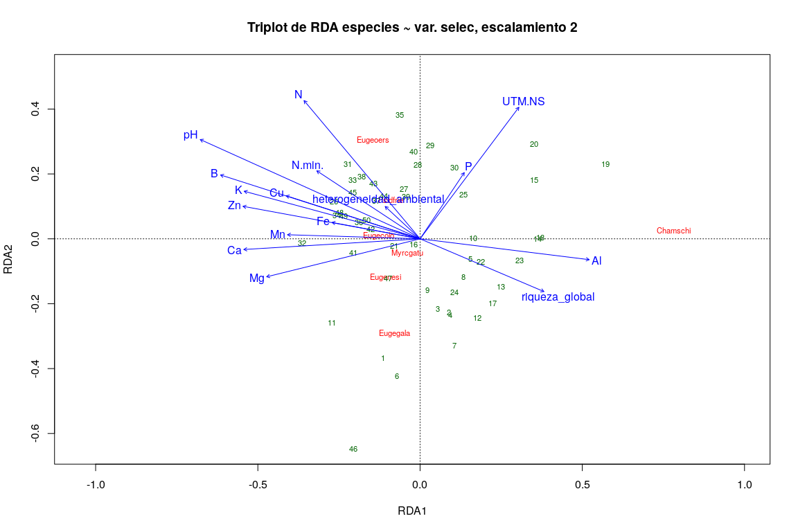

Técnicas de ordenación. <br> Parte 2: Ordenación restringida o 'canónica'. <br> RDA, CCA
================
JR
21 de noviembre, 2020

``` r
knitr::opts_chunk$set(fig.width=12, fig.height=8)
```

Preámbulo
---------

### Cargar paquetes

``` r
library(vegan)
```

    ## Loading required package: permute

    ## Loading required package: lattice

    ## This is vegan 2.5-6

``` r
library(tidyverse)
```

    ## ── Attaching packages ─────────────── tidyverse 1.2.1 ──

    ## ✔ ggplot2 3.2.1     ✔ purrr   0.3.3
    ## ✔ tibble  2.1.3     ✔ dplyr   0.8.3
    ## ✔ tidyr   1.0.0     ✔ stringr 1.4.0
    ## ✔ readr   1.3.1     ✔ forcats 0.4.0

    ## ── Conflicts ────────────────── tidyverse_conflicts() ──
    ## ✖ dplyr::filter() masks stats::filter()
    ## ✖ dplyr::lag()    masks stats::lag()

``` r
library(sf)
```

    ## Linking to GEOS 3.8.0, GDAL 3.0.4, PROJ 7.0.0

``` r
source('biodata/funciones.R')
```

### Cargar datos

``` r
load('biodata/Myrtaceae.Rdata')
load('biodata/matriz_ambiental.Rdata')
mi_fam <- mc_myrtc
(colnames(mi_fam) <- make.cepnames(colnames(mi_fam)))
```

    ## [1] "Chamschi" "Eugecolo" "Eugegala" "Eugenesi" "Eugeoers" "Myrcgatu"
    ## [7] "Psidfrie"

``` r
(df_equivalencias <- data.frame(
  nombre_original = colnames(mc_myrtc),
  colnames(mi_fam)))
```

    ##               nombre_original colnames.mi_fam.
    ## 1          Chamguava schippii         Chamschi
    ## 2       Eugenia coloradoensis         Eugecolo
    ## 3        Eugenia galalonensis         Eugegala
    ## 4           Eugenia nesiotica         Eugenesi
    ## 5         Eugenia oerstediana         Eugeoers
    ## 6           Myrcia gatunensis         Myrcgatu
    ## 7 Psidium friedrichsthalianum         Psidfrie

``` r
bci_env_grid %>% tibble
```

    ## # A tibble: 50 x 1
    ##     .$id $categoria_de_e… $geologia $habitat $quebrada $heterogeneidad…
    ##    <dbl> <fct>            <fct>     <fct>    <fct>                <dbl>
    ##  1     1 c3               Tb        OldSlope Yes                 0.627 
    ##  2     2 c3               Tb        OldLow   Yes                 0.394 
    ##  3     3 c3               Tb        OldLow   No                  0     
    ##  4     4 c3               Tb        OldLow   No                  0     
    ##  5     5 c3               Tb        OldSlope No                  0.461 
    ##  6     6 c3               Tb        OldLow   No                  0.0768
    ##  7     7 c3               Tb        OldLow   Yes                 0.381 
    ##  8     8 c3               Tb        OldLow   Yes                 0.211 
    ##  9     9 c3               Tb        OldLow   No                  0     
    ## 10    10 c3               Tb        OldLow   No                  0     
    ## # … with 40 more rows, and 33 more variables: $UTM.EW <dbl>,
    ## #   $UTM.NS <dbl>, $geomorf_llanura_pct <dbl>, $geomorf_pico_pct <dbl>,
    ## #   $geomorf_interfluvio_pct <dbl>, $geomorf_hombrera_pct <dbl>,
    ## #   $`geomorf_espolón/gajo_pct` <dbl>, $geomorf_vertiente_pct <dbl>,
    ## #   $geomorf_vaguada_pct <dbl>, $geomorf_piedemonte_pct <dbl>,
    ## #   $geomorf_valle_pct <dbl>, $geomorf_sima_pct <dbl>, $Al <dbl>,
    ## #   $B <dbl>, $Ca <dbl>, $Cu <dbl>, $Fe <dbl>, $K <dbl>, $Mg <dbl>,
    ## #   $Mn <dbl>, $P <dbl>, $Zn <dbl>, $N <dbl>, $N.min. <dbl>, $pH <dbl>,
    ## #   $elevacion_media <dbl>, $pendiente_media <dbl>,
    ## #   $orientacion_media <dbl>, $curvatura_perfil_media <dbl>,
    ## #   $curvatura_tangencial_media <dbl>, $geometry <POLYGON [m]>,
    ## #   $abundancia_global <dbl>, $riqueza_global <int>

Ordenación restringida
----------------------

Con este conjunto de técnicas de ordenación, las tendencias detectadas en un conjunto de datos se asocian a otro conjunto, por ejemplo, al buscar tendencias en una matriz de comunidad restringiéndolas a una matriz ambiental.

Las principales técnicas de ordenación restringida son análisis de redundancia o RDA (siglas de *Redundancy Analysis*), análisis de redundancia basado en distancia o db-RDA (*distance-based redundancy analysis*), análisis de correspondencia canónica o CCA (*canonical correspondence analysis*), análisis discriminante lineal o LDA (*lineal discriminant analysis*), curvas de respuesta principales o PRC (*principal response curves*), análisis de correspondencia conjunto o CoCA (*co-correspondence analysis*), análisis de correlación canónica o CCorA (*canonical correlation analysis*), análisis de inercia conjunto o CoIA (*co-inertia analysis*) y análisis factorial múltiple o MFA (*multiple factor analysis*). En este script me concentraré en RDA y CCA.

### Análisis de redundancia (RDA)

En el análisis de ordenación simple o no restringida, la matriz de datos (de comunidad o ambiental) expresa libremente las relaciones entre objetos, sin restricciones de ningún tipo. Se trata, por lo tanto, de un enfoque exploratorio. **La ordenación canónica, por su parte, explora de manera explícita las relaciones entre dos matrices: una matriz de respuesta y una matriz explicativa**.

RDA combina la regresión y el análisis de componentes principales. El RDA es una regresión lineal múltiple aplicada a múltiples variables de respuesta (multivariado), seguido de un PCA de la matriz de valores ajustados. En detalle, el procedimiento se resume así:

-   Cada variable de respuesta (e.g. matriz de comunidad) es ajustada (por regresión) a la matriz explicativa, de donde se obtienen valores ajustados con sus residuos. Con estos valores se construye una matriz de valores ajustados.

-   Se prueba significancia estadística de la relación entre las variables de respuesta y explicativas (e.g. matriz de ambiental); ya sabes, de nuevo, el valor de *p*, o dicho correctamente, la probabilidad de que el efecto observado sea por azar, por lo que, si el valor de *p* es muy pequeño, entonces consideramos que hay efecto (o lo que es lo mismo, las variables independientes explican más de lo que hacen datos generados al azar).

-   Si la prueba resulta significativa, se realiza un PCA de la matriz de valores ajustados. Esto produce un vector de valores propios "canónicos" (*canonical eigenvalues*) y una matriz de vectores propios "canónicos" (*canonical eigenvectors*).

-   Luego se usa la matriz de vectores propios canónicos para calcular dos tipos de puntuaciones de sitios para la ordenación:

    -   Usando la matriz de valores ajustados para obtener una ordenación en el espacio de las variables explicativas, lo cual produce puntuaciones de sitios ajustadas (*Site constraints (linear combinations of constraining variables)* en terminología `{vegan}`).

    -   Usando la matriz de valores centrados de las variables de respuesta para obtener una ordenación en el espacio de los valores originales de las variables de respuesta (*Site scores (weighted averages of species scores)* en terminología `{vegan}`).

Mostraré a continuación ejemplos aplicados a mi familia asignada. Para agilizar, trasladaré las explicaciones más detalladas de cada resultado a los vídeos regulares que alojo en el repositorio de la asignatura, donde encontrarás las claves sobre cómo interpretar éste y otros resultados.

Nota (de nuevo): recuerda que los datos de BCI están autocorrelacionados espacialmente, por lo que los patrones que encuentres estarán siempre afectados por el incumplimiento del supuesto de independencia; no obstante, el ejercicio es bastante didáctico.

#### Ejemplo usando las matriz ambiental de variables suelo:

``` r
mi_fam_hel <- decostand(mi_fam, method = 'hellinger')
mi_fam_hel %>% tibble
```

    ## # A tibble: 50 x 1
    ##    .$Chamschi $Eugecolo $Eugegala $Eugenesi $Eugeoers $Myrcgatu $Psidfrie
    ##         <dbl>     <dbl>     <dbl>     <dbl>     <dbl>     <dbl>     <dbl>
    ##  1     0          0.323     0.661     0.433     0.382     0.354     0    
    ##  2     0          0.267     0.694     0.5       0.443     0         0    
    ##  3     0.183      0.316     0.447     0.5       0.632     0.129     0    
    ##  4     0.153      0.406     0.775     0.217     0.406     0         0    
    ##  5     0          0.416     0.683     0.258     0.542     0         0    
    ##  6     0.0958     0.235     0.851     0.318     0.332     0         0    
    ##  7     0.2        0.224     0.714     0.361     0.480     0.2       0    
    ##  8     0.213      0.326     0.550     0.477     0.550     0         0.123
    ##  9     0.375      0.397     0.592     0.324     0.459     0.187     0    
    ## 10     0.210      0.420     0.630     0.271     0.556     0         0    
    ## # … with 40 more rows

``` r
env_suelo <- bci_env_grid %>%
  st_drop_geometry %>%
  dplyr::select(matches('^[A-T,Z]|^pH$', ignore.case = F))
env_suelo %>% tibble
```

    ## # A tibble: 50 x 1
    ##     .$Al    $B   $Ca   $Cu   $Fe    $K   $Mg   $Mn    $P   $Zn    $N
    ##    <dbl> <dbl> <dbl> <dbl> <dbl> <dbl> <dbl> <dbl> <dbl> <dbl> <dbl>
    ##  1  901. 0.794 1680.  6.20  135. 142.   279.  267.  1.95  2.97  18.5
    ##  2  954. 0.670 1503.  6.03  142. 137.   280.  320.  2.25  2.53  21.6
    ##  3 1114. 0.595 1182.  6.80  157.  98.7  230.  445.  1.95  2.25  20.2
    ##  4 1024. 0.568 1558.  6.63  153.  98.4  229.  408.  2.63  2.44  20.8
    ##  5 1002. 0.399 1242.  6.44  149.  94.1  203.  251.  1.86  2.14  16.9
    ##  6 1091. 0.731 1442.  6.50  174. 132.   277.  477.  1.62  2.63  20.3
    ##  7 1184. 0.340 1111.  5.55  138. 117.   242.  301.  2.13  2.16  20.1
    ##  8 1256. 0.322 1029.  6.28  147. 104.   185.  204.  3.11  2.07  21.5
    ##  9 1122. 0.464 1230.  7.18  153. 110.   207.  415.  1.99  2.33  21.4
    ## 10 1172. 0.314 1127.  6.89  133. 105.   172.  330.  1.69  2.05  18.3
    ## # … with 40 more rows, and 2 more variables: $N.min. <dbl>, $pH <dbl>

``` r
mi_fam_hel_rda_suelo <- rda(mi_fam_hel ~ ., env_suelo)
summary(mi_fam_hel_rda_suelo)
```

    ## 
    ## Call:
    ## rda(formula = mi_fam_hel ~ Al + B + Ca + Cu + Fe + K + Mg + Mn +      P + Zn + N + N.min. + pH, data = env_suelo) 
    ## 
    ## Partitioning of variance:
    ##               Inertia Proportion
    ## Total         0.09456     1.0000
    ## Constrained   0.04443     0.4699
    ## Unconstrained 0.05013     0.5301
    ## 
    ## Eigenvalues, and their contribution to the variance 
    ## 
    ## Importance of components:
    ##                          RDA1     RDA2     RDA3     RDA4     RDA5
    ## Eigenvalue            0.02749 0.008251 0.003283 0.002532 0.001781
    ## Proportion Explained  0.29076 0.087254 0.034718 0.026774 0.018832
    ## Cumulative Proportion 0.29076 0.378017 0.412734 0.439508 0.458341
    ##                            RDA6      RDA7     PC1     PC2      PC3
    ## Eigenvalue            0.0009095 0.0001823 0.01564 0.01263 0.008559
    ## Proportion Explained  0.0096182 0.0019280 0.16536 0.13361 0.090511
    ## Cumulative Proportion 0.4679589 0.4698869 0.63524 0.76885 0.859360
    ##                            PC4      PC5      PC6       PC7
    ## Eigenvalue            0.005582 0.004089 0.002894 0.0007332
    ## Proportion Explained  0.059036 0.043241 0.030609 0.0077536
    ## Cumulative Proportion 0.918396 0.961637 0.992246 1.0000000
    ## 
    ## Accumulated constrained eigenvalues
    ## Importance of components:
    ##                          RDA1     RDA2     RDA3     RDA4     RDA5
    ## Eigenvalue            0.02749 0.008251 0.003283 0.002532 0.001781
    ## Proportion Explained  0.61879 0.185691 0.073885 0.056980 0.040079
    ## Cumulative Proportion 0.61879 0.804484 0.878370 0.935349 0.975428
    ##                            RDA6      RDA7
    ## Eigenvalue            0.0009095 0.0001823
    ## Proportion Explained  0.0204691 0.0041030
    ## Cumulative Proportion 0.9958970 1.0000000
    ## 
    ## Scaling 2 for species and site scores
    ## * Species are scaled proportional to eigenvalues
    ## * Sites are unscaled: weighted dispersion equal on all dimensions
    ## * General scaling constant of scores:  1.467157 
    ## 
    ## 
    ## Species scores
    ## 
    ##               RDA1     RDA2       RDA3     RDA4      RDA5       RDA6
    ## Chamschi  0.742691 -0.03993  0.0054408  0.04500 -0.002714 -0.0004865
    ## Eugecolo -0.170136  0.09664 -0.0161189  0.15436 -0.078816  0.0645813
    ## Eugegala -0.005198  0.21776 -0.0105871 -0.10573 -0.086159 -0.0550533
    ## Eugenesi -0.091966  0.09538  0.1991573  0.06319  0.090027 -0.0383375
    ## Eugeoers -0.167291 -0.29318  0.0005163 -0.05368  0.016283  0.0133449
    ## Myrcgatu -0.056452  0.09201 -0.1856321  0.05352  0.114062 -0.0356068
    ## Psidfrie -0.075416 -0.16108 -0.0143778  0.10422 -0.074263 -0.1028885
    ## 
    ## 
    ## Site scores (weighted sums of species scores)
    ## 
    ##         RDA1      RDA2      RDA3       RDA4     RDA5     RDA6
    ## 1  -0.154410  0.649523 -0.361401  0.1900204  1.03162 -0.70215
    ## 2  -0.133944  0.424240  0.703069 -0.3309805  0.24812 -0.43925
    ## 3   0.009216 -0.108100  0.421439  0.3397411  1.10526  0.26636
    ## 4   0.061320  0.470525 -0.081651 -0.2627735 -0.84576  0.27616
    ## 5  -0.165145  0.211522  0.028793 -0.2678677 -0.51531  0.56681
    ## 6   0.043851  0.650376  0.208184 -0.7277126 -0.47811 -0.69491
    ## 7   0.107811  0.352567 -0.143920 -0.3290675  0.54525 -0.69502
    ## 8   0.064277 -0.042693  0.641425  0.3530603  0.19201 -0.37894
    ## 9   0.280814  0.271478 -0.216306  0.4640742  0.33038  0.24204
    ## 10  0.077840  0.091896  0.085432  0.0045013 -0.38954  0.69961
    ## 11 -0.126497  0.125120 -0.012069 -0.8785873 -0.36049 -0.03262
    ## 12  0.203786  0.191083 -0.002954 -0.2500360  0.17266 -0.20175
    ## 13  0.370878 -0.170159 -0.485811  0.2331743 -0.38066 -0.23868
    ## 14  0.642448 -0.114290 -0.007517  0.3428000  0.73808 -0.54598
    ## 15  0.386851 -0.601673  0.140145  0.0776035  0.49143  1.00046
    ## 16 -0.172320 -0.329322 -0.492237 -0.5894909 -0.08438 -0.20721
    ## 17  0.057324  0.429651 -0.149772  0.5689969 -0.57846  0.04211
    ## 18  0.387885  0.218116 -0.497472 -0.0244139  0.05627  0.01085
    ## 19  0.934033 -0.030339 -0.118245  0.3288078  0.37328  0.29711
    ## 20  0.413916 -0.220695  0.181797 -0.0003053  0.14961  0.54125
    ## 21 -0.187267 -0.536253  0.304022 -0.4400829  0.36628 -0.32815
    ## 22  0.069830 -0.120005 -0.075075 -0.3046977  0.03889 -0.34715
    ## 23  0.286943 -0.054631  0.038406  0.0046932 -0.58330 -0.75090
    ## 24  0.305450  0.082809  0.194756  0.2046201 -0.20468  0.60649
    ## 25  0.187459  0.006266 -0.112933 -0.0776747 -0.74408 -0.13205
    ## 26  0.002332  0.253628  0.092742 -0.4038718 -0.72386 -1.23422
    ## 27 -0.201051 -0.365719  0.081127 -0.0374146 -0.36710 -0.49511
    ## 28 -0.004901 -0.459979 -0.148909 -0.4953630  0.52115  0.47855
    ## 29 -0.077805 -0.592576 -0.164434 -0.3282991 -0.17345  0.50326
    ## 30  0.078212 -0.062343  0.101467  0.5077536 -0.28022  1.36266
    ## 31 -0.178786 -0.146156  0.236416 -0.3113493 -0.15520 -0.39917
    ## 32 -0.062910 -0.068473  0.053446 -0.4076929  0.41269  0.05527
    ## 33 -0.185775 -0.491258  0.216773 -0.3284789  0.02752 -0.79971
    ## 34 -0.166213  0.082792  0.135684 -0.3187834 -0.41213 -0.13364
    ## 35 -0.231866 -0.395357  0.052972  0.1452561  0.71846  1.04726
    ## 36 -0.228216 -0.122257  0.806341  0.5521670  0.75574  0.95705
    ## 37 -0.237604 -0.062978 -0.071087  0.8471191 -0.35850 -0.11181
    ## 38 -0.203481  0.153407  0.089220  0.2437561  0.29245 -0.16591
    ## 39 -0.177217 -0.267359  0.121933 -0.4380507 -0.16744 -0.33988
    ## 40 -0.100167 -0.408893 -0.406558 -0.3074937  0.21134 -0.12831
    ## 41 -0.184592  0.202494  0.004538  0.1680151 -0.13974 -0.78627
    ## 42 -0.190962 -0.105325 -0.067295 -0.2192014  0.03932 -0.11175
    ## 43 -0.202495  0.096879  0.467041  0.4442533 -0.27873 -0.39920
    ## 44 -0.212046 -0.034828 -0.039879  0.4114383 -0.30147 -0.61205
    ## 45 -0.233546 -0.110211 -0.404522  0.3756081  0.64224  0.93531
    ## 46 -0.165522  0.325782  0.413383 -0.1126949 -0.13379  0.23052
    ## 47 -0.133746  0.458153  0.003515 -0.3546191 -0.71683  0.26171
    ## 48 -0.228318 -0.166828 -0.134500  0.4423834 -0.13198 -0.13985
    ## 49 -0.212307  0.049542 -0.518686  0.4123452 -0.51888  0.30320
    ## 50 -0.213368  0.390854 -1.110835  0.8848146  0.56404  0.86762
    ## 
    ## 
    ## Site constraints (linear combinations of constraining variables)
    ## 
    ##         RDA1      RDA2       RDA3      RDA4      RDA5     RDA6
    ## 1  -0.063398  0.341355 -0.0251223 -0.015610  0.699273 -0.10557
    ## 2   0.146878  0.194793  0.0541873 -0.115887  0.226394 -0.13996
    ## 3   0.029481  0.242349  0.1666507 -0.119368  0.267108 -0.11430
    ## 4   0.064786  0.269378  0.3127322 -0.268038 -0.201350  0.06146
    ## 5   0.142083  0.112361 -0.0125742 -0.124248 -0.140971  0.14005
    ## 6  -0.006903  0.344022  0.1443579 -0.130125  0.044971 -0.21668
    ## 7   0.200943  0.206833  0.0754408 -0.084169 -0.229553 -0.14553
    ## 8   0.140929  0.097021  0.0284632  0.184170  0.114994 -0.06965
    ## 9   0.007168  0.199206  0.2608914 -0.076187 -0.031039 -0.18146
    ## 10  0.114001  0.064125  0.1698718 -0.116066 -0.199300  0.07627
    ## 11 -0.199851  0.205448 -0.2339627 -0.451277  0.410982  0.13551
    ## 12  0.203264  0.151411  0.0757679 -0.226973  0.001922  0.01161
    ## 13  0.350217  0.072817 -0.2313918  0.264996  0.144322 -0.26908
    ## 14  0.311365  0.018866  0.1272267 -0.002396  0.101108  0.23537
    ## 15  0.270651 -0.121877  0.2189681  0.010043  0.183680  0.14297
    ## 16  0.086203 -0.104764 -0.2769352 -0.122308  0.193542  0.03269
    ## 17  0.230191  0.153374 -0.1474929 -0.253296 -0.075158  0.18960
    ## 18  0.435745 -0.096436 -0.5033850  0.170559  0.072228  0.02180
    ## 19  0.502904 -0.224542 -0.2149178  0.015076 -0.030867  0.14065
    ## 20  0.262049 -0.198927  0.0009052  0.048766  0.236056 -0.06732
    ## 21 -0.056991 -0.057967  0.0985322  0.022631  0.132453 -0.16479
    ## 22  0.202183 -0.030826  0.0031025  0.007301 -0.278048  0.02035
    ## 23  0.352074 -0.059359 -0.2232748  0.243758 -0.235507 -0.33149
    ## 24  0.113145  0.210440  0.2726295  0.126589 -0.280000 -0.01061
    ## 25  0.055843 -0.011393  0.0334735  0.170688  0.107363 -0.10066
    ## 26 -0.157087 -0.234748  0.1465148 -0.200304 -0.157658  0.04099
    ## 27 -0.060665 -0.256512 -0.0136878 -0.259148 -0.339690 -0.20447
    ## 28 -0.034576 -0.253940  0.0292446 -0.339465 -0.129772 -0.06072
    ## 29  0.039235 -0.279224  0.0817723  0.024293  0.157576 -0.01690
    ## 30  0.039896 -0.121416  0.1885418 -0.012874 -0.051451  0.20359
    ## 31 -0.214654 -0.312067  0.0184002 -0.006111  0.275847  0.33366
    ## 32 -0.259260 -0.132073 -0.2177093 -0.221311 -0.150709 -0.09609
    ## 33 -0.267978 -0.169128 -0.0311075 -0.393589 -0.080595 -0.23958
    ## 34 -0.316010  0.000195  0.1429079 -0.057270 -0.039002 -0.10469
    ## 35 -0.128385 -0.230632 -0.0465677  0.088562  0.270324  0.55390
    ## 36 -0.124965 -0.169939  0.3417504  0.087780 -0.066921  0.20615
    ## 37 -0.083488 -0.207038  0.3432276  0.133894  0.042331  0.01347
    ## 38 -0.235770 -0.166775  0.2163089  0.030671  0.357859 -0.50813
    ## 39 -0.076959 -0.097221 -0.0701695 -0.249640 -0.154343 -0.19125
    ## 40 -0.025441 -0.250825 -0.0973063 -0.066224 -0.071473  0.16298
    ## 41 -0.176095  0.036943  0.0494178  0.392861  0.031336  0.46768
    ## 42 -0.135155 -0.056570  0.2015950  0.349524 -0.079425  0.12959
    ## 43 -0.167753 -0.152388  0.2457007  0.600147  0.021081 -0.25277
    ## 44 -0.094768 -0.123100 -0.0995118  0.259966 -0.290068 -0.20849
    ## 45 -0.324430  0.098824 -0.3264548  0.066792  0.013934  0.04601
    ## 46 -0.192532  0.778092  0.0545660  0.276115 -0.241112  0.22195
    ## 47 -0.044269  0.086638 -0.1346049 -0.133514 -0.212318  0.39261
    ## 48 -0.230749 -0.060536 -0.2762238  0.240650 -0.156583 -0.23134
    ## 49 -0.284604  0.082854 -0.3744925  0.111350 -0.211410  0.17620
    ## 50 -0.338496  0.212882 -0.5462561  0.118213  0.027640 -0.12559
    ## 
    ## 
    ## Biplot scores for constraining variables
    ## 
    ##           RDA1     RDA2     RDA3     RDA4     RDA5     RDA6
    ## Al      0.6653 -0.01308  0.12975  0.09943  0.14424 -0.08048
    ## B      -0.7990 -0.09019 -0.20009  0.22835  0.07817  0.22653
    ## Ca     -0.7009  0.22061 -0.18271  0.41432 -0.09871  0.22898
    ## Cu     -0.5417 -0.03204  0.04654  0.52806  0.03229  0.19616
    ## Fe     -0.3609  0.07902 -0.27812  0.70203 -0.14799  0.05613
    ## K      -0.7062 -0.02173 -0.21407  0.49196 -0.07433  0.09531
    ## Mg     -0.6084  0.32520 -0.25711  0.40883 -0.13401  0.23486
    ## Mn     -0.5237  0.07093  0.21219  0.15886  0.10078  0.09173
    ## P       0.1683 -0.31542 -0.11755 -0.05474  0.02563 -0.23840
    ## Zn     -0.7081  0.03965 -0.22657  0.42826 -0.22844  0.18737
    ## N      -0.4709 -0.51956  0.42002  0.18278 -0.05088  0.01077
    ## N.min. -0.4218 -0.14484 -0.44262  0.36059 -0.41761  0.24048
    ## pH     -0.8720 -0.29413  0.02199 -0.01155 -0.26319 -0.01467

¿Qué partes del resumen debes mirar?

-   La varianza, particionada, de la cual se muestra tanto la inercia (absoluta) como la proporción, y está repartida entre restringida (*constrained*=0.61) y no restringida (*unconstrained*=0.39). La parte restringida es equivalente al R<sup>2</sup> no ajustado del análisis de regresión. Sin embargo, al igual que ocurre en la regresión, este valor está fuertemente sesgado (inflado de varianza por correlación aleatoria o multicolinealidad); además, en el ejemplo, también está afectado por la no independencia de las observaciones. Por esta razón, es prudente calcular el R<sup>2</sup> ajustado o "insesgado" (ver abajo).

-   Los valores propios (*eigenvalues*) y su contribución a la varianza. Existen *eigenvalues* de los ejes "canónicos", que se refieren a la varianza restringida, rotulados como "RDAx" (en mi caso, 13=número de variables explicativas o predictoras), y *eigenvalues* de la varianza no restringida, o residuos (varianza no explicada por el modelo), rotulados como "PCAx" (en mi caso, 16=número especies). La proporción de varianza restringida explicada del encabezado coincide con la proporción acumulada en RDA13 (=0.61), y la proporción de varianza total (=1) coincide con proporción acumulada en PCA16. La no restringida (=0.39), resulta de la acumulación de los residuos, es decir, de los PCAx.

-   Las puntuaciones de sitios (*site scores*) y de especies (*species scores*) tienen el mismo significado que en el PCA.

-   Las puntuaciones restringidas de sitio (en `{vegan}` se usa la etiqueta *Site constraints (linear combinations of constraining variables)*), y son las coordenadas de los sitios en el espacio de las variables explicativas.

-   Finalmente, el resumen presenta las puntuaciones para el *biplot*, que más adelante usaré en un diagrama algo enriquecido.

Tal como comenté arriba, es importante calcular un R<sup>2</sup> insesgado, siendo este más útil cuando el número de variables (en el RDA, "variables" se refiere a las ambientales) es menor que la mitad del número de sitios. Sea *m* el número de variables, y *n* el número de sitios; en mi caso, *m=13*, *n=50-&gt;n/2=25*, así que \*m<n/2*.


```r
RsquareAdj(mi_fam_hel_rda_suelo)$adj.r.squared
```

```
## [1] 0.2784571
```

```r
 #' 
```

Normalmente, el R<sup>2</sup> insesgado es mucho más bajo que el sesgado, porque se relativiza en función de la razón de grados de libertad. Mientras más alejado de cero se encuentre el valor de R<sup>2</sup>, mayor cantidad de varianza explicada insesgada contiene el modelo.

Otro diagnóstico importante es la determinación de los factores de inflación de la varianza (*variance inflation factors*, VIF), el cual explora posible multicolinealidad en el modelo.

``` r
vif.cca(mi_fam_hel_rda_suelo)
```

    ##        Al         B        Ca        Cu        Fe         K        Mg 
    ##  6.179004 14.491840 44.696375  9.970855  5.766886 26.567498 21.238291 
    ##        Mn         P        Zn         N    N.min.        pH 
    ##  5.403569  4.159870 13.879708  3.197403  6.275682  6.342105

Variables con valores por encima de 10 deben ser examinadas y, desde una posición conservadora, deben excluirse, comenzando por las de mayor VIF y excluyendo una, a lo sumo dos, a la vez. Por ejemplo, en este caso, las variables `Ca`, `K`, `Mg` y `Zn` deberían excluirse. No se deben excluir todas a la vez, puesto que al quitar una variable, los VIF se reajustan; es decir, una variable con efecto de colinealidad podría no tenerlo ante la exclusión de una o varias alternas. Exploraré el potencial de los VIF en el siguiente ejemplo, donde realizó un RDA con más variables, además de las de suelo.

Finalmente, la representación del modelo se realiza en un *triplot*, que es un gráfico enriquecido, puesto que contiene tres elementos: sitios, variables de respuesta (especies) y variables explicativas (variables ambientales). Para los sitios se usan las puntuaciones restringidas de sitio.

Escalamiento 1:

``` r
plot(mi_fam_hel_rda_suelo,
     scaling = 1,
     display = c("sp", "lc", "cn"),
     main = "Triplot de RDA especies ~ var. suelo, escalamiento 1"
)
mi_fam_hel_rda_suelo_sc1 <-
  scores(mi_fam_hel_rda_suelo,
         choices = 1:2,
         scaling = 1,
         display = "sp"
  )
arrows(0, 0,
       mi_fam_hel_rda_suelo_sc1[, 1] * 0.9,
       mi_fam_hel_rda_suelo_sc1[, 2] * 0.9,
       length = 0,
       lty = 1,
       col = "red"
)
```


Paso la interpretación de este gráfico y la del siguiente al vídeo correspondiente.

Escalamiento 2

``` r
plot(mi_fam_hel_rda_suelo,
     scaling = 2,
     display = c("sp", "lc", "cn"),
     main = "Triplot de RDA especies ~ var. suelo, escalamiento 2"
)
mi_fam_hel_rda_suelo_sc2 <-
  scores(mi_fam_hel_rda_suelo,
         scaling = 2,
         choices = 1:2,
         display = "sp"
  )
arrows(0, 0,
       mi_fam_hel_rda_suelo_sc2[, 1] * 0.9,
       mi_fam_hel_rda_suelo_sc2[, 2] * 0.9,
       length = 0,
       lty = 1,
       col = "red"
)
```


#### Ejemplo usando las matriz ambiental con variables seleccionadas

El RDA anterior mostró que las variables de suelo son útiles para predecir la matriz de comunidad. No obstante, se evidenciaron dos cosas:

-   Hay mucha colinealidad entre ellas.

-   No se probó mejorar el modelo añadiendo otras variables, además de las de suelo.

Crearé una matriz ambiental con las variables que resultaron significativas en el ajuste *post-hoc* (pasivo) durante la ordenación no restringida, para obtener un RDA comprensivo. A continuación, evaluaré colinealidad tanto mediante VIF como gráficamente, e iré excluyendo variables paulatinamente:

``` r
env_selec <- bci_env_grid %>%
  select(
    heterogeneidad_ambiental,
    riqueza_global,
    UTM.NS,
    Al, B, Ca, Cu, Fe, K, Mg, Mn, P, Zn, N, N.min., pH) %>% 
  st_drop_geometry
mi_fam_hel_rda_selec <- rda(mi_fam_hel ~ ., env_selec)
```

``` r
vif.cca(mi_fam_hel_rda_selec)
```

    ## heterogeneidad_ambiental           riqueza_global                   UTM.NS 
    ##                 2.136341                 2.597828                 1.210198 
    ##                       Al                        B                       Ca 
    ##                 6.225913                17.009845                45.430108 
    ##                       Cu                       Fe                        K 
    ##                10.841316                 6.017245                29.859265 
    ##                       Mg                       Mn                        P 
    ##                22.456538                 8.935919                 4.223768 
    ##                       Zn                        N                   N.min. 
    ##                14.380861                 3.253089                 6.403467 
    ##                       pH 
    ##                 7.133011

Haré el plot del escalamiento 2 para comprobar gráficamente asociación entre variables sin las flechas de especies (para simplificar):

``` r
plot(mi_fam_hel_rda_selec,
     scaling = 2,
     display = c("sp", "lc", "cn"),
     main = "Triplot de RDA especies ~ var. selec, escalamiento 2"
)
```



Tal como comenté arriba, variables con valores VIF por encima de 10, deben ser examinadas. En el arreglo actual, parecen estar asociadas `Ca`, y `Mg` y, por otra parte, `Zn` y `K`. Es preferible sacar una de cada par, para que la retenida explique la varianza correspondiente en cada caso. Entre `Mg` y `Ca`, no tengo preferencia por razones biogeoquímicas, así que excluyo a `Ca` por tener mayor VIF. No obstante, entre `K` y `Zn`, sin duda prefiero excluir a `K`, puesto que el zinc participa en la síntesis de proteínas de las plantas. Finalmente, nótese que `pH` y `N` lucen asociadas en este arreglo, pero esto podría deberse a la introducción de nuevas variables o a la colinealidad preexistente, así que las conservo para decidir con ellas más adelante.

``` r
env_selec2 <- bci_env_grid %>%
  select(
    heterogeneidad_ambiental,
    riqueza_global,
    UTM.NS,
    Al, B, Cu, Fe, K, Mg, Mn, P, N, N.min., pH) %>% 
  st_drop_geometry
mi_fam_hel_rda_selec2 <- rda(mi_fam_hel ~ ., env_selec2)
vif.cca(mi_fam_hel_rda_selec2)
```

    ## heterogeneidad_ambiental           riqueza_global                   UTM.NS 
    ##                 2.111516                 2.463569                 1.209572 
    ##                       Al                        B                       Cu 
    ##                 5.514148                15.489211                10.470526 
    ##                       Fe                        K                       Mg 
    ##                 5.771638                28.560534                 8.541444 
    ##                       Mn                        P                        N 
    ##                 8.795932                 4.132382                 3.166451 
    ##                   N.min.                       pH 
    ##                 4.825052                 6.865321

``` r
plot(mi_fam_hel_rda_selec2,
     scaling = 2,
     display = c("sp", "lc", "cn"),
     main = "Triplot de RDA especies ~ var. selec2, escalamiento 2"
)
```


Nota que las posiciones rotaron, no así la asociación entre la mayoría de las variables. `B` ahora luce asociado con `N.min.`, pero este último es muy importante para las plantas, por lo que excluiré al primero, que además presenta VIF más alto. Por otra parte, `Fe` y `Mg` interactúan fuertemente en este arreglo, por lo que excluiré `Mg` (con VIF más alto).

``` r
env_selec3 <- bci_env_grid %>%
  select(
    heterogeneidad_ambiental,
    riqueza_global,
    UTM.NS,
    Al, Cu, Fe, K, Mg, Mn, P, N, N.min., pH) %>% 
  st_drop_geometry
mi_fam_hel_rda_selec3 <- rda(mi_fam_hel ~ ., env_selec3)
vif.cca(mi_fam_hel_rda_selec3)
```

    ## heterogeneidad_ambiental           riqueza_global                   UTM.NS 
    ##                 1.796113                 2.390831                 1.209483 
    ##                       Al                       Cu                       Fe 
    ##                 4.710354                10.416371                 5.760698 
    ##                        K                       Mg                       Mn 
    ##                27.491146                 7.617993                 6.807974 
    ##                        P                        N                   N.min. 
    ##                 3.105400                 3.166397                 4.804816 
    ##                       pH 
    ##                 6.603193

``` r
plot(mi_fam_hel_rda_selec3,
     scaling = 2,
     display = c("sp", "lc", "cn"),
     main = "Triplot de RDA especies ~ var. selec3, escalamiento 2"
)
```


Finalmente, la coordenada `UTM.EW` tiene un alto valor VIF, por lo que es preferible excluirla; su retiro mejorará los VIF de las demás variables, como por ejemplo `Zn` y `N.min.`.

``` r
env_selec4 <- bci_env_grid %>%
  select(
    riqueza_global,
    UTM.NS,
    Al, Cu, Fe, Mg, Mn, P, N, N.min., pH) %>% 
  st_drop_geometry
mi_fam_hel_rda_selec4 <- rda(mi_fam_hel ~ ., env_selec4)
vif.cca(mi_fam_hel_rda_selec4)
```

    ## riqueza_global         UTM.NS             Al             Cu             Fe 
    ##       2.285790       1.182582       4.566910       7.236751       5.546612 
    ##             Mg             Mn              P              N         N.min. 
    ##       4.490798       5.668558       2.969140       3.132590       4.062278 
    ##             pH 
    ##       5.078639

``` r
plot(mi_fam_hel_rda_selec4,
     scaling = 2,
     display = c("sp", "lc", "cn"),
     main = "Triplot de RDA especies ~ var. selec4, escalamiento 2"
)
```


Las variables `N.min.` y `Zn` ahora presentan valores VIF aceptables. Habrás notado que es todo un arte la selección interactiva de variables; si este enfoque te parece complejo o arbitrario, hay alternativas semiautomáticas. Tal como comenté anteriormente, es posible localizar modelos de manera algorítmica usando la función `step` (y otros métodos de la misma función, aunque en `{vegan}` se usa `ordistep`), ahorrando algunos pasos, pero su desarrollo supera el alcance de esta guía. Considero válido (y oportuno) buscar variables de manera interactiva, puesto que la selección debe estar controlada por el criterio ecológico y humano, más que por el meramente numérico.

``` r
summary(mi_fam_hel_rda_selec4)
```

    ## 
    ## Call:
    ## rda(formula = mi_fam_hel ~ riqueza_global + UTM.NS + Al + Cu +      Fe + Mg + Mn + P + N + N.min. + pH, data = env_selec4) 
    ## 
    ## Partitioning of variance:
    ##               Inertia Proportion
    ## Total         0.09456     1.0000
    ## Constrained   0.04562     0.4825
    ## Unconstrained 0.04894     0.5175
    ## 
    ## Eigenvalues, and their contribution to the variance 
    ## 
    ## Importance of components:
    ##                          RDA1     RDA2     RDA3     RDA4    RDA5      RDA6
    ## Eigenvalue            0.02736 0.008098 0.005128 0.002551 0.00155 0.0007776
    ## Proportion Explained  0.28932 0.085643 0.054234 0.026974 0.01639 0.0082237
    ## Cumulative Proportion 0.28932 0.374964 0.429198 0.456172 0.47256 0.4807840
    ##                            RDA7     PC1     PC2      PC3      PC4     PC5
    ## Eigenvalue            0.0001618 0.01473 0.01305 0.008426 0.005141 0.00361
    ## Proportion Explained  0.0017106 0.15578 0.13796 0.089109 0.054363 0.03817
    ## Cumulative Proportion 0.4824946 0.63828 0.77624 0.865349 0.919712 0.95788
    ##                            PC6       PC7
    ## Eigenvalue            0.003121 0.0008615
    ## Proportion Explained  0.033004 0.0091110
    ## Cumulative Proportion 0.990889 1.0000000
    ## 
    ## Accumulated constrained eigenvalues
    ## Importance of components:
    ##                          RDA1     RDA2     RDA3     RDA4    RDA5      RDA6
    ## Eigenvalue            0.02736 0.008098 0.005128 0.002551 0.00155 0.0007776
    ## Proportion Explained  0.59964 0.177500 0.112404 0.055904 0.03397 0.0170442
    ## Cumulative Proportion 0.59964 0.777135 0.889540 0.945444 0.97941 0.9964547
    ##                            RDA7
    ## Eigenvalue            0.0001618
    ## Proportion Explained  0.0035453
    ## Cumulative Proportion 1.0000000
    ## 
    ## Scaling 2 for species and site scores
    ## * Species are scaled proportional to eigenvalues
    ## * Sites are unscaled: weighted dispersion equal on all dimensions
    ## * General scaling constant of scores:  1.467157 
    ## 
    ## 
    ## Species scores
    ## 
    ##              RDA1     RDA2      RDA3     RDA4      RDA5      RDA6
    ## Chamschi  0.75182 -0.03271  0.004165 -0.01454  0.021187 -0.005343
    ## Eugecolo -0.10868 -0.01709  0.265769 -0.05622 -0.008917 -0.058498
    ## Eugegala -0.07686  0.24294 -0.106106  0.09044 -0.005460 -0.039206
    ## Eugenesi -0.09660  0.10213 -0.080748 -0.19987  0.035711  0.033536
    ## Eugeoers -0.13750 -0.28933 -0.048887  0.03150 -0.034367  0.039012
    ## Myrcgatu -0.01992  0.11366  0.150441  0.07278  0.080536  0.088458
    ## Psidfrie -0.10582 -0.13003 -0.057365  0.01656  0.160552 -0.047358
    ## 
    ## 
    ## Site scores (weighted sums of species scores)
    ## 
    ##         RDA1      RDA2      RDA3      RDA4      RDA5     RDA6
    ## 1  -0.155508  0.694104  0.296741 -0.064558  0.545505  1.37921
    ## 2  -0.162512  0.465533 -0.387129 -0.600035 -0.244626 -0.01505
    ## 3   0.033939 -0.114533  0.042606 -0.813662  0.001249  1.37761
    ## 4   0.040735  0.433009  0.072340  0.306497 -0.450093 -1.31560
    ## 5  -0.171358  0.148513  0.088493  0.123867 -0.621199 -0.72402
    ## 6  -0.007685  0.732246 -0.427932  0.219279 -0.279179 -0.87466
    ## 7   0.091306  0.449107 -0.158402  0.173397  0.163447  0.84046
    ## 8   0.061439 -0.035411 -0.205095 -0.760695  0.323059 -0.09071
    ## 9   0.297425  0.246249  0.371404 -0.131132  0.197964  0.30579
    ## 10  0.082965  0.026069  0.137822 -0.051899 -0.488427 -0.62675
    ## 11 -0.153615  0.170162 -0.337689  0.482337 -0.649287 -0.27685
    ## 12  0.193623  0.243495 -0.138322  0.089672 -0.092370  0.25573
    ## 13  0.374350 -0.141825  0.102645  0.515226  0.499837 -0.40909
    ## 14  0.646875  0.002231 -0.163549 -0.201146  0.696059  0.80456
    ## 15  0.418638 -0.602579 -0.046405 -0.226115 -0.423504  0.73107
    ## 16 -0.177357 -0.273903 -0.159461  0.807965 -0.104625  0.44965
    ## 17  0.057583  0.349938  0.416933 -0.062636  0.317969 -1.10901
    ## 18  0.388832  0.255901  0.161991  0.463909  0.087266  0.16138
    ## 19  0.941009  0.057103 -0.034015 -0.064408  0.245009  0.05856
    ## 20  0.424776 -0.207078 -0.105191 -0.167521 -0.305327  0.12408
    ## 21 -0.191879 -0.464691 -0.491354 -0.064683 -0.078260  0.75621
    ## 22  0.061588 -0.062200 -0.219580  0.262513  0.031313  0.26673
    ## 23  0.265337  0.006945 -0.280701  0.200769  0.474715 -0.89377
    ## 24  0.312999  0.038877  0.102529 -0.259071 -0.289503 -0.53131
    ## 25  0.174448  0.010654 -0.071870  0.347259  0.045080 -1.02494
    ## 26 -0.044464  0.343207 -0.453872  0.335806  0.384902 -1.07625
    ## 27 -0.208805 -0.350307 -0.222043  0.107823  0.316427 -0.37404
    ## 28  0.009984 -0.422331 -0.155536  0.286777 -0.509082  1.17103
    ## 29 -0.065638 -0.598172 -0.108433  0.396209 -0.382851  0.16116
    ## 30  0.110020 -0.207704  0.464125 -0.361392 -0.500677 -0.59049
    ## 31 -0.193940 -0.113714 -0.321849  0.003775 -0.028621 -0.12908
    ## 32 -0.063499 -0.032322 -0.172065  0.048894 -0.337576  0.78278
    ## 33 -0.200264 -0.408289 -0.510321  0.074187  0.300605  0.25751
    ## 34 -0.183257  0.081546 -0.169542  0.103311 -0.225301 -0.54590
    ## 35 -0.192969 -0.467911  0.248400 -0.333209 -0.472924  1.16575
    ## 36 -0.196594 -0.228963  0.168629 -1.270533 -0.376354  0.61362
    ## 37 -0.221674 -0.159792  0.411312 -0.258567  0.688546 -0.67305
    ## 38 -0.198733  0.127857  0.139357 -0.299206  0.202263  0.32718
    ## 39 -0.190939 -0.224273 -0.353209  0.187678 -0.097297 -0.01590
    ## 40 -0.092714 -0.364425 -0.076564  0.540127  0.046227  0.79221
    ## 41 -0.198505  0.214177 -0.007323 -0.038845  0.541065 -0.26972
    ## 42 -0.192664 -0.096551 -0.068885  0.164398 -0.069618  0.26732
    ## 43 -0.209676  0.053078 -0.015046 -0.582551  0.400437 -0.74822
    ## 44 -0.214600 -0.057207  0.097044 -0.054026  0.667839 -0.46725
    ## 45 -0.191107 -0.204545  0.590930 -0.038254 -0.183963  1.10649
    ## 46 -0.175973  0.283855 -0.037294 -0.386836 -0.422007 -0.43635
    ## 47 -0.155096  0.415545  0.037154  0.223010 -0.534577 -1.10329
    ## 48 -0.215800 -0.217506  0.231426 -0.039707  0.452482 -0.13124
    ## 49 -0.197407 -0.047323  0.518757  0.350863  0.210875 -0.60940
    ## 50 -0.163635  0.254151  1.198038  0.315139  0.327112  0.90583
    ## 
    ## 
    ## Site constraints (linear combinations of constraining variables)
    ## 
    ##         RDA1      RDA2      RDA3      RDA4       RDA5      RDA6
    ## 1   0.004109  0.474048 -0.107580 -0.053951  0.0425839  0.350931
    ## 2   0.052565  0.240863 -0.131711 -0.043356 -0.2373875  0.015949
    ## 3   0.083906  0.301507 -0.004479 -0.286554 -0.1136884  0.298663
    ## 4   0.087685  0.017054 -0.001214  0.018534 -0.2402272  0.257971
    ## 5   0.193185 -0.043514  0.150337  0.124672 -0.1482952  0.131998
    ## 6  -0.113691  0.450554 -0.144222 -0.214384  0.0047197  0.024133
    ## 7   0.084444  0.279062 -0.084024 -0.062106 -0.0404903 -0.130060
    ## 8   0.152614  0.138852 -0.057594 -0.059256  0.1687560 -0.045357
    ## 9   0.022034  0.093574  0.012935 -0.162971 -0.1980153  0.117642
    ## 10  0.142654 -0.098660  0.048933  0.031238 -0.3073503 -0.064771
    ## 11 -0.268195  0.432895 -0.151620  0.052140 -0.2002587  0.232726
    ## 12  0.208564  0.226769 -0.192018  0.039151 -0.0095497  0.081472
    ## 13  0.313271  0.133421 -0.103602  0.254349  0.2648060 -0.261146
    ## 14  0.414866 -0.020832  0.020113 -0.108576 -0.0009134  0.137168
    ## 15  0.373526 -0.190747  0.048492 -0.217021 -0.1492192  0.251012
    ## 16 -0.099842  0.083978 -0.309844  0.229030  0.0638631 -0.115387
    ## 17  0.143683  0.243675 -0.145555  0.199975 -0.1149053 -0.151321
    ## 18  0.393040  0.093085 -0.033608  0.303805  0.4326580 -0.101133
    ## 19  0.446278 -0.123547  0.003320  0.114530 -0.0336164 -0.146331
    ## 20  0.317330 -0.198344  0.069601 -0.060893 -0.1981929 -0.024283
    ## 21 -0.186333  0.038393 -0.179554 -0.159775  0.1772361  0.177389
    ## 22  0.099090  0.002430 -0.126098  0.066723  0.2753471 -0.107186
    ## 23  0.307372  0.008242  0.055114  0.148112  0.6559236  0.204885
    ## 24  0.055102 -0.005949  0.153230 -0.216872 -0.0436609 -0.184802
    ## 25  0.102362 -0.086202  0.312082 -0.209879 -0.1006194  0.123294
    ## 26 -0.315124 -0.201901 -0.433919  0.058189 -0.1718038 -0.384713
    ## 27 -0.124036 -0.167786 -0.253523  0.222287  0.0424416  0.006691
    ## 28  0.004637 -0.227727 -0.182217  0.208946 -0.2856420  0.001401
    ## 29  0.097569 -0.235914 -0.013928 -0.152303 -0.1956835 -0.056301
    ## 30  0.152679 -0.223321  0.194057 -0.275401 -0.2069917 -0.056517
    ## 31 -0.177948 -0.170090 -0.280856 -0.008713  0.2025906 -0.040734
    ## 32 -0.307325 -0.070276 -0.154630  0.410685  0.1449290  0.228713
    ## 33 -0.222756 -0.160156 -0.182795  0.301686 -0.1695062  0.142659
    ## 34 -0.244265 -0.105774  0.022584 -0.044433 -0.0196511  0.209641
    ## 35 -0.027404 -0.258402  0.066431 -0.134749 -0.1939599 -0.381074
    ## 36 -0.215476 -0.182561 -0.208697 -0.321544  0.1759152  0.112973
    ## 37 -0.080751 -0.146111 -0.174893 -0.359032  0.0065875 -0.127757
    ## 38 -0.153429 -0.156862 -0.125546 -0.114989  0.0284828  0.409394
    ## 39 -0.141330 -0.151213  0.016680  0.189495 -0.2321185  0.205389
    ## 40  0.097300 -0.336589  0.097964  0.194876 -0.0162141  0.112879
    ## 41 -0.278888  0.053078  0.118697 -0.382645  0.2461230 -0.008985
    ## 42 -0.117955 -0.025117  0.012256 -0.336178  0.1666099 -0.238691
    ## 43 -0.102102 -0.165215  0.060233 -0.389144  0.4446299 -0.226878
    ## 44 -0.114377 -0.200441  0.198515  0.061714  0.2786438 -0.200517
    ## 45 -0.248187 -0.052622  0.422099  0.187797 -0.0273347 -0.119600
    ## 46 -0.159737  0.585817  0.301605 -0.014968 -0.1883518 -0.637212
    ## 47  0.057896  0.067321 -0.005294  0.335397 -0.2241633 -0.264637
    ## 48 -0.226341 -0.076947  0.196140  0.256012  0.1722014 -0.057574
    ## 49 -0.304535 -0.019609  0.462187  0.165900 -0.0630064 -0.006711
    ## 50 -0.177733  0.137810  0.745416  0.214452  0.1357689  0.304704
    ## 
    ## 
    ## Biplot scores for constraining variables
    ## 
    ##                   RDA1      RDA2    RDA3      RDA4     RDA5      RDA6
    ## riqueza_global  0.4921  0.255908  0.4040 -0.057581  0.48839  0.213665
    ## UTM.NS          0.3937 -0.493000  0.6293  0.050090 -0.26498  0.146748
    ## Al              0.6627  0.057975 -0.1907 -0.122105  0.14034 -0.027283
    ## Cu             -0.5224 -0.143971  0.3875 -0.369722  0.21198  0.004777
    ## Fe             -0.3417 -0.026215  0.5436 -0.097358  0.49926 -0.250152
    ## Mg             -0.5958  0.198798  0.5738 -0.061662  0.10095 -0.188829
    ## Mn             -0.5180 -0.002052  0.1562 -0.370093 -0.05192  0.093940
    ## P               0.1700 -0.267059 -0.1529  0.218215  0.21547  0.209270
    ## N              -0.4596 -0.575088 -0.1049 -0.428648  0.08023  0.007767
    ## N.min.         -0.4047 -0.242782  0.4454  0.295033  0.22820 -0.380275
    ## pH             -0.8645 -0.387216  0.1233  0.005508 -0.02376 -0.036204

``` r
RsquareAdj(mi_fam_hel_rda_selec4)$adj.r.squared
```

    ## [1] 0.3326904

Triplot, pero ahora con las flechas para las especies.

Escalamiento 1:

``` r
plot(mi_fam_hel_rda_selec4,
     scaling = 1,
     display = c("sp", "lc", "cn"),
     main = "Triplot de RDA especies ~ var. selec4, escalamiento 1"
)
mi_fam_hel_rda_selec4_sc1 <-
  scores(mi_fam_hel_rda_selec4,
         choices = 1:2,
         scaling = 1,
         display = "sp"
  )
arrows(0, 0,
       mi_fam_hel_rda_selec4_sc1[, 1] * 0.9,
       mi_fam_hel_rda_selec4_sc1[, 2] * 0.9,
       length = 0,
       lty = 1,
       col = "red"
)
```


Escalamiento 2

``` r
plot(mi_fam_hel_rda_selec4,
     scaling = 2,
     display = c("sp", "lc", "cn"),
     main = "Triplot de RDA especies ~ var. selec4, escalamiento 2"
)
mi_fam_hel_rda_selec4_sc2 <-
  scores(mi_fam_hel_rda_selec4,
         scaling = 2,
         choices = 1:2,
         display = "sp"
  )
arrows(0, 0,
       mi_fam_hel_rda_selec4_sc2[, 1] * 0.9,
       mi_fam_hel_rda_selec4_sc2[, 2] * 0.9,
       length = 0,
       lty = 1,
       col = "red"
)
```


### Análisis de correspondencia canónica (CCA)

#### Ejemplo usando las matriz ambiental con variables seleccionadas:

``` r
mi_fam_cca_selec4 <- cca(mi_fam ~ ., env_selec4)
summary(mi_fam_cca_selec4)
```

    ## 
    ## Call:
    ## cca(formula = mi_fam ~ riqueza_global + UTM.NS + Al + Cu + Fe +      Mg + Mn + P + N + N.min. + pH, data = env_selec4) 
    ## 
    ## Partitioning of scaled Chi-square:
    ##               Inertia Proportion
    ## Total          0.5771     1.0000
    ## Constrained    0.3072     0.5322
    ## Unconstrained  0.2699     0.4678
    ## 
    ## Eigenvalues, and their contribution to the scaled Chi-square 
    ## 
    ## Importance of components:
    ##                         CCA1    CCA2    CCA3     CCA4     CCA5     CCA6
    ## Eigenvalue            0.2336 0.03261 0.02274 0.008415 0.005254 0.004479
    ## Proportion Explained  0.4049 0.05651 0.03941 0.014581 0.009104 0.007761
    ## Cumulative Proportion 0.4049 0.46138 0.50079 0.515375 0.524479 0.532240
    ##                          CA1     CA2     CA3    CA4     CA5      CA6
    ## Eigenvalue            0.1352 0.04793 0.03938 0.0221 0.01540 0.009953
    ## Proportion Explained  0.2342 0.08305 0.06823 0.0383 0.02669 0.017247
    ## Cumulative Proportion 0.7665 0.84953 0.91776 0.9561 0.98275 1.000000
    ## 
    ## Accumulated constrained eigenvalues
    ## Importance of components:
    ##                         CCA1    CCA2    CCA3     CCA4     CCA5     CCA6
    ## Eigenvalue            0.2336 0.03261 0.02274 0.008415 0.005254 0.004479
    ## Proportion Explained  0.7607 0.10618 0.07405 0.027396 0.017105 0.014581
    ## Cumulative Proportion 0.7607 0.86687 0.94092 0.968314 0.985419 1.000000
    ## 
    ## Scaling 2 for species and site scores
    ## * Species are scaled proportional to eigenvalues
    ## * Sites are unscaled: weighted dispersion equal on all dimensions
    ## 
    ## 
    ## Species scores
    ## 
    ##             CCA1     CCA2     CCA3      CCA4      CCA5       CCA6
    ## Chamschi  1.4680 -0.01325 -0.01723 -0.006074 -0.018566  0.0002782
    ## Eugecolo -0.2114 -0.07120 -0.27651 -0.153777  0.007442  0.0854903
    ## Eugegala -0.1466 -0.14629  0.11403  0.041721  0.006840  0.0359903
    ## Eugenesi -0.1995 -0.10343  0.10761 -0.162055 -0.052487 -0.1563885
    ## Eugeoers -0.1252  0.22001 -0.02793  0.034303  0.033626 -0.0206038
    ## Myrcgatu -0.3119 -0.72202 -0.91822  0.485283 -0.095592 -0.2628676
    ## Psidfrie -0.4856  0.47303  0.02137  0.097637 -0.656874  0.1345240
    ## 
    ## 
    ## Site scores (weighted averages of species scores)
    ## 
    ##       CCA1     CCA2     CCA3     CCA4     CCA5    CCA6
    ## 1  -0.7738 -4.56792 -3.41140  4.45790 -2.49701 -9.0508
    ## 2  -0.6858 -1.78634  2.49045 -2.92867 -0.51152 -4.3954
    ## 3  -0.4566  0.40755 -0.21951 -3.08269  0.04352 -8.0300
    ## 4  -0.5061 -2.09860  1.00832 -0.28692  1.51525  5.5661
    ## 5  -0.6638 -0.70431  0.18761 -0.94193  2.06440  3.3814
    ## 6  -0.5920 -2.95223  3.29978  1.08619  0.68549  2.8452
    ## 7  -0.4015 -2.15927  0.63650  2.32685  0.03893 -2.8900
    ## 8  -0.3884 -0.06608  0.91282 -3.43435 -1.84127 -4.4126
    ## 9   0.2693 -1.66601 -1.44377 -0.39255 -0.15813 -0.8613
    ## 10 -0.3599 -0.33413 -0.21948 -1.44525  1.85291  2.5738
    ## 11 -0.6267 -0.52552  1.83493  1.89011  2.39811  2.1990
    ## 12 -0.0836 -1.01897  1.12848  0.62365  0.91273 -0.3274
    ## 13  0.6601  0.11717 -0.31622  1.42396 -1.46355  2.6579
    ## 14  2.0735 -0.55161  0.04299  0.31840 -1.99783 -3.3600
    ## 15  0.8847  2.38974 -0.59046  0.13070  2.12307 -2.2778
    ## 16 -0.6271  1.51039  0.18409  3.26366  1.96643  0.6080
    ## 17 -0.4646 -1.94956 -0.95430 -2.73068 -0.40029  4.6063
    ## 18  0.6051 -1.60485 -0.36166  2.21753  0.45895  1.0826
    ## 19  3.8845 -0.68458  0.08946 -0.20185 -1.84626  0.1114
    ## 20  0.8897  0.66563  0.20550 -0.30661  1.14533 -0.7803
    ## 21 -0.6339  2.61260  0.69947  0.95494  0.85682 -3.6116
    ## 22 -0.3716  0.38276  0.85827  1.37744  1.31353 -0.1999
    ## 23  0.1967 -0.23581  1.25654  0.94416 -2.75775  2.5752
    ## 24  0.3704 -0.50638 -0.06598 -1.82637  0.87565  1.2959
    ## 25 -0.1106 -0.43237  0.67814  0.58888  0.22021  3.7613
    ## 26 -0.6191 -1.46762  2.57046  1.56796 -2.50221  3.3957
    ## 27 -0.7006  1.88684  0.27872  0.74191 -3.37007  1.0746
    ## 28 -0.4533  2.47367 -0.11928  2.08324  3.48887 -2.2249
    ## 29 -0.5492  2.88498 -0.41612  1.71582  2.86227  0.1120
    ## 30 -0.2892  0.35853 -2.12454 -3.79250  1.94991  2.8733
    ## 31 -0.6594  0.69751  1.04192  0.24006  0.17305 -0.5885
    ## 32 -0.5790  0.54460  0.66640  0.66740  2.03205 -2.1064
    ## 33 -0.6777  2.40517  0.91314  1.46043 -2.78813 -1.4776
    ## 34 -0.6587 -0.36130  0.99191 -0.07693  1.16045  1.5494
    ## 35 -0.6476  2.30802 -1.53285 -1.18871  2.76933 -3.2581
    ## 36 -0.7076  0.66784 -0.64112 -6.56994  0.07353 -7.1066
    ## 37 -0.7774  0.50769 -2.00205 -3.09278 -5.05543  3.1588
    ## 38 -0.7009 -0.70113 -0.40840 -1.83433 -0.11230 -2.2901
    ## 39 -0.6451  1.28458  0.91514  1.17773  0.69977 -0.2356
    ## 40 -0.5937  1.85187 -0.49498  2.90022  1.72719 -1.0136
    ## 41 -0.7183 -0.93437  0.45231 -0.63716 -2.47524  0.3802
    ## 42 -0.6526  0.62947  0.23073  0.52285  1.41847 -0.2732
    ## 43 -0.7393 -0.35617  0.21720 -3.62908 -3.36653 -0.5743
    ## 44 -0.7467  0.35914 -0.39218 -0.99550 -4.71659  1.8189
    ## 45 -0.6975  0.31065 -3.60056  0.24786  1.71107 -2.2964
    ## 46 -0.6832 -1.19038  0.85016 -2.63742  0.75870 -0.2300
    ## 47 -0.6697 -1.88097  0.99424 -0.55297  1.57531  4.6987
    ## 48 -0.7217  0.89988 -1.27163 -1.05088 -2.30320  1.1720
    ## 49 -0.7181 -0.31800 -2.26206 -1.08447 -0.16848  4.5365
    ## 50 -0.8257 -4.22202 -9.39277  4.71517 -1.30172 -3.8543
    ## 
    ## 
    ## Site constraints (linear combinations of constraining variables)
    ## 
    ##        CCA1     CCA2     CCA3     CCA4      CCA5      CCA6
    ## 1  -0.56219 -2.37500  0.73654  0.98600  0.676465 -2.142458
    ## 2  -0.10233 -1.02993  1.14773 -0.04567  1.342177 -0.532403
    ## 3  -0.49797 -1.60894  0.38383 -0.28917  0.923650 -1.978316
    ## 4  -0.07705 -0.17156  0.04271  0.54766  1.384464 -0.862276
    ## 5   0.35131 -0.11836 -0.82453  0.78687  1.193370 -0.211498
    ## 6  -1.22502 -1.99211  1.29693 -0.36417 -0.163481 -0.623449
    ## 7   0.05829 -1.35438  0.76843 -0.29173  0.067841  0.229980
    ## 8   0.16161 -0.89539  0.61323 -0.23634 -0.017884 -0.278309
    ## 9  -0.58398 -0.45944  0.29557 -0.52036  1.383519 -0.598889
    ## 10  0.33211  0.45408 -0.02211 -0.38914  1.732838  0.811425
    ## 11 -1.44587 -1.75474  1.22190  0.54898  1.204658 -0.195362
    ## 12  0.52997 -1.15253  1.21718  0.65152 -0.288559 -0.318011
    ## 13  0.88934 -0.97596  1.15377  0.64521 -0.520831  1.091358
    ## 14  1.40419 -0.39863 -0.11162  0.06899 -0.141191 -1.213082
    ## 15  1.32054  0.50048 -0.25750 -0.59284  0.628436 -1.345375
    ## 16 -0.52230 -0.02202  1.91147  0.76619 -0.267032  1.060456
    ## 17  0.63459 -1.17815  1.19224  0.40021  0.567856  1.012293
    ## 18  1.29068 -1.07247  0.36000  1.43162 -1.435388  0.319607
    ## 19  2.11024  0.12446  0.02924 -0.01443 -0.052249  0.534795
    ## 20  1.08582  0.66054 -0.33733 -0.35335  0.597683 -0.089001
    ## 21 -1.02050 -0.07622  0.62199  0.10351 -1.090490 -1.460938
    ## 22  0.32990 -0.22104  0.41412  0.43529 -1.725046  0.083031
    ## 23  0.75910 -0.91517 -0.85733  1.87598 -2.828377 -1.532780
    ## 24 -0.23043 -0.26739 -0.56052 -1.17792 -0.005325 -0.118916
    ## 25  0.17854 -0.18444 -1.89499 -0.71061  0.846798 -1.439683
    ## 26 -1.53980  1.90517  2.31954 -0.16769 -0.249922  1.357385
    ## 27 -0.62873  1.10689  0.63882  1.40532 -0.914094  0.234886
    ## 28 -0.14097  1.41344  0.22799  1.45761  0.551393 -0.199498
    ## 29  0.37074  1.01419 -0.09306 -0.87155  0.620026 -0.622946
    ## 30  0.15195  0.73127 -1.38248 -0.80846  0.228102 -1.219309
    ## 31 -0.63814  1.09581  0.81964  0.27007 -1.677963 -0.232435
    ## 32 -0.98388  0.45346  0.19865  1.73493 -0.025948  0.459702
    ## 33 -1.35837  1.17333  0.27716  1.96884  0.498977 -0.009345
    ## 34 -1.41581  0.45658 -0.23214 -0.18804  0.917702 -0.734936
    ## 35 -0.26767  1.25586  0.17345 -2.05543  0.994974  1.585318
    ## 36 -0.75814  0.97392  0.63524 -1.00070 -1.308043 -1.811313
    ## 37 -0.20968  0.80835  0.85093 -1.89004 -0.759901 -0.541581
    ## 38 -0.76619  0.65409  0.33201 -0.02399  0.175693 -1.890737
    ## 39 -0.28379  0.63300 -0.11535  0.16145  1.557242  0.307947
    ## 40  0.58107  1.19438 -0.90245  0.47769  0.131925  0.229597
    ## 41 -0.69408 -0.59235 -0.49879 -2.15468 -0.747865 -1.256167
    ## 42 -0.45422  0.02893  0.13342 -2.01218 -1.257558  0.162346
    ## 43 -0.84266  0.50560 -0.19849 -1.97793 -2.684531  0.073489
    ## 44 -0.68143  0.62355 -1.21033 -0.20160 -1.969411  1.454421
    ## 45 -1.40104 -0.14514 -2.06536  0.15936  0.088690  1.573132
    ## 46 -0.58741 -3.00560 -0.38003 -1.48444  0.536030  2.184231
    ## 47  0.73589 -0.29360  0.19660  0.66291  0.282967  1.999607
    ## 48 -0.79566  0.14976 -1.18730  0.62376 -0.823346  1.437870
    ## 49 -1.07676 -0.31561 -2.47415  0.04049  0.660731  1.008959
    ## 50 -1.10707 -1.71581 -4.57438  1.70809 -0.447257 -0.620237
    ## 
    ## 
    ## Biplot scores for constraining variables
    ## 
    ##                    CCA1     CCA2     CCA3     CCA4     CCA5       CCA6
    ## riqueza_global  0.53841 -0.43842 -0.38450  0.12826 -0.39616 -0.2684665
    ## UTM.NS          0.40779  0.36497 -0.62201 -0.05077  0.34914 -0.0487573
    ## Al              0.65662 -0.10637  0.24568 -0.20518 -0.02970 -0.0810531
    ## Cu             -0.35454  0.03994 -0.38075 -0.53984 -0.13251 -0.0006318
    ## Fe             -0.23825 -0.18467 -0.46774 -0.36307 -0.47474  0.2426904
    ## Mg             -0.44223 -0.33445 -0.45358 -0.30698 -0.08520  0.2717513
    ## Mn             -0.40235 -0.00846 -0.11075 -0.48642  0.03665 -0.0520135
    ## P               0.14362  0.20840  0.07088  0.20616 -0.01909 -0.1652418
    ## N              -0.46187  0.55071 -0.03833 -0.29784 -0.15363 -0.2880791
    ## N.min.         -0.07958  0.07723 -0.47219 -0.07308 -0.34331  0.5843928
    ## pH             -0.81781  0.37095 -0.19672 -0.03768 -0.04911  0.1291035

``` r
RsquareAdj(mi_fam_cca_selec4)
```

    ## $r.squared
    ## [1] 0.5322398
    ## 
    ## $adj.r.squared
    ## [1] 0.3997148

Escalamiento 1

``` r
plot(mi_fam_cca_selec4,
     scaling = 1,
     display = c("sp", "lc", "cn"),
     main = "Triplot de CCA especies ~ var. selec4, escalamiento 1"
)
```


Escalamiento 2

``` r
plot(mi_fam_cca_selec4,
     scaling = 2,
     display = c("sp", "lc", "cn"),
     main = "Triplot de CCA especies ~ var. selec4, escalamiento 2"
)
```


Excluyendo especies con abundancia menor a 100 individuos

``` r
colSums(mi_fam) %>% sort
```

    ## Myrcgatu Psidfrie Eugenesi Chamschi Eugecolo Eugeoers Eugegala 
    ##       56       58      502      541      609     1838     1975

``` r
mi_fam_no_raras <- mi_fam %>% select_if(colSums(.) > 100)
intersect(colnames(mi_fam), colnames(mi_fam_no_raras))
```

    ## [1] "Chamschi" "Eugecolo" "Eugegala" "Eugenesi" "Eugeoers"

``` r
setdiff(colnames(mi_fam), colnames(mi_fam_no_raras))
```

    ## [1] "Myrcgatu" "Psidfrie"

``` r
mi_fam_no_raras_cca_selec4 <- cca(mi_fam_no_raras ~ ., env_selec4)
summary(mi_fam_no_raras_cca_selec4)
```

    ## 
    ## Call:
    ## cca(formula = mi_fam_no_raras ~ riqueza_global + UTM.NS + Al +      Cu + Fe + Mg + Mn + P + N + N.min. + pH, data = env_selec4) 
    ## 
    ## Partitioning of scaled Chi-square:
    ##               Inertia Proportion
    ## Total          0.5107     1.0000
    ## Constrained    0.2848     0.5577
    ## Unconstrained  0.2259     0.4423
    ## 
    ## Eigenvalues, and their contribution to the scaled Chi-square 
    ## 
    ## Importance of components:
    ##                         CCA1    CCA2    CCA3     CCA4    CA1     CA2
    ## Eigenvalue            0.2341 0.02921 0.01548 0.005975 0.1345 0.04868
    ## Proportion Explained  0.4585 0.05720 0.03031 0.011699 0.2633 0.09532
    ## Cumulative Proportion 0.4585 0.51568 0.54598 0.557682 0.8210 0.91629
    ##                           CA3     CA4
    ## Eigenvalue            0.02700 0.01575
    ## Proportion Explained  0.05286 0.03085
    ## Cumulative Proportion 0.96915 1.00000
    ## 
    ## Accumulated constrained eigenvalues
    ## Importance of components:
    ##                         CCA1    CCA2    CCA3     CCA4
    ## Eigenvalue            0.2341 0.02921 0.01548 0.005975
    ## Proportion Explained  0.8221 0.10258 0.05434 0.020977
    ## Cumulative Proportion 0.8221 0.92468 0.97902 1.000000
    ## 
    ## Scaling 2 for species and site scores
    ## * Species are scaled proportional to eigenvalues
    ## * Sites are unscaled: weighted dispersion equal on all dimensions
    ## 
    ## 
    ## Species scores
    ## 
    ##             CCA1     CCA2      CCA3      CCA4      CA1      CA2
    ## Chamschi  1.4572 -0.01156 -0.018701 -0.005844  1.08987 -0.07086
    ## Eugecolo -0.2201  0.04469 -0.342499  0.026728 -0.17397  0.26678
    ## Eugegala -0.1542 -0.17667  0.049855  0.051072 -0.06315  0.20347
    ## Eugenesi -0.2067 -0.14167 -0.002744 -0.232098 -0.02302 -0.04793
    ## Eugeoers -0.1338  0.21713  0.066166  0.001377 -0.18901 -0.27308
    ## 
    ## 
    ## Site scores (weighted averages of species scores)
    ## 
    ##       CCA1     CCA2     CCA3     CCA4      CA1       CA2
    ## 1  -0.7256 -2.64199 -0.34931 -3.47943 -0.12937  0.227063
    ## 2  -0.7176 -2.55885  0.76779 -5.22567 -0.57916  0.423018
    ## 3  -0.4755  0.70253  0.05770 -7.62239 -0.04306 -2.099868
    ## 4  -0.5392 -2.38981 -1.04471  4.05257 -0.40484  2.493070
    ## 5  -0.6968 -0.70013 -1.09026  2.24235 -1.25054  1.374933
    ## 6  -0.6240 -3.97349  1.55807  2.53773  0.87382  0.907604
    ## 7  -0.3960 -2.02551  1.50848 -0.47193 -0.53388 -0.008834
    ## 8  -0.3962 -0.54650 -0.17328 -5.82711 -0.69480 -0.707356
    ## 9   0.2909 -0.91370 -1.71207 -0.48945  1.21971  0.478046
    ## 10 -0.3943 -0.20999 -1.37219  1.35517 -0.82906  1.066120
    ## 11 -0.6594 -1.01159  1.79000  2.95673  0.92659 -0.819186
    ## 12 -0.1054 -1.24837  0.93495  0.26744 -0.84193  0.051025
    ## 13  0.7094  0.03662 -0.10647  2.55206 -0.40445 -0.495407
    ## 14  2.1258 -0.53549  0.58349 -2.58050  0.99135 -0.402645
    ## 15  0.8450  2.66194  0.89512 -1.18753 -0.75566 -1.384238
    ## 16 -0.6348  1.58370  2.17072  2.75128 -0.38251 -1.429534
    ## 17 -0.4748 -1.72691 -3.59676  1.80757 -1.39011  1.626605
    ## 18  0.6285 -1.22852  0.07015  2.52292 -0.92138  0.511191
    ## 19  3.8473 -0.81849 -0.34797 -0.38179  2.35098  0.025452
    ## 20  0.8506  0.63742  0.41783 -0.58824 -0.25276 -0.046849
    ## 21 -0.6431  2.34791  2.58369 -2.14741  0.24738 -2.403245
    ## 22 -0.3882  0.17834  1.53310  0.82428 -1.03515 -0.406665
    ## 23  0.2355 -1.08517  0.74087  1.65986 -0.73818  0.524092
    ## 24  0.3334 -0.47099 -1.28501  0.01469  0.76946  0.229032
    ## 25 -0.1192 -0.79372 -0.05983  2.99835 -0.29597  1.090015
    ## 26 -0.6059 -2.74723  1.51592  2.59844  1.49157  2.313639
    ## 27 -0.6639  1.28825  0.86237  0.27426 -0.09421 -0.251356
    ## 28 -0.4813  2.76420  2.26182  0.26409 -0.53673 -1.105853
    ## 29 -0.5688  3.08006  1.51887  1.55092 -1.41195 -1.143329
    ## 30 -0.3245  1.07683 -3.75589  0.37654 -0.57954  1.142548
    ## 31 -0.6699  0.25007  1.26650 -0.47410 -0.03581  0.152030
    ## 32 -0.6058  0.52496  1.49311 -0.79229  0.49016 -0.572307
    ## 33 -0.6463  1.70063  2.42596 -1.15270  0.90696 -1.105000
    ## 34 -0.6826 -0.69312  0.35404  1.15273  1.04106  0.705722
    ## 35 -0.6750  3.04778 -0.25263 -2.41232 -0.63896 -1.544409
    ## 36 -0.7406  0.91338 -1.99725 -8.96714  0.08764 -0.312682
    ## 37 -0.7335  0.55886 -3.85647 -0.54541 -0.69265  1.150491
    ## 38 -0.7132 -0.44892 -0.98392 -2.68581  0.17900  0.949740
    ## 39 -0.6547  0.90245  1.76062  0.44352 -0.46855 -0.392499
    ## 40 -0.5952  2.22774  1.90127  1.40426 -1.60340 -0.538063
    ## 41 -0.7052 -1.33691 -0.44270 -0.66744  0.03157  0.500868
    ## 42 -0.6703  0.63609  0.74290  0.33914 -0.38538 -0.712254
    ## 43 -0.7293 -0.86264 -1.73386 -3.47668  0.23636  0.636584
    ## 44 -0.7045 -0.08825 -1.26244 -0.34401  0.04576  0.489762
    ## 45 -0.6988  2.10568 -2.10887 -0.53892  0.82845 -1.311020
    ## 46 -0.7158 -1.42502 -0.89907 -1.66255 -0.20646 -1.429928
    ## 47 -0.7023 -2.15784 -0.94210  3.27742 -1.68223  1.965946
    ## 48 -0.6988  1.05047 -1.56141 -0.21281  0.10736 -0.397751
    ## 49 -0.7140  0.38364 -3.32696  2.96273  0.51380  0.573998
    ## 50 -0.7594  0.36343 -6.65615  2.32897  0.45517  0.856828
    ## 
    ## 
    ## Site constraints (linear combinations of constraining variables)
    ## 
    ##        CCA1     CCA2      CCA3     CCA4      CA1       CA2
    ## 1  -0.56639 -2.28619  0.715397 -0.64158 -0.12937  0.227063
    ## 2  -0.12963 -1.27392  0.731256 -0.22792 -0.57916  0.423018
    ## 3  -0.51649 -1.45796  0.051347 -1.28353 -0.04306 -2.099868
    ## 4  -0.10398  0.01319  0.458065  0.05748 -0.40484  2.493070
    ## 5   0.32854  0.36821 -0.235029  0.78542 -1.25054  1.374933
    ## 6  -1.23074 -2.32446  0.299853 -0.73187  0.87382  0.907604
    ## 7   0.04681 -1.55419 -0.024161 -0.01409 -0.53388 -0.008834
    ## 8   0.16550 -1.09515  0.150452 -0.37993 -0.69480 -0.707356
    ## 9  -0.61125 -0.41450  0.012769 -0.45642  1.21971  0.478046
    ## 10  0.29241  0.51572 -0.132904  0.66024 -0.82906  1.066120
    ## 11 -1.46894 -1.92880  0.719562  0.43156  0.92659 -0.819186
    ## 12  0.52514 -1.51376  0.933559  0.02976 -0.84193  0.051025
    ## 13  0.90888 -1.44989  0.705871  0.96132 -0.40445 -0.495407
    ## 14  1.39417 -0.27702  0.036478 -0.78078  0.99135 -0.402645
    ## 15  1.29060  0.64162 -0.041230 -1.19755 -0.75566 -1.384238
    ## 16 -0.52507 -0.86205  1.675363  0.83530 -0.38251 -1.429534
    ## 17  0.62160 -1.52263  0.582843  0.98798 -1.39011  1.626605
    ## 18  1.32457 -1.22724  0.507836  0.87841 -0.92138  0.511191
    ## 19  2.09807  0.06814 -0.041600  0.32913  2.35098  0.025452
    ## 20  1.05776  0.77979 -0.176541 -0.15674 -0.25276 -0.046849
    ## 21 -1.01362 -0.36922  0.743073 -1.30928  0.24738 -2.403245
    ## 22  0.35134 -0.50938  0.362779 -0.08724 -1.03515 -0.406665
    ## 23  0.81465 -0.60269  0.065832 -0.23153 -0.73818  0.524092
    ## 24 -0.24003 -0.04616 -1.071066 -0.69729  0.76946  0.229032
    ## 25  0.16041  0.71247 -1.600546 -0.92740 -0.29597  1.090015
    ## 26 -1.55504  0.67235  2.151808  0.19282  1.49157  2.313639
    ## 27 -0.62333  0.70590  1.441250  0.64853 -0.09421 -0.251356
    ## 28 -0.16248  1.29743  1.403233  0.73349 -0.53673 -1.105853
    ## 29  0.35028  0.99863  0.008825 -0.95657 -1.41195 -1.143329
    ## 30  0.13172  1.27934 -1.003562 -1.13591 -0.57954  1.142548
    ## 31 -0.62729  0.50857  1.104061 -0.62010 -0.03581  0.152030
    ## 32 -0.97374  0.36790  1.023341  1.33579  0.49016 -0.572307
    ## 33 -1.36645  1.07753  1.555335  1.21069  0.90696 -1.105000
    ## 34 -1.41941  0.60839  0.061845 -0.44395  1.04106  0.705722
    ## 35 -0.29407  1.00062 -0.663220 -0.13499 -0.63896 -1.544409
    ## 36 -0.75192  0.51951  0.649914 -2.43456  0.08764 -0.312682
    ## 37 -0.21761  0.26077  0.120399 -2.00678 -0.69265  1.150491
    ## 38 -0.76352  0.55626  0.841038 -1.44722  0.17900  0.949740
    ## 39 -0.30564  0.77536  0.195331  0.60674 -0.46855 -0.392499
    ## 40  0.57702  1.48711 -0.147076  0.54369 -1.60340 -0.538063
    ## 41 -0.69314 -0.45912 -1.400582 -2.30890  0.03157  0.500868
    ## 42 -0.45726 -0.23505 -0.934974 -1.47594 -0.38538 -0.712254
    ## 43 -0.81875  0.21867 -1.077592 -1.78909  0.23636  0.636584
    ## 44 -0.66673  0.84420 -1.262459  0.66451  0.04576  0.489762
    ## 45 -1.40717  0.71158 -1.955721  1.66557  0.82845 -1.311020
    ## 46 -0.61253 -2.63234 -2.405169  1.08857 -0.20646 -1.429928
    ## 47  0.70653 -0.35804 -0.018095  1.89379 -1.68223  1.965946
    ## 48 -0.79623  0.52088 -0.950698  1.45508  0.10736 -0.397751
    ## 49 -1.09899  0.76246 -2.260248  1.37789  0.51380  0.573998
    ## 50 -1.10124  0.43137 -3.383393  1.60703  0.45517  0.856828
    ## 
    ## 
    ## Biplot scores for constraining variables
    ## 
    ##                    CCA1     CCA2     CCA3     CCA4 CA1 CA2
    ## riqueza_global  0.55583 -0.25782 -0.34586 -0.08568   0   0
    ## UTM.NS          0.40983  0.62093 -0.36429  0.07871   0   0
    ## Al              0.65718 -0.20462  0.07114 -0.22536   0   0
    ## Cu             -0.35485  0.15880 -0.54856 -0.31252   0   0
    ## Fe             -0.23062 -0.04537 -0.66862 -0.06340   0   0
    ## Mg             -0.44140 -0.14983 -0.66695  0.09032   0   0
    ## Mn             -0.40715  0.02313 -0.31026 -0.31869   0   0
    ## P               0.14538  0.17374  0.25311 -0.02351   0   0
    ## N              -0.46187  0.49886  0.05705 -0.47574   0   0
    ## N.min.         -0.06998  0.20388 -0.50761  0.36924   0   0
    ## pH             -0.81780  0.40314 -0.07604  0.05225   0   0

``` r
RsquareAdj(mi_fam_no_raras_cca_selec4)
```

    ## $r.squared
    ## [1] 0.5576823
    ## 
    ## $adj.r.squared
    ## [1] 0.432077

Escalamiento 1

``` r
plot(mi_fam_no_raras_cca_selec4,
     scaling = 1,
     display = c("sp", "lc", "cn"),
     main = "Triplot de CCA especies no raras ~ var. selec4, escalamiento 1"
)
```


Escalamiento 2

``` r
plot(mi_fam_no_raras_cca_selec4,
     scaling = 2,
     display = c("sp", "lc", "cn"),
     main = "Triplot de CCA especies no raras ~ var. selec4, escalamiento 2"
)
```


